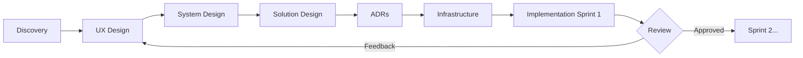

# Workflow — Building a Project With AI

## The Spiral Model (Not Waterfall)

Each "phase" produces documents, but the **implementation is iterative**. You may revisit earlier phases as you learn.

## Session Protocol

### Start of a session:
1. Review `docs/*/README.md` for phase status
2. Check latest `docs/05-adr/` for recent decisions
3. Review `docs/07-implementation/current-sprint.md`
4. Ask: "What would you like to work on today?"

### During a session:
- Propose before coding (especially for architecture)
- If something will take >30 min, suggest splitting
- Commit after each logical unit of work

### End of a session:
1. Update status of documents modified
2. Update `current-sprint.md` with progress
3. Summarise what was done and what's next

## File Change Rules

- `.ai/` — Only human modifies. AI may suggest changes but never writes here.
- `docs/` — AI generates drafts. Human approves/edits.
- `src/` — AI writes code. Human reviews PRs.
- `infrastructure/` — AI generates. Human tests in non-prod first.
- `tests/` — Always written alongside implementation code.
