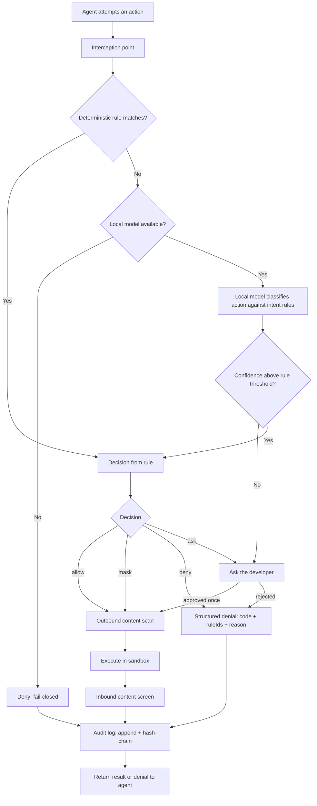
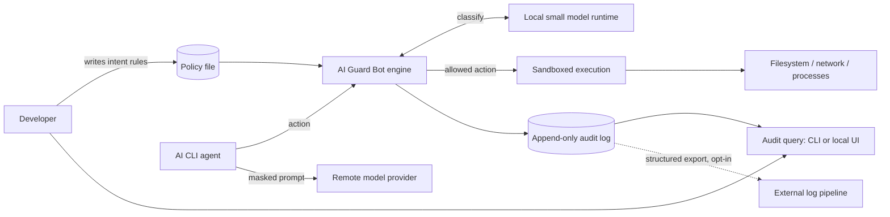
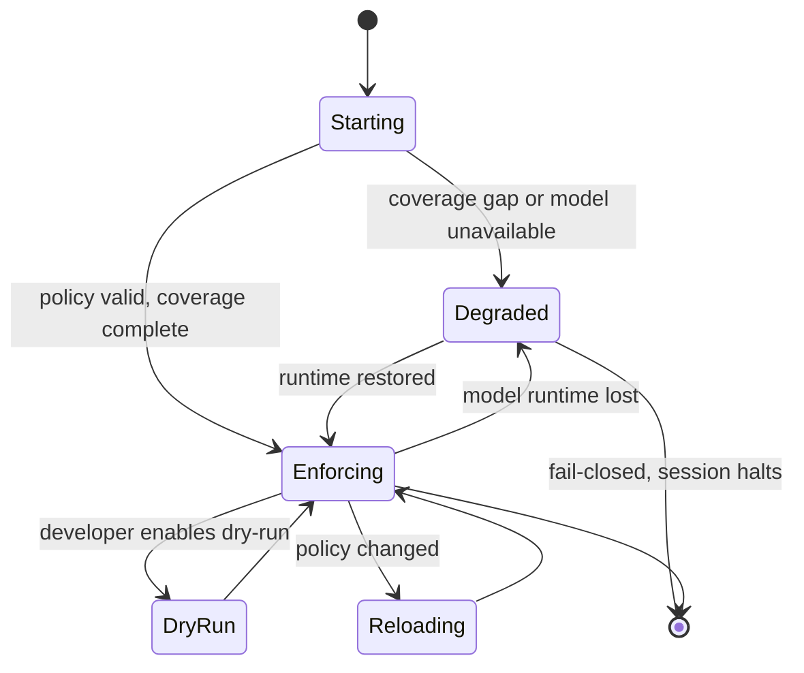

# 01 — Discovery: Requirements

**Status**: Draft
**Last updated**: 2026-09-28
**Approved by**: _pending_

---

## Project Brief

**AI Guard Bot** is a local, vendor-agnostic guardrail layer between an AI CLI agent and the
machine it runs on. Every action the agent attempts — tool call, MCP request, or shell command —
is intercepted, evaluated against a small set of developer-authored **intent-level rules** by
deterministic matchers plus a locally-run small model, and then allowed, rewritten (secret/PII
masking), or rejected with a machine-readable error code naming the violated rule. Every decision
is recorded in an append-only, queryable audit log. It targets AI CLIs first (Claude Code, Codex
CLI, Gemini CLI), with a path to AI desktop applications. No policy decision requires a network
call, so no prompt or file content leaves the machine in order to be judged.

---

## Problem Statement

Developers running AI coding agents face a choice between two bad options, and in practice pick
the unsafe one.

1. **Per-action prompts are answered by reflex.** The vendor's own permission prompt fires on
   every file write and every shell command. It interrupts exactly the flow it protects, so the
   common response is to disable it entirely (`--dangerously-skip-permissions` and equivalents)
   and grant the agent the full privileges of the logged-in user. The granularity is wrong:
   developers are asked about individual actions, while what they actually hold in their heads is
   a handful of high-level intentions.

2. **Configuring permissions properly costs more than it returns.** Each CLI does offer settings
   — allow/deny lists, hook scripts — but authoring one means enumerating concrete tool names,
   command prefixes, and glob patterns up front, in a tool-specific syntax, then maintaining that
   list as the agent discovers new commands. The effort is front-loaded and never finished, and
   it does not transfer: a policy written for one CLI must be rewritten for the next.

3. **Nothing is recorded.** Once permissions are blanket-approved, the only trace is terminal
   scrollback. No one — the developer, a teammate, a security reviewer — can answer "what did the
   agent actually do in that session?" after the fact.

The consequence is that the fastest-growing class of tooling in software engineering runs
unconstrained and unobserved on machines holding production credentials, customer data, and
deploy access. The problem is not that guardrails are missing; it is that the guardrails that
exist demand effort at the wrong level of abstraction and produce no evidence.

**What "solved" looks like.** A developer writes five plain-language rules once, launches any AI
CLI with full autonomy, is not interrupted, and can afterwards answer precisely which actions
were attempted, which were blocked, and why.

### Problem framing (not solution-prescribed)

The problem statement above deliberately does **not** commit to interception mechanism, rule
syntax, model choice, or sandbox technology. Those are Phase 3 concerns. What Discovery fixes is
that any acceptable solution must be: (a) authored at intent level, (b) uniform across CLIs,
(c) non-interrupting in the common case, (d) fully recorded, and (e) local-only for decisions.

---

## Target Users / Personas

Summarised here; full detail in [`user-personas.md`](user-personas.md).

| Persona | Role | Primary goal | Core pain | Technical level |
|---|---|---|---|---|
| **Dana** | Senior product engineer, small startup | Keep agent autonomy without risking her own machine | Runs with permissions skipped; knows it is wrong, will not trade speed for prompts | Expert; will read a config file, will not maintain a glob list |
| **Miguel** | Platform / DevEx engineer, ~120-engineer company | One reviewable policy governing every agent his org's engineers use | Each CLI has its own permission syntax; cannot roll anything out uniformly | Expert; owns internal tooling and CI |
| **Priya** | Security engineer / AppSec lead | An enforcement point and an audit trail, without banning the tools | No evidence of agent behaviour; current answer is a policy memo nobody can verify | Strong, but not the author of the agent workflows |
| **Tom** | Mid-level engineer, agency, multi-client work | Not leak client A's data into client B's session or to a model provider | Unaware of most risks; needs safe defaults, not a policy language | Intermediate; wants it to just work |

---

## User Stories

Prioritised P0 (must for v1) / P1 (should) / P2 (nice). Each is independently deliverable and
testable; acceptance criteria are stated where the story is not self-evidently verifiable.

### P0 — Must Have

- **S-01** As a developer, I want to write my guardrails as a handful of plain-language rules, so
  that I do not have to enumerate every tool, command, and path in advance.
  *Accepts:* a 5-rule file authored with no tool-specific identifiers produces correct allow/deny
  decisions on the FR-11 evaluation corpus at or above the FR-11 accuracy bar.
- **S-02** As a developer, I want every action my AI CLI attempts to be intercepted before it
  executes, so that a decision is made pre-effect rather than reported after the damage.
  *Accepts:* for the v1 target CLI, no file write, shell command, or network egress reaches the
  OS without a recorded decision; verified by a red-team action set in E2E.
- **S-03** As a developer, I want a local model to decide on my behalf when the rules do not map
  to a literal pattern, so that I am not interrupted for judgement calls.
- **S-04** As a developer, I want actions that violate a rule to be rejected with a stable error
  code and the violated rule id, so that the agent can adapt instead of retrying blindly.
  *Accepts:* denial payload is machine-parseable, contains `code` + `ruleIds` + human reason, and
  the target CLI surfaces it to the model as tool-call feedback.
- **S-05** As a developer, I want secrets and PII masked out of what the agent sends outward, so
  that credentials in a file or command output never reach a model provider.
  *Accepts:* known-secret corpus (FR-13) is masked at the stated recall; masking is applied to
  outbound content, and the mask is stable so the agent is not confused by shifting values.
- **S-06** As a developer, I want every intercepted action and its decision recorded in an
  append-only log, so that I can reconstruct a session afterwards.
- **S-07** As a developer, I want to query that log by session, decision, rule, or time, so that
  I can answer "what did it do?" without reading raw files.
- **S-08** As a developer, I want the guardrail to deny anything it cannot evaluate, so that a
  crashed or unavailable evaluator is not an open door.
  *Accepts:* killing the model runtime mid-session causes denials, not allows; configurable per
  rule, with the fail-open choice recorded in the log.
- **S-09** As a developer, I want to install and enable the guardrail for my CLI in one command,
  so that adoption costs less than the permission config I am avoiding.
  *Accepts:* time from install to first enforced decision under 5 minutes, measured on a clean
  machine with no prior local-model install.
- **S-10** As a developer, I want a dry-run mode that logs decisions without enforcing them, so
  that I can see what a new rule would have blocked before trusting it.

### P1 — Should Have

- **S-11** As a platform engineer, I want one policy file to work unchanged across every
  supported CLI, so that I write and review the rule set once.
- **S-12** As a platform engineer, I want to distribute a baseline policy that engineers can
  extend but not weaken, so that org guarantees survive local edits.
- **S-13** As a developer, I want approved actions to run inside a sandbox with an explicit
  filesystem, network, and process allowlist, so that an allow decision made on incomplete
  information is still bounded.
- **S-14** As a security engineer, I want to export the audit log in a structured format to our
  existing log pipeline, so that agent activity lands where we already look.
- **S-15** As a developer, I want to interactively approve a blocked action once, so that a
  false positive does not force me to edit rules mid-task.
- **S-16** As a developer, I want inbound content (file reads, command output, fetched pages)
  screened for prompt injection, so that untrusted text cannot redirect my agent.
- **S-17** As a developer, I want to see decision latency per action, so that I can tell whether
  the guardrail is what slowed my session down.
- **S-18** As a platform engineer, I want rules under version control with a changelog, so that
  a policy change is reviewable like code.

### P2 — Nice to Have

- **S-19** As a developer, I want a local web UI to browse the audit log and edit rules, so that
  I am not limited to the terminal.
- **S-20** As a developer, I want rule suggestions derived from my own dry-run history, so that
  authoring the first policy is guided.
- **S-21** As a security engineer, I want per-repository policy overlays, so that a sensitive
  repo can be stricter than the machine default.
- **S-22** As a developer, I want the same engine to guard AI desktop applications, not just
  CLIs.
- **S-23** As a platform engineer, I want a redacted, aggregated team-level view of denials, so
  that I can see which rules fire most and fix the friction.

---

## Functional Requirements

### Rules and policy

- **FR-01** The system SHALL accept a policy consisting of intent-level rules written in natural
  language, each with a stable id, and SHALL NOT require the author to name tools, commands, or
  path globs.
- **FR-02** The system SHALL additionally accept deterministic rules matching on tool name,
  command string, filesystem path, network destination, and content pattern, with the four
  decisions `allow`, `deny`, `ask`, `mask`.
- **FR-03** The system SHALL resolve rule conflicts by a documented, deterministic precedence
  order, and SHALL record the winning rule id on every decision.
- **FR-04** The system SHALL validate a policy file on load and refuse to start on a policy that
  is malformed or references an undefined hook.
- **FR-05** The system SHALL support a machine-level baseline policy that a project-level policy
  may narrow but not widen.
- **FR-06** The system SHALL support user-supplied hook programs as additional evaluators,
  receiving the action as structured input and returning a decision.

### Interception

- **FR-07** The system SHALL intercept, before execution, every agent-initiated shell command,
  filesystem read/write, network request, and MCP tool call, for each supported CLI.
- **FR-08** The system SHALL integrate via the host CLI's own hook or permission interface where
  one exists, and SHALL NOT require a fork or patch of the host agent.
- **FR-09** The system SHALL expose the same policy engine to CLIs lacking such an interface via
  an MCP proxy and/or process-level interception.
- **FR-10** The system SHALL degrade to `deny` when interception coverage for a given action
  class cannot be guaranteed, and SHALL report that gap at startup rather than silently.

### Evaluation

- **FR-11** The system SHALL evaluate deterministic rules first and invoke the local model only
  for actions no deterministic rule decides, and SHALL classify actions against intent-level
  rules with **≥ 95 % recall on deny-class actions and ≤ 2 % false-deny rate on allow-class
  actions**, measured on a maintained, versioned evaluation corpus of at least 500 labelled
  actions covering all rule categories.
- **FR-12** The system SHALL make every policy decision without any network call.
- **FR-13** The system SHALL detect and mask credentials, API keys, private keys, and
  user-defined sensitive keywords in outbound content, at **≥ 99 % recall on the high-confidence
  structured-secret corpus** (keys with recognisable formats) and **≥ 90 % recall on the
  semantic-PII corpus**, with **≤ 1 % of masked spans being false positives** on the structured
  corpus.
- **FR-14** The system SHALL screen inbound content for prompt-injection patterns and flag or
  strip it per policy.
- **FR-15** The system SHALL return, on denial, a structured payload containing a stable error
  code, the violated rule ids, and a human-readable reason.
- **FR-16** The system SHALL support a dry-run mode in which decisions are computed and logged
  but not enforced.

### Sandboxing

- **FR-17** The system SHALL execute approved actions within a confinement boundary configured by
  explicit filesystem, network, and process allowlists.
- **FR-18** The system SHALL document its confinement boundary as a concrete threat model,
  including what it does not stop, and SHALL make no absolute isolation claim.

### Observability

- **FR-19** The system SHALL append to an immutable local log, for every intercepted action: a
  timestamp, session id, agent identity, action type, action payload (masked per policy),
  decision, deciding rule ids, evaluator used, and evaluation latency.
- **FR-20** The system SHALL detect tampering with the audit log (e.g. hash-chained records) and
  report it.
- **FR-21** The system SHALL provide query over the log by session, time range, decision, rule
  id, and action type.
- **FR-22** The system SHALL emit the same records as structured events on a documented stream
  for export to an external log pipeline.
- **FR-23** The system SHALL expose a health check reporting engine status, model-runtime
  availability, policy version in force, and per-CLI interception coverage.

### Operation

- **FR-24** The system SHALL install and enable itself for a supported CLI via a single
  documented command, including provisioning the local model runtime.
- **FR-25** The system SHALL allow a one-off interactive override of a denial, recording the
  override, the actor, and the justification as a distinct log event.
- **FR-26** The system SHALL hot-reload a changed policy without restarting a running agent
  session, and SHALL log the policy version transition.

---

## Non-Functional Requirements

### Performance

| Metric | Target |
|---|---|
| Added latency, deterministic-only decision | **P95 < 20 ms, P99 < 50 ms** |
| Added latency, decision requiring local model | **P95 < 300 ms, P99 < 800 ms** |
| Share of actions resolved without the model, on the reference workload | **≥ 80 %** |
| Interception overhead on an allowed, unmodified action (no rewrite) | **P95 < 10 ms** |
| Policy load / hot-reload | **< 500 ms for a 200-rule policy** |
| Audit log write | **P95 < 5 ms, never blocking the decision path beyond that** |
| Audit query over 30 days / 1 M records | **P95 < 1 s** |
| Cold start, engine ready to decide | **< 2 s excluding model-runtime warm-up; < 15 s including it** |

### Scalability

| Metric | Target |
|---|---|
| Concurrent agent sessions on one developer laptop | **≥ 4**, within budget below |
| Resident memory, engine excluding model | **< 250 MB** |
| Resident memory, including the v1 local model | **< 5 GB** |
| Idle CPU | **< 1 % of one core** |
| Sustained action rate | **≥ 50 actions/s deterministic; ≥ 5 actions/s model-evaluated** |
| Audit log growth | **< 1 GB per 30 days at the reference workload**, with documented rotation |

### Security

- Fail-closed: any action the engine cannot evaluate is **denied**. Fail-open is configurable
  per rule only, and every fail-open decision is logged as such.
- No policy decision performs a network call (**hard requirement**, verified by test).
- No secrets in code, environment variables committed to the repo, or config files; sensitive
  keyword lists are referenced, not inlined into shareable policy.
- The policy file and audit log are integrity-protected: policy is version-pinned and hashed at
  load; audit records are hash-chained.
- The engine's own configuration and log must not be writable by the sandboxed agent — a guarded
  agent SHALL NOT be able to weaken the policy that guards it, and the attempt SHALL be logged.
- Local model inputs are treated as untrusted data, never as instructions to the engine; the
  model's output is constrained to a decision enum, not free-form action.
- Threat model is stated explicitly in Phase 3 and distinguishes an **erring** agent from an
  **actively escaping** one (see Risk R-02 and Open Question Q-03).

### Availability / reliability

- The guardrail SHALL NOT be a single point of failure for the developer's machine: if the engine
  dies, the guarded agent stops acting (fail-closed), it does not lose work.
- Engine crash recovery: restart and resume enforcement in **< 5 s**, with no gap in which
  actions execute unevaluated.
- Audit durability: a decision is not returned to the agent until its log record is durable;
  **zero decisions unlogged** is the target, and any logging failure is itself a deny.

### Observability

- Every decision emits a structured event with rule id, decision, evaluator, and latency (FR-19).
- Metrics exposed: decisions/s by outcome, evaluator mix, P50/P95/P99 latency per evaluator,
  model-runtime availability, policy version, denial rate per rule, override count.
- Health check per FR-23.

### Accessibility

- Any UI surface meets **WCAG 2.1 AA**: keyboard operable end to end, visible focus, contrast
  ≥ 4.5:1 for body text, no colour-only encoding of a decision outcome, and screen-reader
  announcement of live decision updates.
- CLI output is usable without colour and respects `NO_COLOR`.

### Browser support

- For the P2 local web UI: last two major versions of Chrome, Edge, Firefox, and Safari. No IE.
  The UI binds to localhost only.

### Privacy

- No action content, file content, or prompt leaves the local machine as part of a policy
  decision. Any future telemetry is opt-in, aggregate, and excludes action payloads.

---

## Constraints

| Constraint | Detail |
|---|---|
| **Binding ADR** | ADR-001 (Accepted): Next.js 14+ App Router, TypeScript, RSC by default — governs any web/UI surface. |
| **Open by design** | The enforcement core's language/runtime is deliberately *not* settled by ADR-001; startup time, latency, and OS-level sandboxing are different constraints. Now proposed in [ADR-002](../05-adr/002-enforcement-core-language.md) (Rust core, TypeScript UI) — awaiting acceptance at the Phase 3 gate. |
| **Local model runtime** | Pluggable (Ollama or equivalent). No hard dependency on one model or vendor — see [ADR-005](../05-adr/005-pluggable-local-model-runtime.md). |
| **No vendor SDK in the enforcement path** | And no cloud service in the policy-decision path. |
| **Host agents unmodified** | Integration through documented hook/permission interfaces; no forks or patches — see [ADR-007](../05-adr/007-cli-integration-strategy.md). |
| **Hardware floor** | Must run on a developer laptop with 16 GB RAM alongside the IDE and the agent — this caps model size and is the real constraint behind the latency targets. |
| **Compliance** | Not a certified control. The audit log is designed to be *evidence* for SOC 2 / ISO 27001 change-and-access narratives, but no certification claim is made in v1. |
| **Timeline** | Not yet set (Open Question Q-07). |

---

## Scope Boundaries

### In Scope (v1)

- Interception and pre-execution evaluation for **one** AI CLI end-to-end, with the engine
  designed for the others (Q-04 picks which).
- Intent-level natural-language rules plus deterministic rules, with documented precedence.
- Local deterministic + small-model evaluation; no network in the decision path.
- Structured denial responses the host agent can parse.
- Outbound secret/PII masking; inbound prompt-injection screening (P1).
- Append-only, hash-chained, queryable audit log with structured export.
- Dry-run mode, one-off interactive override, hot policy reload.
- Single-machine, single-developer installation.
- Target platform per Q-02.

### Out of Scope (v1) — explicitly

- A hosted/SaaS control plane, central policy server, or team dashboard (S-23 is P2).
- Guarding AI **desktop** applications (S-22, P2) or IDE-embedded agents.
- Guarding agents running on CI runners or remote/cloud dev environments.
- Multi-tenant or RBAC'd operation; there is one local user in v1.
- Any claim of unbreakable sandboxing, or defence against a local attacker with root.
- Rewriting agent *prompts* to change behaviour — the engine judges actions, it does not steer
  the model.
- Training, fine-tuning, or shipping our own model.
- Windows support, unless Q-02 says otherwise.
- Certification against a compliance framework.
- Code review of the agent's output, static analysis, or secret scanning of the repo at rest —
  this guards actions in flight, not the codebase.
- Billing, licensing, or account management.

---

## Key Risks

| # | Risk | Impact | Likelihood | Mitigation |
|---|---|---|---|---|
| **R-01** | **Local model decisions are wrong.** A false allow defeats the product; a false deny makes it unusable and it gets uninstalled. | Critical | High | Deterministic rules decide first and cover all catastrophic classes (credential paths, destructive commands, egress) so the model is never the only thing between the agent and an irreversible action. Versioned evaluation corpus with the FR-11 accuracy gates enforced in CI; dry-run mode (S-10) to measure false-deny rate on real sessions before enforcing; one-off override (S-15) as the escape hatch; per-rule confidence thresholds with `ask` as the middle outcome. |
| **R-02** | **The sandbox is escapable**, particularly by an agent driven by prompt injection rather than one merely erring. | Critical | Medium | Publish a concrete threat model naming what is and is not stopped (FR-18); never claim absolute isolation; choose an OS-native primitive over a hand-rolled boundary and record the choice in an ADR; treat the engine's own config and log as outside the agent's reach; screen inbound content for injection (S-16); assume breach and rely on the audit log to detect it. Q-03 must be answered before Phase 3 fixes this. |
| **R-03** | **Latency makes developers turn it off** — the exact failure mode of the prompts this replaces. | High | Medium | Hard NFR budgets above with the model off the hot path for ≥ 80 % of actions; decision cache keyed on normalised action + policy version; latency surfaced per action (S-17) and in metrics so regressions are visible; a performance regression gate in CI on the reference workload. |
| **R-04** | **Interception is incomplete** — an action class slips past, giving false assurance, which is worse than no guardrail. | Critical | Medium | Per-CLI coverage matrix published and asserted at startup (FR-23); deny-by-default for unmapped action classes (FR-10); a red-team action set in E2E that tries to reach the OS around the interception points; refuse to advertise support for a CLI until its matrix is complete. |
| **R-05** | **Host CLI interfaces change or are withdrawn**, breaking integration on a vendor's release cadence we do not control. | High | High | Depend only on documented hook/permission interfaces; keep an adapter per CLI behind one internal contract so a break is contained; version-pin supported CLI versions and detect unknown versions at startup; the MCP-proxy path (FR-09) as the fallback that does not depend on vendor hooks. |
| **R-06** | **Nobody writes the rules.** Five plain-language rules is still five more than zero, and the product's premise is that authoring effort is what kills adoption. | High | Medium | Ship an opinionated, safe default policy that is useful with no authoring at all; one-command install (S-09, < 5 min); rule suggestions from dry-run history (S-20); shareable policies so one author serves a team (S-11/S-12). |
| **R-07** | **The guarded agent disables or weakens its own guard** — it has shell access and the engine's config is on the same filesystem. | Critical | Medium | The engine's config, policy, and log are outside the agent's write allowlist by construction; policy hash pinned at load; tamper detection on the log (FR-20); any attempt logged as a distinct high-severity event. |

---

## Glossary

| Term | Meaning |
|---|---|
| **Action** | A single agent-initiated operation subject to evaluation: shell command, file read/write, network request, or MCP/tool call. |
| **Agent** | The AI CLI being guarded (Claude Code, Codex CLI, Gemini CLI, …). |
| **Intent-level rule** | A rule written in natural language expressing a goal ("never touch production credentials") rather than a pattern. |
| **Deterministic rule** | A rule matching literally on tool name, command, path, destination, or content pattern. |
| **Decision** | One of `allow`, `deny`, `ask`, `mask`. |
| **Evaluator** | A component producing a decision: the deterministic matcher, the local model, or a user hook. |
| **Interception point** | The mechanism by which an action is captured pre-execution (host hook, MCP proxy, process-level). |
| **Fail-closed** | An action that cannot be evaluated is denied. |
| **Dry-run** | Decisions computed and logged, not enforced. |
| **Masking** | Replacing a detected secret or PII span with a stable placeholder before the content leaves the machine. |
| **Prompt injection** | Untrusted content read by the agent that attempts to redirect its behaviour. |
| **Baseline policy** | A machine- or org-level policy a local policy may narrow but not widen. |
| **Coverage matrix** | Per-CLI table of which action classes are interceptable, published and asserted at startup. |
| **Reference workload** | The fixed, recorded agent session used for all performance targets. |
| **Evaluation corpus** | The versioned, labelled action set used to gate FR-11/FR-13 accuracy in CI. |

---

## Diagrams

### Decision flow

### Context

### Session states

---

## Discovery Exit Checklist

Per `.ai/rules/review-criteria.md`:

- [x] Problem stated clearly, not solution-prescribed — see *Problem framing*.
- [x] Personas represent real user segments — four, in `user-personas.md`.
- [x] User stories are INVEST — each independently deliverable, with acceptance criteria where
      verification is not obvious.
- [x] P0 stories are truly must-have — P0 is exactly the set without which the product's premise
      (broad autonomy, no interruption, full record) fails.
- [x] NFRs are quantified — all performance, scalability, and accuracy targets carry numbers.
- [x] Risks have mitigations — seven risks, each with concrete mitigations, not acknowledgement.
- [x] Out-of-scope items explicitly listed — twelve.

**Blocking for approval**: Open Questions Q-02, Q-03, Q-04 and Q-06 below.

---

## Open Questions

Carried from `.ai/context/project-brief.md` and extended. Q-02, Q-03, Q-04 and Q-06 must be
answered before Discovery is approved, because each changes requirements rather than design.

| # | Question | Why it blocks |
|---|---|---|
| **Q-01** | **Local model choice.** The brief and the latest input name "laya" / "jev"; read as a small local model in the **Llama**/Gemma/Qwen class. Confirm the intended model and runtime. | Sets the memory floor and the P95 model-path latency target. |
| **Q-02** | **Target platforms.** macOS only, or macOS + Linux + Windows? | Decides the sandbox primitive and whether Windows is in or out of scope. |
| **Q-03** | **Threat model.** Guard against an agent that *errs*, or one *actively trying to escape* (prompt-injection-driven)? | Changes R-02's mitigation from "confine by config" to "assume adversary", and the whole sandbox design. |
| **Q-04** | **First target CLI**, supported end-to-end. | Fixes which hook interface the v1 interception depends on. |
| **Q-05** | **Distribution.** Single-user local tool, or team deployment with centrally-managed policy? | Promotes or demotes S-11/S-12/S-23 and the baseline-policy requirement. |
| **Q-06** | **UI scope for v1.** CLI-and-config-file only, or is a local web UI in v1? | Determines whether ADR-001 and the accessibility/browser NFRs apply to v1 at all. |
| **Q-07** | **Timeline / target date.** | Needed for the phase effort estimate. |
| **Q-08** | **Enforcement posture on day one.** Ship enforcing by default, or dry-run by default for the first N sessions? | Trades R-01 (false denies) against the product's core promise. Recommendation: dry-run for the first session, then enforce, with the transition explicit. |

---

## Related documents

- `.ai/context/project-brief.md` — source brief, including Background / Existing Problems
- [`user-personas.md`](user-personas.md) — persona detail
- [`../05-adr/001-use-react-and-typescript.md`](../05-adr/001-use-react-and-typescript.md) — binding for any UI surface
- [`../05-adr/README.md`](../05-adr/README.md) — ADR-002 … ADR-009 (Proposed), which answer the architectural questions these requirements raise; the index's "Blocked on human input" table maps Q-01 … Q-06 onto the ADRs each one gates
- [`../04-solution-design/`](../04-solution-design/) — Phase 4 documents, drafted ahead of the Phase 3 gate (see the note at the top of each)
