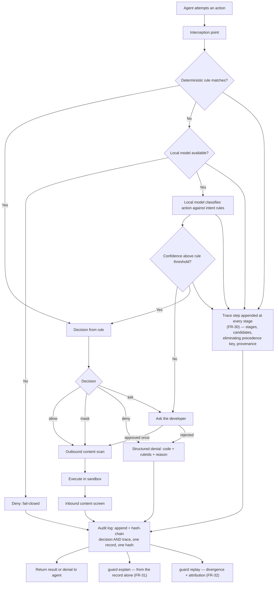
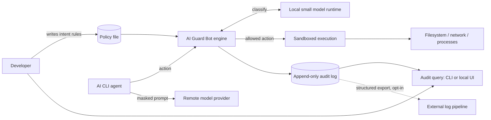
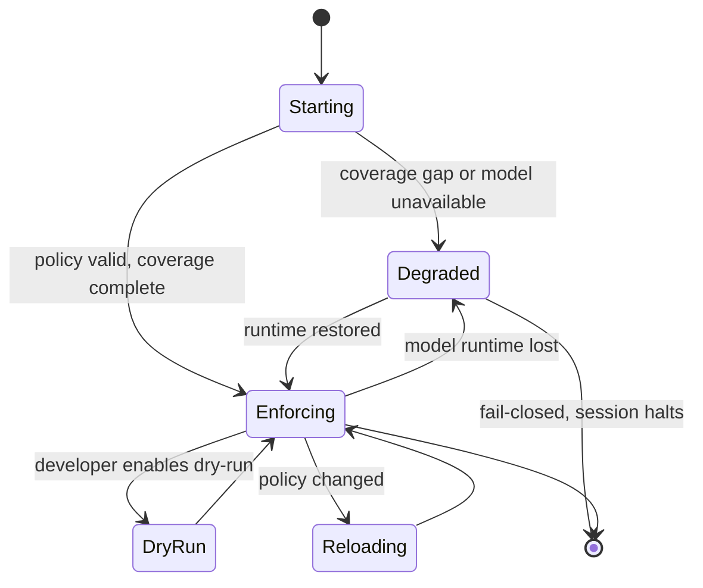

# 01 — Discovery: Requirements

**Status**: Draft
**Last updated**: 2026-10-02
**Approved by**: _pending_

---

## Project Brief

**AI Guard Bot** is a local, vendor-agnostic guardrail layer between an AI CLI agent and the
machine it runs on. Every action the agent attempts — tool call, MCP request, or shell command —
is intercepted, evaluated against a small set of developer-authored **intent-level rules** by
deterministic matchers plus a locally-run small model, and then allowed, rewritten (secret/PII
masking), or rejected with a machine-readable error code naming the violated rule. Every decision
is recorded in an append-only, queryable audit log. It targets AI CLIs first (Claude Code, Codex
CLI, Gemini CLI), with a path to AI desktop applications. No policy decision requires a network
call, so no prompt or file content leaves the machine in order to be judged.

---

## Problem Statement

Developers running AI coding agents face a choice between two bad options, and in practice pick
the unsafe one.

1. **Per-action prompts are answered by reflex.** The vendor's own permission prompt fires on
   every file write and every shell command. It interrupts exactly the flow it protects, so the
   common response is to disable it entirely (`--dangerously-skip-permissions` and equivalents)
   and grant the agent the full privileges of the logged-in user. The granularity is wrong:
   developers are asked about individual actions, while what they actually hold in their heads is
   a handful of high-level intentions.

2. **Configuring permissions properly costs more than it returns.** Each CLI does offer settings
   — allow/deny lists, hook scripts — but authoring one means enumerating concrete tool names,
   command prefixes, and glob patterns up front, in a tool-specific syntax, then maintaining that
   list as the agent discovers new commands. The effort is front-loaded and never finished, and
   it does not transfer: a policy written for one CLI must be rewritten for the next.

3. **Nothing is recorded.** Once permissions are blanket-approved, the only trace is terminal
   scrollback. No one — the developer, a teammate, a security reviewer — can answer "what did the
   agent actually do in that session?" after the fact.

The consequence is that the fastest-growing class of tooling in software engineering runs
unconstrained and unobserved on machines holding production credentials, customer data, and
deploy access. The problem is not that guardrails are missing; it is that the guardrails that
exist demand effort at the wrong level of abstraction and produce no evidence.

**What "solved" looks like.** A developer writes five plain-language rules once, launches any AI
CLI with full autonomy, is not interrupted, and can afterwards answer precisely which actions
were attempted, which were blocked, and why.

### Problem framing (not solution-prescribed)

The problem statement above deliberately does **not** commit to interception mechanism, rule
syntax, model choice, or sandbox technology. Those are Phase 3 concerns. What Discovery fixes is
that any acceptable solution must be: (a) authored at intent level, (b) uniform across CLIs,
(c) non-interrupting in the common case, (d) fully recorded, and (e) local-only for decisions.

---

## Target Users / Personas

Summarised here; full detail in [`user-personas.md`](user-personas.md).

| Persona | Role | Primary goal | Core pain | Technical level |
|---|---|---|---|---|
| **Dana** | Senior product engineer, small startup | Keep agent autonomy without risking her own machine | Runs with permissions skipped; knows it is wrong, will not trade speed for prompts | Expert; will read a config file, will not maintain a glob list |
| **Miguel** — **not a v1 persona** | Platform / DevEx engineer, ~120-engineer company | One reviewable policy governing every agent his org's engineers use | Each CLI has its own permission syntax; cannot roll anything out uniformly | Expert; owns internal tooling and CI |
| **Priya** | Security engineer / AppSec lead | An enforcement point and an audit trail, without banning the tools | No evidence of agent behaviour; current answer is a policy memo nobody can verify | Strong, but not the author of the agent workflows |
| **Tom** | Mid-level engineer, agency, multi-client work | Not leak client A's data into client B's session or to a model provider | Unaware of most risks; needs safe defaults, not a policy language | Intermediate; wants it to just work |

**v1 persona scope (Q-05, 2026-10-02):** the product is a **single-user local tool**, so **P2
(Miguel) is out of scope for v1** — his goal needs policy distribution and a team view, both
deferred ([ADR-011](../05-adr/011-v1-scope-envelope.md)). P1 (Dana) is the primary persona; P3
(Priya) and P4 (Tom) are served by the local audit log and the shipped default policy respectively.

---

## User Stories

Prioritised P0 (must for v1) / P1 (should) / P2 (nice). Each is independently deliverable and
testable; acceptance criteria are stated where the story is not self-evidently verifiable.

### P0 — Must Have

- **S-01** As a developer, I want to write my guardrails as a handful of plain-language rules, so
  that I do not have to enumerate every tool, command, and path in advance.
  *Accepts:* a 5-rule file authored with no tool-specific identifiers produces correct allow/deny
  decisions on the FR-11 evaluation corpus at or above the FR-11 accuracy bar.
- **S-02** As a developer, I want every action my AI CLI attempts to be intercepted before it
  executes, so that a decision is made pre-effect rather than reported after the damage.
  *Accepts:* for **both** v1 adapters (Claude Code hook, MCP proxy), no file write, shell command,
  or network egress reaches the OS without a recorded decision; verified by a red-team action set in
  E2E on macOS and Linux.
- **S-03** As a developer, I want a local model to decide on my behalf when the rules do not map
  to a literal pattern, so that I am not interrupted for judgement calls.
- **S-04** As a developer, I want actions that violate a rule to be rejected with a stable error
  code and the violated rule id, so that the agent can adapt instead of retrying blindly.
  *Accepts:* denial payload is machine-parseable, contains `code` + `ruleIds` + human reason, and
  the target CLI surfaces it to the model as tool-call feedback.
- **S-05** As a developer, I want secrets and PII masked out of what the agent sends outward, so
  that credentials in a file or command output never reach a model provider.
  *Accepts:* known-secret corpus (FR-13) is masked at the stated recall; masking is applied to
  outbound content, and the mask is stable so the agent is not confused by shifting values.
- **S-06** As a developer, I want every intercepted action and its decision recorded in an
  append-only log, so that I can reconstruct a session afterwards.
- **S-07** As a developer, I want to query that log by session, decision, rule, or time, so that
  I can answer "what did it do?" without reading raw files.
- **S-08** As a developer, I want the guardrail to deny anything it cannot evaluate, so that a
  crashed or unavailable evaluator is not an open door.
  *Accepts:* killing the model runtime mid-session causes denials, not allows; configurable per
  rule, with the fail-open choice recorded in the log.
- **S-09** As a developer, I want to install and enable the guardrail for my CLI in one command,
  so that adoption costs less than the permission config I am avoiding.
  *Accepts:* time from install to first enforced decision under 5 minutes, measured on a clean
  machine with no prior local-model install.
- **S-10** As a developer, I want a dry-run mode that logs decisions without enforcing them, so
  that I can see what a new rule would have blocked before trusting it.
  *Scope note (Q-08):* dry-run is **opt-in and not the default**. The product enforces from the
  first action, so dry-run is a rule-authoring aid rather than an onboarding phase — which moves
  the burden of proving the default policy onto the pre-release accuracy gate (see R-01).
- **S-24** As a developer, I want a read-only TUI to browse and filter the audit log in the
  terminal, so that reviewing a long session does not mean reading raw JSON (Q-06).
  *Accepts:* keyboard-only operation; every query the TUI can express is also expressible as
  `guard audit query` producing the same rows; the TUI opens no socket the CLI does not already use
  and has no write path to policy.
- **S-25** As a developer, I want to remove the guardrail — or detach it from one CLI — with one
  command, so that trying it is reversible and a guard I no longer want cannot leave my agent CLI
  broken behind it.
  *Rationale:* `install` (S-09) writes into configuration **the user owns elsewhere** — the host
  CLI's hook settings and its MCP server list ([ADR-007](../05-adr/007-cli-integration-strategy.md)).
  Combined with the fail-closed default ([ADR-009](../05-adr/009-fail-closed-default.md)), a
  registered hook whose binary has been deleted denies *every* subsequent agent action, so
  "uninstall by `rm`" is not merely unsupported — it bricks the host CLI. R-01 also names uninstall
  as the user's exit path from a false-deny, so that path cannot be undefined.
  *Accepts:* after removal, the host CLI runs with no guard hook registered and no residual
  denials; removal is idempotent and exits `0` from a partially-installed or hand-edited state,
  naming what it could not find; the audit log and policy file survive by default and their paths
  are printed; `--purge` is required to delete them and prompts for confirmation; the audit chain
  ends with a verifiable terminal record so `guard log verify` can distinguish removal from
  truncation.
- **S-26** As a developer, I want to ask the guard *why* it decided what it decided — and whether it
  would still decide the same way — so that a surprising denial is something I can inspect and argue
  with rather than a verdict I have to work around.
  *Rationale:* with enforcement on from the first action (Q-08) and fail-closed as the default
  ([ADR-009](../05-adr/009-fail-closed-default.md)), R-01's false-deny is a *first-session* event.
  The acceptance path for that risk — read the reason, fix the rule — assumes the decision can be
  reconstructed. A verdict plus a one-line reason is not enough when the deciding factor was a
  precedence comparison (a model deny over a deterministic allow), a cache hit, or an evaluator that
  never ran.
  *Accepts:* `guard explain <actionId>` names the deciding rule, the stages that ran, every rule that
  matched and the precedence key that eliminated it, and the provenance in force — from the stored
  record alone, working while the model runtime is down, in P95 < 50 ms; a fail-closed deny that no
  rule produced explains *why nothing decided*; `guard replay` re-decides the recorded action and
  reports identical or divergent with an attribution, exiting `4` on divergence; neither command
  enforces, writes to the log, or warms the cache. See
  [ADR-012](../05-adr/012-decision-trace.md), FR-30 … FR-32.

### P1 — Should Have

- **S-13** As a developer, I want approved actions to run inside a sandbox with an explicit
  filesystem, network, and process allowlist, so that an allow decision made on incomplete
  information is still bounded.
- **S-14** As a security engineer, I want to export the audit log in a structured format to our
  existing log pipeline, so that agent activity lands where we already look.
- **S-15** As a developer, I want to interactively approve a blocked action once, so that a
  false positive does not force me to edit rules mid-task.
- **S-16** As a developer, I want inbound content (file reads, command output, fetched pages)
  screened for prompt injection, so that untrusted text cannot redirect my agent.
- **S-17** As a developer, I want to see decision latency per action, so that I can tell whether
  the guardrail is what slowed my session down.
- **S-18** As a platform engineer, I want rules under version control with a changelog, so that
  a policy change is reviewable like code.

### P2 — Nice to Have

- **S-19** ~~As a developer, I want a local web UI to browse the audit log and edit rules~~ —
  **withdrawn** (Q-06): superseded by **S-24** (read-only TUI). A web UI would require a listening
  process, which [ADR-003](../05-adr/003-local-daemon-over-unix-socket.md) item 4 forbids
  outright.
- **S-20** As a developer, I want rule suggestions derived from my own dry-run history, so that
  authoring the first policy is guided.
- **S-21** As a security engineer, I want per-repository policy overlays, so that a sensitive
  repo can be stricter than the machine default.
- **S-22** As a developer, I want the same engine to guard AI desktop applications, not just
  CLIs.

### Post-v1 — deferred by the Q-05 single-user answer

These were P1/P2 stories; they are not descoped as ideas, only removed from v1, because each needs
policy distribution or a team view that a single-user local tool has nowhere to put
([ADR-011](../05-adr/011-v1-scope-envelope.md) derived decision 4).

- **S-11** As a platform engineer, I want one policy file to work unchanged across every
  supported CLI, so that I write and review the rule set once. *(The underlying capability — one
  policy, many adapters — is still built and proven by the two v1 adapters; what defers is the
  multi-engineer rollout the story is written for.)*
- **S-12** As a platform engineer, I want to distribute a baseline policy that engineers can
  extend but not weaken, so that org guarantees survive local edits. *(Needs the baseline/project
  layering dropped from v1; the precedence resolver that would implement it stays.)*
- **S-23** As a platform engineer, I want a redacted, aggregated team-level view of denials, so
  that I can see which rules fire most and fix the friction.

---

## Functional Requirements

### Rules and policy

- **FR-01** The system SHALL accept a policy consisting of intent-level rules written in natural
  language, each with a stable id, and SHALL NOT require the author to name tools, commands, or
  path globs.
- **FR-02** The system SHALL additionally accept deterministic rules matching on tool name,
  command string, filesystem path, network destination, and content pattern, with the four
  decisions `allow`, `deny`, `ask`, `mask`.
- **FR-03** The system SHALL resolve rule conflicts by a documented, deterministic precedence
  order, and SHALL record the winning rule id on every decision.
- **FR-04** The system SHALL validate a policy file on load and refuse to start on a policy that
  is malformed or references an undefined hook.
- **FR-05** The system SHALL resolve policy sources through a precedence resolver in which a
  narrower source may narrow but not widen a broader one. *(Post-v1 by Q-05: with a single-user
  local tool there is no distributed baseline to layer, so v1 ships one policy source. The resolver
  itself is still built — deterministic-over-model and specific-over-general precedence need it,
  [ADR-004](../05-adr/004-layered-policy-model.md) — and the layering turns on when distribution
  arrives.)*
- **FR-06** The system SHALL support user-supplied hook programs as additional evaluators,
  receiving the action as structured input and returning a decision.

### Interception

- **FR-07** The system SHALL intercept, before execution, every agent-initiated shell command,
  filesystem read/write, network request, and MCP tool call, for each supported CLI.
- **FR-08** The system SHALL integrate via the host CLI's own hook or permission interface where
  one exists, and SHALL NOT require a fork or patch of the host agent.
- **FR-09** The system SHALL expose the same policy engine to CLIs lacking such an interface via
  an MCP proxy and/or process-level interception.
  **v1 satisfies the MCP-proxy half only.** Process-level interception is undesigned for v1 and
  deferred to [ADR-015](../05-adr/015-supervised-exec-adapter.md) (post-v1, Linux-only, blocked on
  Q-10). The gap this leaves is explicit: a host CLI offering **neither** a hook interface **nor**
  MCP traffic has no interception point, so every action class is `unavailable` and FR-10 denies all
  of them — such a host is **unservable in v1**, not partially served.
- **FR-10** The system SHALL degrade to `deny` when interception coverage for a given action
  class cannot be guaranteed, and SHALL report that gap at startup rather than silently.
- **FR-28** The system SHALL intercept and evaluate **every MCP request class an agent can issue**,
  not tool invocation alone: `tools/call`, `resources/read`, `prompts/get`,
  `sampling/createMessage`, and `elicitation/create`. Each SHALL be a distinct action kind with its
  own normaliser and its own cell in the per-adapter coverage matrix (FR-23), so that a class left
  unintercepted fails closed under FR-10 instead of inheriting the coverage asserted for
  `tools/call`.
- **FR-29** The system SHALL treat content returned by an MCP server — resource contents, prompt
  templates, and tool results — as inbound content subject to FR-14 injection screening, and SHALL
  evaluate a `sampling/createMessage` request as an action in its own right, since it inverts
  control by having the server drive agent inference rather than the agent drive the server.

### Evaluation

- **FR-11** The system SHALL evaluate deterministic rules first and invoke the local model only
  for actions no deterministic rule decides, and SHALL classify actions against intent-level
  rules with **≥ 95 % recall on deny-class actions and ≤ 2 % false-deny rate on allow-class
  actions**, measured on a maintained, versioned evaluation corpus of at least 500 labelled
  actions covering all rule categories.
- **FR-12** The system SHALL make every policy decision without any network call.
- **FR-13** The system SHALL detect and mask credentials, API keys, private keys, and
  user-defined sensitive keywords in outbound content, at **≥ 99 % recall on the high-confidence
  structured-secret corpus** (keys with recognisable formats) and **≥ 90 % recall on the
  semantic-PII corpus**, with **≤ 1 % of masked spans being false positives** on the structured
  corpus.
- **FR-14** The system SHALL screen inbound content for prompt-injection patterns and flag or
  strip it per policy.
- **FR-15** The system SHALL return, on denial, a structured payload containing a stable error
  code, the violated rule ids, and a human-readable reason.
- **FR-16** The system SHALL support a dry-run mode in which decisions are computed and logged
  but not enforced.

### Sandboxing

- **FR-17** The system SHALL execute approved actions within a confinement boundary configured by
  explicit filesystem, network, and process allowlists.
- **FR-18** The system SHALL document its confinement boundary as a concrete threat model,
  including what it does not stop, and SHALL make no absolute isolation claim.

### Observability

- **FR-19** The system SHALL append to an immutable local log, for every intercepted action: a
  timestamp, session id, agent identity, action type, action payload (masked per policy),
  decision, deciding rule ids, evaluator used, and evaluation latency — **and the FR-30 decision
  trace**, in the same record, under the same hash.
- **FR-20** The system SHALL detect tampering with the audit log (e.g. hash-chained records) and
  report it.
- **FR-21** The system SHALL provide query over the log by session, time range, decision, rule
  id, and action type.
- **FR-22** The system SHALL emit the same records as structured events on a documented stream
  for export to an external log pipeline.
- **FR-23** The system SHALL expose a health check reporting engine status, model-runtime
  availability, policy version in force, and per-CLI interception coverage.
- **FR-30** The system SHALL record, **inside the same tamper-evident record as the decision**, a
  bounded **decision trace** sufficient to reconstruct how that decision was reached: the evaluation
  stages that ran and in what order, every rule that matched (not only the one that won), the
  precedence key that eliminated each losing candidate, and the **provenance** of every component
  whose version can change an outcome — guard build, matcher set, specificity weights, policy
  version, detector versions, and, where the model ran, model identity and weights digest. The trace
  SHALL be produced for **every** decision, including a decision served from cache and a
  fail-closed deny that no rule produced, with **no verbose mode, sampling, or debug level**
  involved. It SHALL contain no matched content, no payload value, and no prompt transcript, and
  SHALL be bounded by schema — **≤ 16 stages, ≤ 32 candidate rules, P99 ≤ 4 KB encoded, 16 KB
  absolute** — declaring truncation and the dropped counts within the hashed bytes rather than
  shortening silently.
- **FR-31** The system SHALL explain any recorded decision **from the stored record alone**, without
  consulting the live policy or the model runtime, in **P95 < 50 ms**, naming the deciding rule, the
  comparison that produced it, and the provenance under which it was made.
- **FR-32** The system SHALL re-evaluate a recorded action against a named policy version and report
  whether the outcome is identical or divergent, attributing a divergence to the policy, to a
  provenance change, or to model non-determinism — and reporting it as **unexplained** when none of
  those account for it. Replay SHALL neither enforce, append to the log, nor populate the decision
  cache. On the deterministic and cache paths, replay with identical provenance and policy SHALL be
  **bit-identical**; on the model path no bitwise claim is made.

### Operation

- **FR-24** The system SHALL install and enable itself for a supported CLI via a single
  documented command, including provisioning the local model runtime.
- **FR-25** The system SHALL allow a one-off interactive override of a denial, recording the
  override, the actor, and the justification as a distinct log event.
- **FR-26** The system SHALL hot-reload a changed policy without restarting a running agent
  session, and SHALL log the policy version transition.
- **FR-27** The system SHALL remove itself — wholly, or from a single named CLI — via a single
  documented command that (a) de-registers every adapter from the host CLI's configuration
  **before** stopping the daemon, so that no interval exists in which a registered hook faces an
  absent engine; (b) retains the audit log and the policy file unless deletion is explicitly
  requested; (c) appends a terminal, chain-valid record to the audit log describing the removal;
  and (d) succeeds idempotently from a partially-installed state. The command SHALL be able to
  report the exact set of files it would modify without modifying them.

---

## Non-Functional Requirements

### Performance

| Metric | Target |
|---|---|
| Added latency, deterministic-only decision | **P95 < 20 ms, P99 < 50 ms** |
| Added latency, decision requiring local model | **P95 < 300 ms, P99 < 800 ms** |
| Share of actions resolved without the model, on the reference workload | **≥ 80 %** |
| Interception overhead on an allowed, unmodified action (no rewrite) | **P95 < 10 ms** |
| Policy load / hot-reload | **< 500 ms for a 200-rule policy** |
| Audit log write | **P95 < 5 ms, never blocking the decision path beyond that** |
| Audit query over 30 days / 1 M records | **P95 < 1 s** |
| Cold start, engine ready to decide | **< 2 s excluding model-runtime warm-up; < 15 s including it** |
| Removal to clean state (`guard uninstall`, FR-27) | **< 30 s**, excluding `--purge` deletion of model weights |
| Window in which a hook is registered with no reachable engine, during removal | **0 ms — no such state exists** (adapters de-register first; see ADR-009 item 12) |

### Scalability

| Metric | Target |
|---|---|
| Concurrent agent sessions on one developer laptop | **≥ 4**, within budget below |
| Resident memory, engine excluding model | **< 250 MB** |
| Resident memory, including the v1 local model | **< 5 GB** |
| Idle CPU | **< 1 % of one core** |
| Sustained action rate | **≥ 50 actions/s deterministic; ≥ 5 actions/s model-evaluated** |
| Audit log growth | **< 1 GB per 30 days at the reference workload**, with documented rotation |

### Security

- Fail-closed: any action the engine cannot evaluate is **denied**. Fail-open is configurable
  per rule only, and every fail-open decision is logged as such.
- No policy decision performs a network call (**hard requirement**, verified by test).
- No secrets in code, environment variables committed to the repo, or config files; sensitive
  keyword lists are referenced, not inlined into shareable policy.
- The policy file and audit log are integrity-protected: policy is version-pinned and hashed at
  load; audit records are hash-chained.
- The engine's own configuration and log must not be writable by the sandboxed agent — a guarded
  agent SHALL NOT be able to weaken the policy that guards it, and the attempt SHALL be logged.
- Local model inputs are treated as untrusted data, never as instructions to the engine; the
  model's output is constrained to a decision enum, not free-form action.
- **Threat model (Q-03, answered 2026-10-02): the adversary is an agent that *errs*, not one
  actively escaping.** Phase 3 states this explicitly and publishes what is and is not stopped.
  Prompt-injection-driven escape is **in scope for detection and logging and explicitly not claimed
  to be prevented** ([ADR-008](../05-adr/008-sandbox-confinement-primitive.md) item 12; Risk R-02).

### Availability / reliability

- The guardrail SHALL NOT be a single point of failure for the developer's machine: if the engine
  dies, the guarded agent stops acting (fail-closed), it does not lose work.
- Engine crash recovery: restart and resume enforcement in **< 5 s**, with no gap in which
  actions execute unevaluated.
- Audit durability: a decision is not returned to the agent until its log record is durable;
  **zero decisions unlogged** is the target, and any logging failure is itself a deny.

### Observability

- Every decision emits a structured event with rule id, decision, evaluator, and latency (FR-19).
- **Every decision carries its own reconstruction** (FR-30): stages, candidate rules, eliminating
  precedence key, provenance. Budgets, inside the existing hot-path budgets rather than added to
  them: trace construction **P95 < 1 ms, P99 < 2 ms**; added audit-append cost **P95 < 1 ms**;
  encoded size **P50 ≤ 512 B, P99 ≤ 4 KB**; log growth **still < 1 GB / 30 days**, measured as a
  release gate rather than assumed.
- **Explain and replay are product surfaces, not debugging aids** (FR-31, FR-32): `guard explain`
  **P95 < 50 ms** from the record alone; `guard replay` deterministic **P95 < 100 ms**, exit code `4`
  on divergence so a determinism check is a CI job over real recorded history.
- Metrics exposed: decisions/s by outcome, evaluator mix, P50/P95/P99 latency per evaluator,
  model-runtime availability, policy version, denial rate per rule, override count, **cache-hit
  rate, trace truncation rate, encoded-trace size P50/P99, and replay divergences by attribution**.
- **Zero untraced decisions and zero unexplainable records** are acceptance conditions, measured the
  same way "zero decisions unlogged" is: a decision record without a trace fails validation, and the
  pipeline cannot produce one.
- Health check per FR-23.

### Accessibility

v1's surfaces are the **terminal (CLI) and the read-only TUI audit viewer** (Q-06). WCAG 2.1 AA
applies to both, read as it applies to a terminal application:

- **No information conveyed by colour alone.** Every decision outcome carries a text token
  (`ALLOW`/`DENY`/`ASK`/`MASK`) alongside any styling, and denial reasons are legible with all ANSI
  styling stripped. CLI output respects `NO_COLOR` and degrades to plain text when not a TTY.
- **Contrast ≥ 4.5:1 for body text** against the default light and dark terminal profiles of the
  supported platforms; no reliance on a 256-colour or truecolour palette for meaning.
- **The TUI is keyboard operable end to end** — no pointer-only affordance — with a visible focus
  indicator that does not depend on colour, and a documented key map reachable from any view.
- **Screen-reader usability:** the TUI offers a `--plain` / non-interactive query mode producing the
  same results as linear text, because a full-screen TUI is not reliably announceable. This is the
  accessible equivalent path, not an afterthought: `guard audit query` must be able to answer every
  question the TUI can.
- The interactive `ask` prompt (FR-13) must be answerable without colour and must state the timeout
  and the default outcome in text.

### Browser support

**Not applicable.** v1 ships no web UI (Q-06 / [ADR-010](../05-adr/010-supersede-adr-001-no-web-server-ui.md));
the product opens no TCP port in any configuration
([ADR-003](../05-adr/003-local-daemon-over-unix-socket.md) item 4).

### Privacy

- No action content, file content, or prompt leaves the local machine as part of a policy
  decision. Any future telemetry is opt-in, aggregate, and excludes action payloads.

---

## Constraints

| Constraint | Detail |
|---|---|
| **Platforms** | **macOS and Linux only** (Q-02, 2026-10-02). Seatbelt on macOS; Landlock + seccomp + network namespace on Linux. **Windows is unsupported and no Windows boundary claim is published.** |
| **Threat model** | **An agent that errs**, not one actively trying to escape (Q-03). Prompt-injection-driven escape is detected and logged, and explicitly **not** claimed to be prevented. |
| **Distribution** | **Single-user local tool** (Q-05). No control plane, no centrally-managed baseline in v1. |
| **Interface** | **CLI + config file + a read-only TUI audit viewer** (Q-06). No web UI. WCAG 2.1 AA applies to the terminal and TUI surfaces. |
| **Day-one posture** | **Enforcing immediately** (Q-08). No dry-run grace period; `guard dry-run` is opt-in. |
| **No inherited UI stack** | ADR-001 (Next.js/RSC) was scaffold boilerplate and is **superseded by [ADR-010](../05-adr/010-supersede-adr-001-no-web-server-ui.md)**: it binds nothing. The UI is a TUI, in-process, with no server runtime and no listener, read-only against the daemon. |
| **Single-language Rust** | **Confirmed 2026-10-02** (Q-09, [ADR-013](../05-adr/013-model-and-language-resolution.md)): enforcement core, CLI, and TUI are one Rust binary. [ADR-002](../05-adr/002-enforcement-core-language.md) is amended accordingly; no Node runtime ships. |
| **Local model runtime** | Pluggable in the port's design — see [ADR-005](../05-adr/005-pluggable-local-model-runtime.md). The model is named: **Laya** (Q-01, [ADR-013](../05-adr/013-model-and-language-resolution.md)), which is not Ollama-servable. It is served via its own `laya-serve` reference server as a local sidecar — ADR-005 item 2, resolved by [ADR-014](../05-adr/014-laya-serving-resolution.md). |
| **No vendor SDK in the enforcement path** | And no cloud service in the policy-decision path. |
| **Host agents unmodified** | Integration through documented hook/permission interfaces; no forks or patches — see [ADR-007](../05-adr/007-cli-integration-strategy.md). |
| **Hardware floor** | Must run on a developer laptop with 16 GB RAM alongside the IDE and the agent — this caps model size and is the real constraint behind the latency targets. |
| **Compliance** | Not a certified control. The audit log is designed to be *evidence* for SOC 2 / ISO 27001 change-and-access narratives, but no certification claim is made in v1. |
| **Timeline** | **Side project, intermittent** (Q-07, 2026-10-02). No fixed date. Each sprint must land something independently useful, and the documents must carry enough context to survive multi-week gaps. |

---

## Scope Boundaries

### In Scope (v1)

- Interception and pre-execution evaluation for **two** AI CLI integrations end-to-end (Q-04): a
  **hook-based adapter for Claude Code** and the **vendor-neutral MCP proxy**. Two shapes, not one,
  because a `CliAdapter` contract validated against a single implementation is a contract shaped by
  that implementation — see [ADR-007](../05-adr/007-cli-integration-strategy.md).
- Intent-level natural-language rules plus deterministic rules, with documented precedence.
- Local deterministic + small-model evaluation; no network in the decision path.
- Structured denial responses the host agent can parse.
- Outbound secret/PII masking; inbound prompt-injection screening (P1).
- Append-only, hash-chained, queryable audit log with structured export.
- **A decision trace inside every decision record, with `guard explain` and `guard replay`** (FR-30 …
  FR-32, [ADR-012](../05-adr/012-decision-trace.md)). In scope for v1 rather than after it because a
  record written without a trace can never acquire one, so shipping the log first would create a
  permanently unexplainable era at exactly the point where the default policy is least trustworthy.
- **A read-only TUI audit viewer** (Q-06), in-process, with no listener and no write path.
- Dry-run mode as an **opt-in** facility, one-off interactive override, hot policy reload.
- Single-machine, single-developer installation; **enforcing from the first action** (Q-08).
- **macOS and Linux**, both with a passing adversarial confinement suite on real kernels (Q-02).

### Out of Scope (v1) — explicitly

- **Windows.** Declared unsupported in v1 and **no Windows boundary claim is published** (Q-02).
  AppContainer remains the candidate primitive if it returns post-v1. Untested means unsupported,
  stated plainly rather than shipped quietly — see
  [ADR-008](../05-adr/008-sandbox-confinement-primitive.md) item 3.
- **Any web UI, and any process that binds a TCP port**
  ([ADR-010](../05-adr/010-supersede-adr-001-no-web-server-ui.md)). The audit viewer is a TUI.
- **Team and multi-developer distribution** (Q-05): a hosted/SaaS control plane, central policy
  server, team dashboard, or a shared baseline policy layer. **S-11, S-12 and S-23 move to
  post-v1**, and the platform/DevEx persona (P2, Miguel) is not a v1 persona. The policy
  *precedence resolver* stays — deterministic-over-model precedence is still needed
  ([ADR-004](../05-adr/004-layered-policy-model.md)) — only the baseline/project layering drops.
- **Defence against an agent actively trying to escape** (Q-03). v1's adversary is an agent that
  errs. Prompt-injection-driven escape attempts are detected and logged; preventing them is not
  claimed.
- Guarding AI **desktop** applications (S-22, P2) or IDE-embedded agents.
- Guarding agents running on CI runners or remote/cloud dev environments.
- Multi-tenant or RBAC'd operation; there is one local user in v1.
- Any claim of unbreakable sandboxing, or defence against a local attacker with root.
- Rewriting agent *prompts* to change behaviour — the engine judges actions, it does not steer
  the model.
- Training, fine-tuning, or shipping our own model.
- Certification against a compliance framework.
- Code review of the agent's output, static analysis, or secret scanning of the repo at rest —
  this guards actions in flight, not the codebase.
- Billing, licensing, or account management.

---

## Key Risks

| # | Risk | Impact | Likelihood | Mitigation |
|---|---|---|---|---|
| **R-01** | **Local model decisions are wrong.** A false allow defeats the product; a false deny makes it unusable and it gets uninstalled. **Raised to the top risk by Q-08** (2026-10-02): with the product enforcing from the first action, there is no observation period in which false denies are harmless. | Critical | High | Deterministic rules decide first and cover all catastrophic classes (credential paths, destructive commands, egress) so the model is never the only thing between the agent and an irreversible action. Versioned evaluation corpus with the FR-11 accuracy gates enforced in CI — **now a release blocker, not a target**, since nothing else stands between a bad model and a first-run denial. The **shipped default policy must be conservative and measured against real sessions before release** (the work dry-run would otherwise have done in the user's first session is moved pre-release). One-off override (S-15) and a denial reason that names the rule and the remedy (S-04) are the difference between a tuning annoyance and an uninstall; and because uninstall is the acknowledged exit path from this risk, it must be **clean and one command** (S-25, FR-27) — a removal that leaves a dead hook behind converts a false-deny into a broken CLI and turns a lost user into a hostile one; per-rule confidence thresholds with `ask` as the middle outcome. `guard dry-run` (S-10) remains available voluntarily. |
| **R-02** | **The sandbox is escapable**, particularly by an agent driven by prompt injection rather than one merely erring. | Critical | Medium | Publish a concrete threat model naming what is and is not stopped (FR-18); never claim absolute isolation; choose an OS-native primitive over a hand-rolled boundary and record the choice in an ADR; treat the engine's own config and log as outside the agent's reach; screen inbound content for injection (S-16); assume breach and rely on the audit log to detect it. **Q-03 answered 2026-10-02:** the adversary is an erring agent, so confinement by allowlist is sufficient for the v1 claim — and the no-prevention-claim for injection-driven escape is published rather than implied ([ADR-008](../05-adr/008-sandbox-confinement-primitive.md) item 12). |
| **R-03** | **Latency makes developers turn it off** — the exact failure mode of the prompts this replaces. | High | Medium | Hard NFR budgets above with the model off the hot path for ≥ 80 % of actions; decision cache keyed on normalised action + policy version; latency surfaced per action (S-17) and in metrics so regressions are visible; a performance regression gate in CI on the reference workload. |
| **R-04** | **Interception is incomplete** — an action class slips past, giving false assurance, which is worse than no guardrail. | Critical | Medium | Per-CLI coverage matrix published and asserted at startup (FR-23); deny-by-default for unmapped action classes (FR-10); a red-team action set in E2E that tries to reach the OS around the interception points; refuse to advertise support for a CLI until its matrix is complete. |
| **R-05** | **Host CLI interfaces change or are withdrawn**, breaking integration on a vendor's release cadence we do not control. | High | High | Depend only on documented hook/permission interfaces; keep an adapter per CLI behind one internal contract so a break is contained; version-pin supported CLI versions and detect unknown versions at startup; the MCP-proxy path (FR-09) as the fallback that does not depend on vendor hooks. |
| **R-06** | **Nobody writes the rules.** Five plain-language rules is still five more than zero, and the product's premise is that authoring effort is what kills adoption. | High | Medium | Ship an opinionated, safe default policy that is useful with no authoring at all; one-command install (S-09, < 5 min); rule suggestions from dry-run history (S-20); a conservative shipped default is now **load-bearing**, since Q-08 removed the dry-run grace period. *(Shareable policies — S-11/S-12 — would spread one author's work across a team, but are post-v1 by Q-05, so the default policy carries this risk alone in v1.)* |
| **R-07** | **The guarded agent disables or weakens its own guard** — it has shell access and the engine's config is on the same filesystem. | Critical | Medium | The engine's config, policy, and log are outside the agent's write allowlist by construction; policy hash pinned at load; tamper detection on the log (FR-20); any attempt logged as a distinct high-severity event. |

---

## Glossary

| Term | Meaning |
|---|---|
| **Action** | A single agent-initiated operation subject to evaluation: shell command, file read/write, network request, or MCP/tool call. |
| **Agent** | The AI CLI being guarded (Claude Code, Codex CLI, Gemini CLI, …). |
| **Intent-level rule** | A rule written in natural language expressing a goal ("never touch production credentials") rather than a pattern. |
| **Deterministic rule** | A rule matching literally on tool name, command, path, destination, or content pattern. |
| **Decision** | One of `allow`, `deny`, `ask`, `mask`. |
| **Evaluator** | A component producing a decision: the deterministic matcher, the local model, or a user hook. |
| **Interception point** | The mechanism by which an action is captured pre-execution (host hook, MCP proxy, process-level). |
| **Fail-closed** | An action that cannot be evaluated is denied. |
| **Dry-run** | Decisions computed and logged, not enforced. |
| **Masking** | Replacing a detected secret or PII span with a stable placeholder before the content leaves the machine. |
| **Prompt injection** | Untrusted content read by the agent that attempts to redirect its behaviour. |
| **Baseline policy** | A machine- or org-level policy a local policy may narrow but not widen. |
| **Coverage matrix** | Per-CLI table of which action classes are interceptable, published and asserted at startup. |
| **Reference workload** | The fixed, recorded agent session used for all performance targets. |
| **Evaluation corpus** | The versioned, labelled action set used to gate FR-11/FR-13 accuracy in CI. |
| **Decision trace** | The bounded, structured record of *how* a decision was reached — stages run, rules that matched, the precedence key that eliminated each loser — stored inside the decision's own tamper-evident record (FR-30). |
| **Provenance** | The identity and version of every component that could change an outcome: guard build, matcher set, specificity weights, policy version, detector versions, model id and weights digest (FR-30). |
| **Precedence key** | One of the five ordered comparisons that resolve two matching rules into one decision; the trace names which key eliminated each losing candidate. |
| **Replay** | Re-evaluating a recorded action against a named policy version to see whether today's engine still decides the same way; never enforces and never writes (FR-32). |
| **Divergence** | A replay whose outcome differs from the record, attributed to the policy, to provenance, to model non-determinism — or **unexplained**, which is a defect. |

---

## Diagrams

### Decision flow

### Context

### Session states

---

## Discovery Exit Checklist

Per `.ai/rules/review-criteria.md`:

- [x] Problem stated clearly, not solution-prescribed — see *Problem framing*.
- [x] Personas represent real user segments — four, in `user-personas.md`.
- [x] User stories are INVEST — each independently deliverable, with acceptance criteria where
      verification is not obvious.
- [x] P0 stories are truly must-have — P0 is exactly the set without which the product's premise
      (broad autonomy, no interruption, full record) fails.
- [x] NFRs are quantified — all performance, scalability, and accuracy targets carry numbers.
- [x] Risks have mitigations — seven risks, each with concrete mitigations, not acknowledgement.
- [x] Out-of-scope items explicitly listed — fifteen, including the four v1 exclusions confirmed on
      2026-10-02 (Windows, web UI, team distribution, defence against an actively escaping agent).
- [x] Scope envelope confirmed by the product owner — Q-02 … Q-08, recorded in
      [ADR-011](../05-adr/011-v1-scope-envelope.md).
- [x] Q-01 and Q-09 answered by the product owner later the same day — recorded in
      [ADR-013](../05-adr/013-model-and-language-resolution.md).

**Approved 2026-10-02.** All eight Open Questions are answered; none block. A ninth, **Q-10** (is
a Linux-only capability admissible?), was raised in design review the same day and is open but
**not** blocking — it gates [ADR-015](../05-adr/015-supervised-exec-adapter.md) alone, which is
post-v1.

---

## Open Questions

Carried from `.ai/context/project-brief.md` and extended. **All eight were answered by the product
owner on 2026-10-02** — seven in the requirements-confirmation session recorded as
[ADR-011](../05-adr/011-v1-scope-envelope.md), and the remaining two (Q-01, Q-09) later the same
day, recorded in [ADR-013](../05-adr/013-model-and-language-resolution.md). None block Discovery
approval. ADR-013 raised one narrower open point of its own — how Laya is served — which the
owner resolved on 2026-10-04 ([ADR-014](../05-adr/014-laya-serving-resolution.md)); it never
blocked Discovery, only the finalizing of ADR-005 item 2. A ninth question, **Q-10**, was raised in
design review on 2026-10-02 and is open but non-blocking — it gates only
[ADR-015](../05-adr/015-supervised-exec-adapter.md), which is post-v1.

### Open

| # | Question | Why it blocks |
|---|---|---|
| **Q-10** | **Is a Linux-only capability admissible?** FR-09 offers "an MCP proxy **and/or** process-level interception", but the only mechanism that can review an action pre-execution at the kernel's own interface is `seccomp` user notification on Linux; macOS's equivalent (Endpoint Security `AUTH` events) needs an Apple-granted entitlement and answers under a kernel deadline. So the second half of FR-09 is buildable on one v1 platform and not the other. Recommendation: **no for v1**, defensible post-v1 as matrix-declared defence in depth with the macOS row empty. | **Does not block approval of this document.** It gates [ADR-015](../05-adr/015-supervised-exec-adapter.md) only, and tests whether ADR-007 §6's "do not advertise support on an incomplete matrix" rule tolerates a platform-asymmetric capability at all. A "no" closes ADR-015 as Rejected. |

### Answered 2026-10-02 (afternoon)

| # | Question | Answer | Effect on these requirements |
|---|---|---|---|
| **Q-01** | **Local model choice.** The brief names "laya" / "jev". | **Laya** — Convai Innovations' open-source "System 1 decision model" ([github.com/receptron/laya](https://github.com/receptron/laya)); ONNX weights ≈ 1.7 GB fp32, Apache-2.0; not a chat LLM, but a `choice`/`score`/`noul` probability model. Served via its own `laya-serve` reference server as a provisioned local sidecar ([ADR-014](../05-adr/014-laya-serving-resolution.md), 2026-10-04), not Ollama and not embedded in the Rust binary. | Sets the memory floor (≈ 2 GB resident per Laya's own docs, against the < 5 GB budget) and the model-path latency baseline (≈ 140 ms/3-question call, warm, on Apple-silicon CPU) — both still **secondary-source estimates**, per ADR-014, pending re-measurement against the package at the start of S-6; see [ADR-013](../05-adr/013-model-and-language-resolution.md) and [ADR-014](../05-adr/014-laya-serving-resolution.md). |
| **Q-09** | **Single-language Rust?** Now that Q-06 answered with a TUI, nothing consumes the TypeScript half of [ADR-002](../05-adr/002-enforcement-core-language.md). | **Yes.** One Rust binary: enforcement core, CLI, and TUI (`ratatui`-class). No Node runtime in any configuration. | [ADR-002](../05-adr/002-enforcement-core-language.md) drops its TypeScript half outright; the schema-codegen build step is deleted from scope, not conditionally built. S-09's one-command install is one binary. |

### Answered 2026-10-02 (morning)

| # | Question | Answer | Effect on these requirements |
|---|---|---|---|
| **Q-02** | Target platforms | **macOS + Linux, both tested. Windows unsupported in v1.** | Windows moves to out-of-scope. No Windows boundary claim is published, since an untested claim is deleted (ADR-008). |
| **Q-03** | Threat model | **An agent that errs**, not one actively escaping | R-02's mitigation is "confine by configuration". Prompt-injection escape is detected and logged, explicitly **not** claimed to be prevented. |
| **Q-04** | First integration | **Two adapters at ship: Claude Code (hook-based) + the MCP proxy** | FR-08 and FR-09 are both v1. Two integration shapes validate the `CliAdapter` contract rather than one shaping it. |
| **Q-05** | Distribution | **Single-user local tool** | **S-11, S-12, S-23 move to post-v1**; the baseline/project policy layering drops out of v1 (the precedence *resolver* stays — FR-05). Persona P2 (Miguel) is not a v1 persona. |
| **Q-06** | UI scope | **CLI + config file + a read-only TUI audit viewer** | No web UI, no browser. The browser/WCAG surface becomes the **terminal and TUI** surface. S-19/S-20 gain a TUI path. |
| **Q-07** | Timeline | **Side project, intermittent** | Each sprint must land something independently useful; design is documented up front because context will not survive the gaps. |
| **Q-08** | Day-one posture | **Enforcing immediately** — no dry-run grace period | The Discovery recommendation (dry-run first session) was **not** taken. The promise holds from the first action; in exchange **R-01 becomes the top risk** and its mitigations become release blockers — see R-01 below. `guard dry-run` remains available voluntarily. |

---

## Related documents

- `.ai/context/project-brief.md` — source brief, including Background / Existing Problems
- [`user-personas.md`](user-personas.md) — persona detail
- [`../05-adr/011-v1-scope-envelope.md`](../05-adr/011-v1-scope-envelope.md) — the confirmation session of 2026-10-02 that answered Q-02 … Q-08, and the consequences of each answer
- [`../05-adr/013-model-and-language-resolution.md`](../05-adr/013-model-and-language-resolution.md) — the same day's later session that answered Q-01 and Q-09, and the serving-mechanism open point it raises
- [`../05-adr/010-supersede-adr-001-no-web-server-ui.md`](../05-adr/010-supersede-adr-001-no-web-server-ui.md) — supersedes ADR-001; the UI constraints that make a TUI the answer to Q-06
- [`../05-adr/README.md`](../05-adr/README.md) — ADR-002 … ADR-015 (Proposed), which answer the architectural questions these requirements raise; no ADR blocks Discovery or ADR approval any longer, and Q-10 blocks only [ADR-015](../05-adr/015-supervised-exec-adapter.md), which is post-v1
- [`../05-adr/015-supervised-exec-adapter.md`](../05-adr/015-supervised-exec-adapter.md) — why FR-09's "process-level interception" clause is undesigned in v1, and the gap that leaves: a host CLI with neither hooks nor MCP traffic has no interception point, so under FR-10 every action it attempts is denied
- [`../04-solution-design/`](../04-solution-design/) — Phase 4 documents, drafted ahead of the Phase 3 gate (see the note at the top of each)
