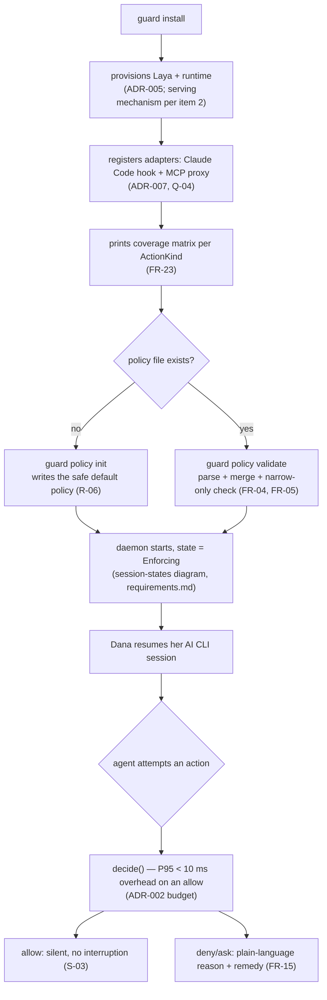
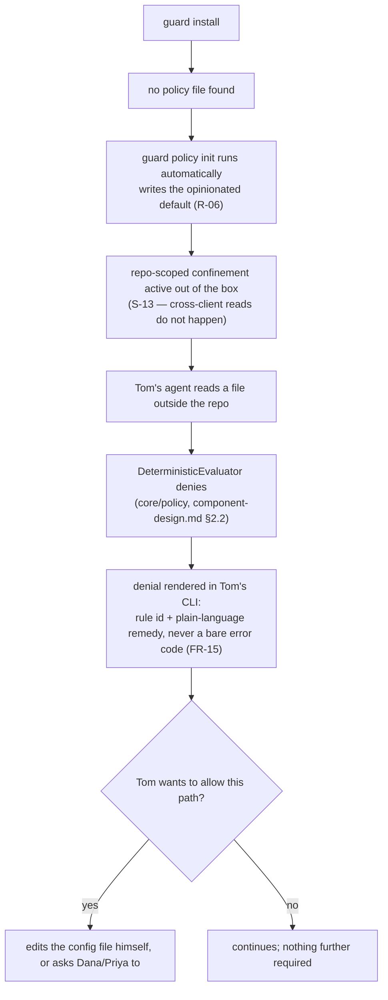
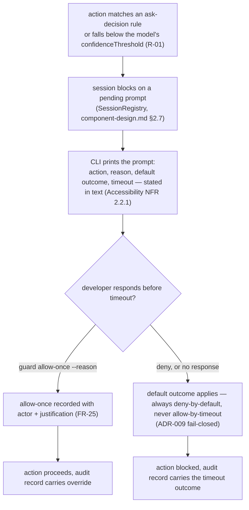
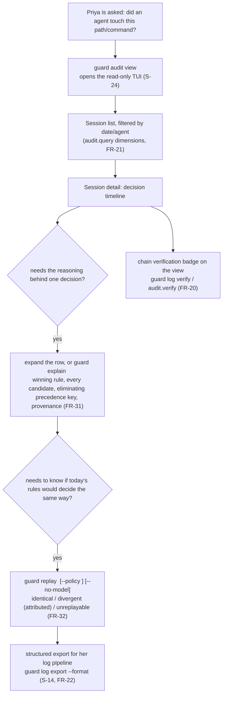
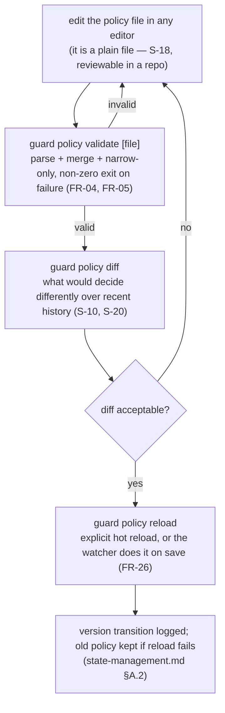
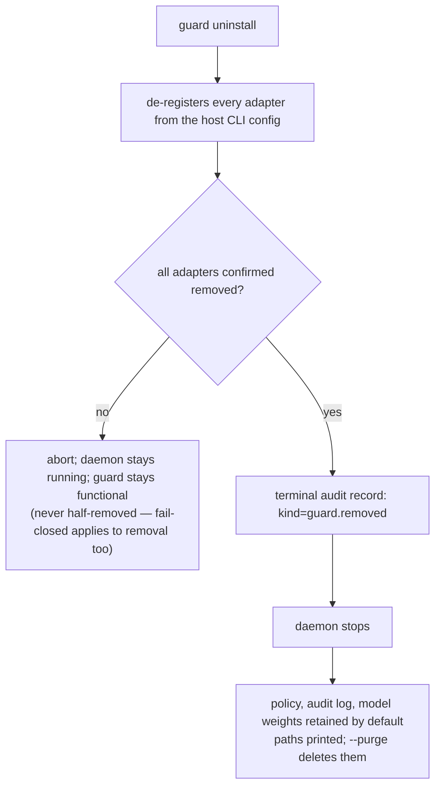
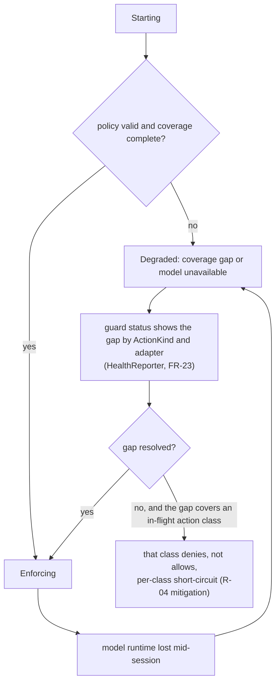
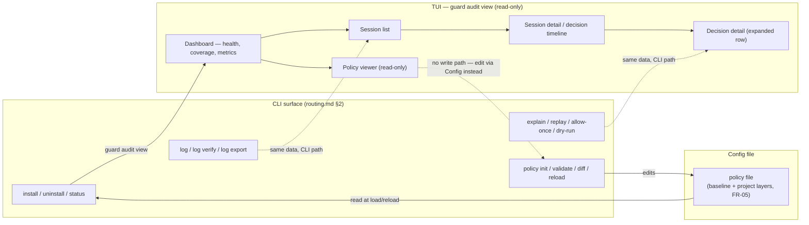

# 02 — UX Design: User Flows

**Status**: Draft
**Last updated**: 2026-10-02
**Approved by**: _pending_

> **Prerequisite met.** Discovery is Approved ([`../01-discovery/README.md`](../01-discovery/README.md),
> 2026-10-02) — both blockers (Q-01: the model is **Laya**; Q-09: **single-language Rust**) are
> resolved in [ADR-013](../05-adr/013-model-and-language-resolution.md). Phase 3 and Phase 4 were
> drafted ahead of this phase at the product owner's request; this document is written to be
> consistent with them rather than to re-derive their decisions, and cites them where it relies on one.

## What "user flow" means for this product

`.ai/templates/ux-design.md` asks for flowcharts of key journeys through screens. This product has
no screens in that sense — its three surfaces are a **CLI**, a **config file**, and a **read-only
TUI** audit viewer ([ADR-010](../05-adr/010-supersede-adr-001-no-web-server-ui.md),
[ADR-011](../05-adr/011-v1-scope-envelope.md)). A "flow" here is a sequence of terminal
interactions over time — often across more than one command invocation, sometimes across days —
not a path through pages. The flowcharts below use `guard <command>` nodes and TUI-view nodes
interchangeably, the way the persona actually experiences them.

Every flow below is reachable with the keyboard alone and produces text output that survives
`NO_COLOR` (Accessibility NFR) — that constraint shapes every wireframe in
[`wireframes.md`](wireframes.md), not just the TUI ones.

---

## Flow 1 — Install to first enforced decision (Dana, S-09, S-01, S-03)

Dana's rejection condition is noise and latency ([`../01-discovery/user-personas.md`](../01-discovery/user-personas.md)
P1). This flow has to reach *enforcing* in minutes with zero prompts beyond the ones she asked for.

**Why no confirmation step after install**: S-09 budgets install at under 5 minutes and Dana
rejects anything that adds friction before she sees value; `guard status` (Flow-adjacent, not a
gate) is available on demand rather than inserted into this path.

---

## Flow 2 — Zero-authoring default policy, first denial (Tom, S-04, S-05, R-06)

Tom never opens a settings file ([`../01-discovery/user-personas.md`](../01-discovery/user-personas.md)
P4: "He rejects it if first run presents him with an empty policy file"). This flow is deliberately
the same install path as Flow 1 with no detour through policy authoring.

**Rejection condition this flow protects against**: "a denial gives him an error code with no
explanation" — every denial text in [`wireframes.md`](wireframes.md) Screen B carries the rule id
and a next step, never a code alone.

---

## Flow 3 — Interactive `ask` resolution (S-15, FR-25)

**Why the default can never be allow**: a timed-out prompt is, by construction, a case the engine
could not resolve; ADR-009's fail-closed default applies identically to an unanswered `ask` as to
an unavailable evaluator.

---

## Flow 4 — Investigating a past decision (Priya, S-26, FR-30–32)

Priya's goal is evidence, not just a log line. This is the flow `guard explain` and `guard replay`
exist for, and the one place the TUI and the CLI cover the same ground on purpose — see
[`wireframes.md`](wireframes.md) Screens E, F, K.

**Why `explain` and `replay` are separate commands**: `explain` reads the record and evaluates
nothing — it works with the model stopped or the policy deleted. `replay` re-runs the pipeline.
Conflating them would mean the evidence path depends on the engine still running, which Priya's
"did it happen" question must not.

---

## Flow 5 — Policy iteration loop (S-10, S-18, S-20)

**Why `diff` sits before `reload`, not after**: a security policy's last-write-wins risk is exactly
what `diff` exists to prevent seeing *after* the fact — the loop is designed so the developer sees
the consequence before it is live, not as a forensic step afterward.

---

## Flow 6 — Clean removal (Dana, S-25, FR-27)

This is the UX framing of the removal-ordering invariant already specified in
[`../04-solution-design/routing.md`](../04-solution-design/routing.md#21-removal-semantics-guard-uninstall);
it is restated here only to the depth a flow diagram needs — the full state machine is canonical there.

**Why this matters as UX, not just mechanics**: Dana's stated condition for trying the product at
all is that leaving it must be as cheap as starting ([`../01-discovery/user-personas.md`](../01-discovery/user-personas.md)
P1). A removal flow that can strand her CLI mid-session is the one failure that would confirm her
prior (correct) instinct about permission prompts.

---

## Flow 7 — Degraded mode (coverage gap or model unavailable; ADR-009)

**What the user actually sees**: never a silent allow and never an unexplained hang. `guard status`
is the one command every other flow's "is something wrong?" question routes back to — it is the
single source of truth for "why is this slower / quieter / noisier than usual," which is why
Screen D in [`wireframes.md`](wireframes.md) is written as the first screen to design precisely.

---

## Information Architecture

Not a page sitemap — a map of how the three surfaces relate, and how a developer moves between
them. CLI commands launch into the TUI in one direction only (`guard audit view` opens it; nothing
inside the TUI launches a CLI command, since the TUI is read-only by construction —
[ADR-010](../05-adr/010-supersede-adr-001-no-web-server-ui.md) item 3).

**The one rule this diagram enforces**: every TUI view has a CLI equivalent that returns the same
rows as linear text (`guard audit query`, `guard explain`, `guard log`). That equivalence is not a
convenience — it is the Accessibility NFR's screen-reader conformance path (1.3.1, 4.1.2), tested
as a pass/fail check in [`../04-solution-design/testing-strategy.md`](../04-solution-design/testing-strategy.md)
§1a, not merely documented. The TUI is the *faster* way to browse; the CLI path is never the
degraded one.

---
**Status**: Draft
**Last updated**: 2026-10-02
**Approved by**: _pending_
