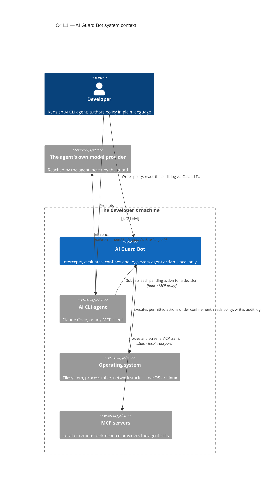
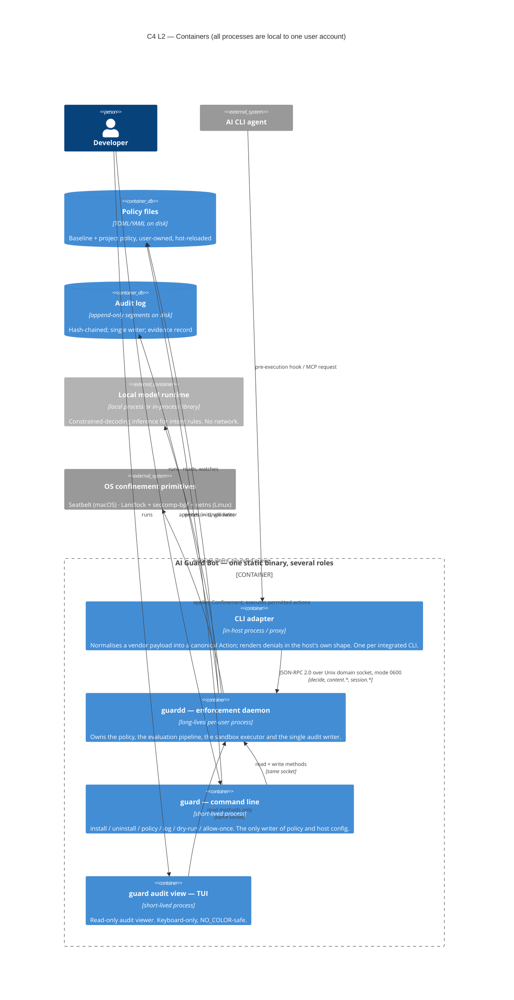
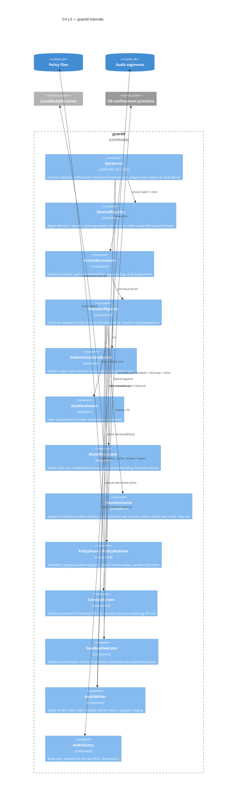
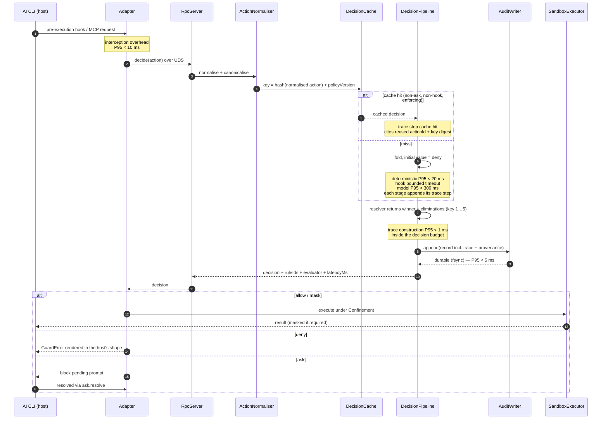
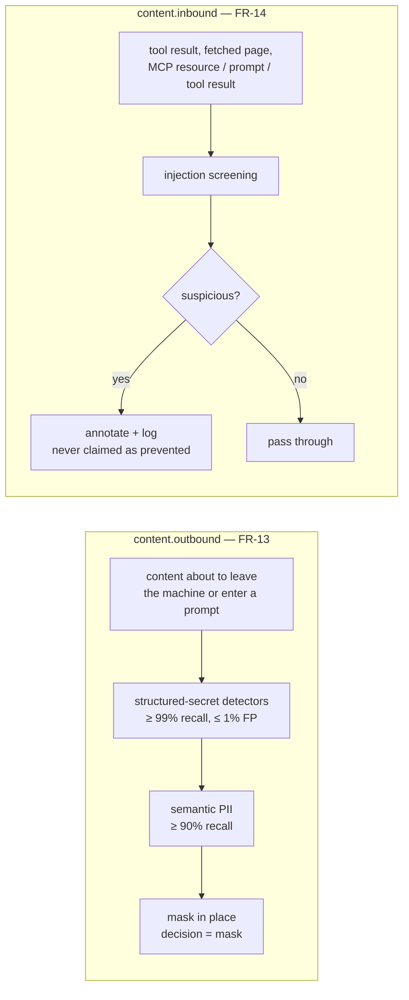
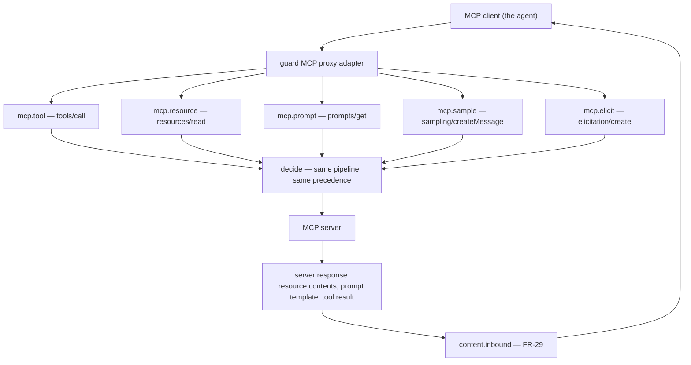
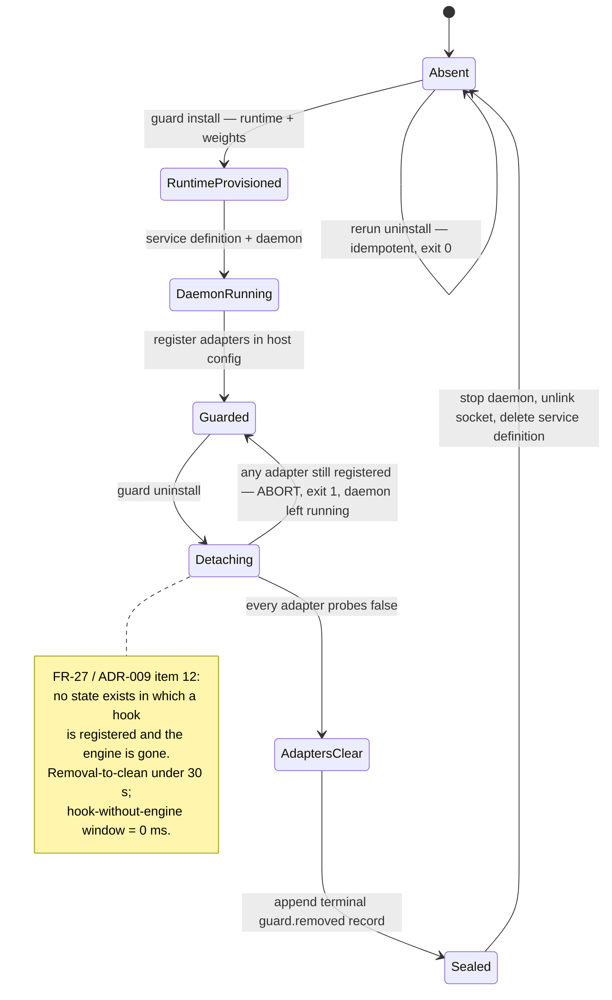
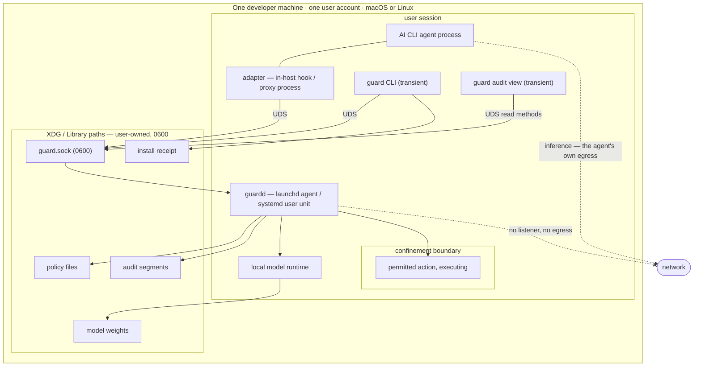

# 03 — System Design: Architecture

**Status**: Draft
**Last updated**: 2026-10-04 — A-2 and §8 updated for [ADR-014](../05-adr/014-laya-serving-resolution.md)'s resolution of the Laya-serving open point
**Approved by**: _pending_

> **Phase-gate note.** `docs/03-system-design/README.md` names **UX Design approved** as this
> phase's prerequisite. Phase 2 is **⬜ Not started**; Phase 1 is now **Approved** (Q-01 and Q-09
> answered 2026-10-02 — [ADR-013](../05-adr/013-model-and-language-resolution.md)), but that does
> not satisfy *this* phase's own prerequisite. This document is drafted ahead of that gate at the
> product owner's explicit request —
> the same precedent under which Phase 4 was drafted. Two consequences, stated rather than absorbed:
>
> 1. **No UX artefact is cited as settled.** Where a decision here touches the interface, it rests
>    on [ADR-010](../05-adr/010-supersede-adr-001-no-web-server-ui.md) and
>    [ADR-011](../05-adr/011-v1-scope-envelope.md) (CLI + config file + read-only TUI), not on a
>    Phase 2 deliverable. Phase 2, when it runs, may reshape the TUI view inventory
>    ([`../04-solution-design/routing.md`](../04-solution-design/routing.md) §3) without reopening
>    anything in this document.
> 2. **Phase 4 exists and was written first.** Phase 4 is a *shape*; Phase 3 is canonical. Where
>    this document and Phase 4 differ, §7 names the difference explicitly and Phase 4 is to be
>    superseded, not silently reconciled.

**Assumptions carried, not resolved** (§8 lists what changes if the owner decides otherwise):

| # | Assumption | Source | Status |
|---|---|---|---|
| **A-1** | The product is **single-language Rust**: enforcement core, CLI and TUI are one binary, one type set, no Node runtime shipped. | Q-09 / [ADR-013](../05-adr/013-model-and-language-resolution.md), amending [ADR-002](../05-adr/002-enforcement-core-language.md) | **Confirmed 2026-10-02.** |
| **A-2** | The local model is **Laya** (ONNX, `choice`/`score`/`noul`, not a chat LLM), served via its own `laya-serve` reference server as a provisioned local sidecar. No figure in this document is yet re-derived from Laya's own measured numbers — ADR-014 treats the published figures as secondary-source estimates pending re-measurement at S-6. | Q-01 / [ADR-013](../05-adr/013-model-and-language-resolution.md); serving mechanism resolved by [ADR-014](../05-adr/014-laya-serving-resolution.md) | **Named 2026-10-02; serving mechanism resolved 2026-10-04.** |
| **A-3** | TypeScript interface syntax is used throughout Phases 3 and 4 as **schema notation**, not as an implementation-language commitment. Under A-1 these become Rust `struct`/`enum` with `serde`. | Editorial | Notation only. |

---

## 1. What this system is, in one diagram's worth of words

AI Guard Bot sits between an AI CLI agent and the machine. Every action the agent attempts is
intercepted **before execution**, evaluated against developer-authored policy, and resolved to
`allow` / `deny` / `ask` / `mask`; permitted actions then execute inside an OS-native confinement
boundary, and every decision is appended to a hash-chained audit log before the agent is told
anything. Nothing in the decision path touches the network.

Three properties drive every structural choice below, and each is an architectural constraint rather
than a quality target:

- **Fail-closed is the pipeline's initial value, not a branch** ([ADR-009](../05-adr/009-fail-closed-default.md)).
  There is no code path that reaches "allow" by omission.
- **The decision path is local and offline** — the Privacy NFR is verifiable by inspection because
  the product **opens no TCP listener in any configuration** ([ADR-003](../05-adr/003-local-daemon-over-unix-socket.md)).
- **Latency is a correctness property, not a nicety** (R-03). A guardrail developers turn off
  guards nothing, so the model is kept off the hot path for ≥ 80 % of actions by construction.

---

## 2. C4 Level 1 — System context

**Read the L1 for what is absent.** There is no control plane, no telemetry endpoint, no shared
baseline, no license server, and no second user — all four are out of scope by
[ADR-011](../05-adr/011-v1-scope-envelope.md), and their absence is what makes the Privacy NFR a
structural fact rather than a policy promise. The one network relation in the diagram belongs to the
**agent**, not to the guard.

---

## 3. C4 Level 2 — Containers

### 3.1 Why a long-lived daemon and not a per-invocation process

Ratifies [ADR-003](../05-adr/003-local-daemon-over-unix-socket.md). A hook fires on **every** action;
a cold process per action cannot meet a P95 < 20 ms deterministic budget, and the model runtime's
warm-up (up to 15 s, Performance NFR) is unamortisable without a resident process. The daemon also
makes three invariants cheap that are otherwise expensive: one policy version active at a time
(atomic swap), one audit writer (hash-chain integrity), one bounded model queue (saturation is
detectable rather than emergent).

### 3.2 Why the socket is the whole of the authorisation model

There is **one local user**. Anyone who can `open(2)` a `0600` user-owned socket already holds that
user's privileges, so an authentication layer on top of it would secure nothing while implying a
boundary that does not exist. What the architecture *does* enforce is a **capability split by
method** (§4.3) and the R-07 invariant that the guarded agent's `Confinement` can never include the
socket path or the engine's config directory — a construction, not a rule a policy author could
forget. This is developed in [`security.md`](security.md) §4.

### 3.3 One binary, several roles

Under A-1 the adapter, daemon, CLI and TUI are the same executable dispatching on `argv[0]`/subcommand
— ratifying [ADR-002](../05-adr/002-enforcement-core-language.md) as amended. Consequences that
matter architecturally: a single version number spans the whole product (so an adapter can never be
newer than the engine it talks to); `install` has one artefact to place; `uninstall` has one to
remove; and the coverage matrix the adapter publishes is compiled from the same `ActionKind` enum the
pipeline evaluates, so a matrix cell cannot drift from a real action class.

---

## 4. C4 Level 3 — Components inside `guardd`

### 4.1 The pipeline is a fold, and that is the fail-closed guarantee

Ratifies [ADR-009](../05-adr/009-fail-closed-default.md). `DecisionPipeline` is a fold whose
**initial value is `deny`**; each evaluator may only return a decision that the precedence relation
accepts as a replacement. There is no `else { allow }` anywhere in the pipeline, and no early return
that skips the audit append. The architectural consequences:

- An unmapped `ActionKind` — a coverage gap — denies, because nothing ever replaced the initial
  value (FR-10).
- An evaluator that panics, times out, or returns malformed output denies, for the same reason.
- `failOpen` exists only as a **per-rule** `{ justification: string }`. It is not a mode, not a
  global flag, and not reachable by configuration error; a rule that wants it must carry prose
  explaining why.
- Dry-run (FR-16) does **not** alter the fold. It alters only what the adapter does with the
  decision, and the audit record carries `mode: 'dry-run'` so the two are never confused in evidence.

**The fold also accumulates the decision trace** ([ADR-012](../05-adr/012-decision-trace.md), FR-30).
Each stage appends its step as it runs, so the trace is a by-product of evaluation rather than a second
pass over it: there is no "tracing enabled" variant of the pipeline, and an evaluator that returned a
decision without appending its step fails a pipeline invariant test. This is the same structural move as
fail-closed — a property produced by the shape of the code rather than enforced by remembering to do it.
Its consequence is the case that matters most: when nothing replaces the initial `deny`, the record
still carries the step that explains **why** nothing decided — a coverage gap, an unavailable runtime, a
hook timeout, a failed normalisation ([`data-model.md`](data-model.md) §5.5.3). A fail-closed deny with
no account of itself would be indistinguishable, to a user, from a malfunction.

### 4.2 Evaluator ordering is a cost gradient, not a preference

Ratifies [ADR-004](../05-adr/004-layered-policy-model.md). Deterministic rules run first and
short-circuit; hooks run on the residual; the model runs only on what remains. This is what buys the
"≥ 80 % of actions resolved without the model" NFR and what keeps R-01 survivable: the catastrophic
classes (credential paths, destructive commands, egress) are **deterministic by requirement**, so a
wrong model is never the only thing between the agent and an irreversible action.

Precedence is a **fixed total order**, resolved identically by every caller (CLI simulation, daemon,
replay, tests). The order and its formalisation live in [`api-design.md`](api-design.md) §6; a tie that
the relation cannot break is a **policy validation failure**, not a runtime coin-flip. The resolver
returns its comparisons as data — one entry per eliminated candidate, naming the deciding key
([`api-design.md`](api-design.md) §6.4) — which is what lets the audit record show that a cheap layer
was overruled rather than merely show who won.

### 4.3 The capability split

| Capability | `decide` | `content.*` | policy write | `ask.resolve` | audit append | audit read |
|---|---|---|---|---|---|---|
| Adapter | ✅ | ✅ | — | — | — | — |
| `guard` CLI | — | — | ✅ | ✅ | — | ✅ |
| TUI | — | — | — | — | — | ✅ |
| `AuditWriter` (internal) | — | — | — | — | ✅ **only** | — |

No caller outside an adapter can invoke `decide`; **nothing at all** can write an audit record over
the RPC surface — appending is `AuditWriter`'s private capability, reachable only from the pipeline.
This is why audit tampering is an adversarial-gate case rather than an access-control rule.

---

## 5. Technology stack

| Layer | Technology | Rationale |
|---|---|---|
| Enforcement core | **Rust** (2021 edition or later), single static binary | [ADR-002](../05-adr/002-enforcement-core-language.md). No GC pauses inside a P99 < 50 ms budget; the OS confinement primitives are C ABIs reached without an extra FFI boundary; one artefact to install and remove. |
| CLI + TUI | **Rust**, same binary (A-1) | [ADR-010](../05-adr/010-supersede-adr-001-no-web-server-ui.md), [ADR-013](../05-adr/013-model-and-language-resolution.md). A read-only TUI leaves TypeScript with no consumer; one language means one hand-written type set and no codegen step. |
| IPC | **JSON-RPC 2.0 over a Unix domain socket**, mode `0600` | [ADR-003](../05-adr/003-local-daemon-over-unix-socket.md). Filesystem permissions are the authentication; no TCP listener in any configuration, which makes the Privacy NFR inspectable. JSON keeps the wire human-auditable at a cost the budgets absorb (§6). |
| Policy format | **Declarative text (TOML or YAML), user-owned, git-committable** | FR-04/FR-05: policy must be reviewable in a pull request and validated in CI (`guard policy validate`, exit `2`). The exact surface is fixed in [`data-model.md`](data-model.md) §3. |
| Model runtime | **Pluggable `LocalModelRuntime` port**, constrained decoding (Laya's own output has no free-text channel to constrain), model named as Laya and served via its own `laya-serve` sidecar (A-2) | [ADR-005](../05-adr/005-pluggable-local-model-runtime.md), [ADR-013](../05-adr/013-model-and-language-resolution.md), [ADR-014](../05-adr/014-laya-serving-resolution.md). The port exists so the choice is late-bound and a recorded-response stub serves tests deterministically regardless of how the model is served. |
| Confinement | **OS-native**: Seatbelt / `sandbox_init` (macOS); Landlock + seccomp-bpf + network namespace (Linux) | [ADR-008](../05-adr/008-sandbox-confinement-primitive.md). A hand-rolled boundary would be a new attack surface claiming to be a mitigation. **Windows unsupported and no Windows boundary claim is published.** |
| Audit store | **Embedded, append-only, hash-chained segments**; engine chosen against a measured benchmark | [ADR-006](../05-adr/006-audit-log-integrity.md). Selection criteria and the benchmark that decides it are in [`data-model.md`](data-model.md) §6 — the P95 < 5 ms durable-append budget is the gate, not a preference between libraries. |
| Service management | **launchd user agent** (macOS) / **systemd user unit** (Linux) | Per-user, no root. Owned by `install`/`uninstall` and torn down **last** ([ADR-003](../05-adr/003-local-daemon-over-unix-socket.md) item 7). |
| CI | **GitHub Actions**, macOS + Linux runners on real kernels | [ADR-011](../05-adr/011-v1-scope-envelope.md): both platforms adversarially tested. The confinement boundary cannot be asserted in a container that fakes the primitive. |

**Not chosen, deliberately**: any HTTP server or framework (no TCP port exists to serve on); any
database server (a single-user local tool with one writer); any cloud SDK; any dynamic plugin loading
in the decision path (a loadable evaluator is an arbitrary-code hole in a security boundary — hooks
run as bounded external processes instead).

---

## 6. Runtime views

### 6.1 The hot path, with budgets attached

**The audit append precedes the response.** That ordering *is* the "zero decisions unlogged"
guarantee (FR-19): there is no window in which the agent has been told it may proceed but the record
does not yet exist. It is also why the 5 ms durable-append budget is load-bearing rather than
aspirational — it sits inside the 20 ms decision budget.

**The trace is written on that same append** (FR-30), not afterwards and not elsewhere. A second write
would reintroduce precisely the window the first one closes: a decision returned, then an explanation
that may or may not land. One record, one fsync, one hash
([ADR-012](../05-adr/012-decision-trace.md) item 1).

### 6.2 Content screening — the two directions are different problems

Outbound screening **changes the content** and therefore needs precision (a false positive corrupts
the agent's input). Inbound screening **does not change the content**; it annotates and logs, because
[ADR-011](../05-adr/011-v1-scope-envelope.md) fixes injection-driven escape as *detected and logged,
never described as prevented*. Conflating the two would publish a claim the product cannot defend —
see [`security.md`](security.md) §3.

### 6.3 MCP: five request classes, five coverage cells

Per **FR-28**, each MCP request class is a distinct `ActionKind` with its own normaliser and **its own
cell in the coverage matrix**, so a gap in one fails closed instead of inheriting another's coverage:

`mcp.sample` is an action in its own right because **it inverts control**: the server asks the agent's
model to generate, which is a capability request, not a result (FR-29). Treating it as a response
would leave the inversion unevaluated.

### 6.4 Lifecycle: install is bottom-up, removal is top-down

The asymmetry is the point. Install provisions bottom-up because each layer needs the one below;
removal must run top-down because, under fail-closed, a registered adapter with no reachable engine
**denies every host action** — so stopping the daemon first is the one genuinely destructive
sequencing error this product can make, and the `Detaching → Guarded` transition exists to make it
unreachable. A failed uninstall leaves a working guard, never a broken host CLI. Policy file, audit
log and model weights survive by default and their paths are printed; `--purge` is required to delete
them. Detail: [`../04-solution-design/routing.md`](../04-solution-design/routing.md) §2.1.

### 6.5 Deployment view

Everything runs as the invoking user; nothing needs root. The confinement boundary is applied to the
**executed action**, not to the daemon. The daemon has no network path at all — and because there is
no TCP listener in any configuration, that is checkable with `lsof`/`ss` rather than argued from code.

---

## 7. Disposition of the Proposed ADRs

Phase 3's job is to accept or supersede the Proposed ADRs. None is superseded. Several are **ratified
with the Phase-3-owned detail they delegated**, and the delegated work is assigned to a document here
rather than left open:

| ADR | Disposition | Phase 3 obligation discharged in |
|---|---|---|
| 002 — Rust core | **Ratified, with the Q-09 amendment confirmed** (A-1): single-language Rust, one binary, one type set — [ADR-013](../05-adr/013-model-and-language-resolution.md). | §3.3, §5 |
| 003 — local daemon over UDS | **Ratified.** The socket path is treated as part of the threat model, not an implementation detail. | §3.1, §6.5; [`security.md`](security.md) §4.2 |
| 004 — layered policy evaluation | **Ratified.** The **specificity relation** the total order depends on is formalised rather than asserted. | [`api-design.md`](api-design.md) §6 |
| 005 — pluggable local model runtime | **Ratified.** The **constrained-decoding schema** is defined, and a runtime that cannot honour it is **rejected at startup** rather than trusted and parsed defensively. | [`api-design.md`](api-design.md) §7 |
| 006 — hash-chained audit log | **Ratified.** The embedded store is selected against a **measured durable-append benchmark** against the 5 ms budget; segment/rotation format and the `guard.removed` terminal record are specified. | [`data-model.md`](data-model.md) §5, §6 |
| 007 — per-CLI adapters + coverage matrix | **Ratified.** The coverage matrix's **`ActionKind` list is fixed here**, including the five `mcp.*` cells (FR-28); an incomplete matrix fails startup. | [`data-model.md`](data-model.md) §2; [`api-design.md`](api-design.md) §8 |
| 008 — OS-native confinement | **Ratified.** The per-platform `BoundaryDescription` is written, and the published threat model carries the no-prevention statement **verbatim**. A claim without a passing adversarial test is deleted rather than softened. | [`security.md`](security.md) §2, §3 |
| 009 — fail-closed as a default value | **Ratified.** Expressed structurally as the fold's initial value, with removal as the one lifecycle operation whose *ordering* preserves the invariant. | §4.1, §6.4 |
| 010 — no web-server UI | **Ratified.** No HTTP surface anywhere; the CORS review-criteria item is therefore N/A with reason. | §5; [`security.md`](security.md) §8 |
| 011 — v1 scope envelope | **Ratified as the scope this design implements.** Two adapters, two platforms, enforcing from the first action, removal in the envelope. | throughout |
| 001 — React/Next.js | Already superseded by ADR-010. **Binds nothing.** Not cited as a constraint anywhere in Phase 3. | — |
| 012 — decision trace | **Raised by this phase and adopted into this design** (not a delegation from Phase 2): the evidence record was carrying a verdict without its grounds. The fold accumulates the trace, the resolver reports its comparisons, the runtime reports its identity, and `explain`/`replay` are product surfaces with budgets. | §4.1, §4.2, §6.1, §9; [`data-model.md`](data-model.md) §5.5; [`api-design.md`](api-design.md) §3.1, §6.4, §7.6 |

**Phase 4 corrections carried here.** [`../04-solution-design/component-design.md`](../04-solution-design/component-design.md)
§3 (web UI component tree) is withdrawn as a build target and survives only as the TUI view
inventory; [`routing.md`](../04-solution-design/routing.md) §3 likewise. Phase 4's wire shapes are
superseded by [`api-design.md`](api-design.md) where they differ — specifically: `mcp.call` is split
into five kinds, and the `GuardError` code list is **closed** ([`api-design.md`](api-design.md) §5)
rather than illustrative.

---

## 8. What the open-question resolutions changed, and what is left open

Both questions this section used to treat as live hypotheticals were answered by the product owner
on 2026-10-02 ([ADR-013](../05-adr/013-model-and-language-resolution.md)). The narrower point that
answer raised — how Laya is served — was itself resolved by the owner on 2026-10-04
([ADR-014](../05-adr/014-laya-serving-resolution.md)). This section now records what those answers
confirmed, kept as a historical note of the delta this document would otherwise have absorbed. No
open point remains.

**Q-09 — single-language Rust, confirmed** (A-1 confirmed, not falsified): the TypeScript-consumer
branch this section used to describe did not happen. The wire types stay **hand-written** in one
language; the TUI stays in the same process and binary as the engine, so `install`/`uninstall` place
and remove one file, not two; and the version-skew guarantee in §3.3 (an adapter can never be newer
than the engine) remains a property of shared compilation rather than needing an explicit handshake
in `session.open`. Nothing in §4 or §6 changes from what is already written there.

**Q-01 — the local model is Laya** (A-2, named 2026-10-02, serving mechanism resolved 2026-10-04):
naming the model does not by itself change the architecture, because the constrained-decoding
schema ([`api-design.md`](api-design.md) §7) and the rejection-at-startup rule make the port's
contract independent of model identity. What naming Laya *does* gate: the resident-memory NFR
(< 5 GB including the model), the warm-up figure inside the < 15 s cold start, and the accuracy
corpus's achievable headroom against FR-11 — none of those numbers in this document has yet been
re-derived from a measured baseline (the ≈1.7 GB fp32 ONNX weights and ≈140 ms warm 3-question
batch figure are secondary-source estimates, per [ADR-014](../05-adr/014-laya-serving-resolution.md)),
and that re-derivation is deferred to the start of S-6, not before.

**Resolved: how Laya is served.** Laya's only published Node/TypeScript wrapper, and its shape as
an ONNX classifier rather than a chat model, put it in tension with both the single-language-Rust
confirmation above and this document's original "default to an Ollama-class local server" framing
of decision item 2 ([ADR-005](../05-adr/005-pluggable-local-model-runtime.md)). ADR-013 named two
resolutions without choosing one — (a) an Ollama-servable substitute, or (b) embedding `ort` plus a
from-scratch Rust reimplementation of Laya's pre/post-processing — and
[ADR-014](../05-adr/014-laya-serving-resolution.md) took neither: it runs Laya's own Python
reference server (`laya-serve`) as a provisioned local sidecar over loopback HTTP, which needs no
Node and no Rust reimplementation of Laya's internals. The `ModelEvaluator` port and the
constrained-decoding schema this document already specifies do not change — only what sits behind
the port does. ADR-014 also replaced the model-generated reason string with one the engine
templates from whichever per-rule `noul` check(s) crossed threshold, and requires every decision's
rule-checks to be batched into a single call to `laya-serve` to stay inside the P95/P99 budget on
CPU-only hardware.

---

## 9. Non-functional requirements this architecture must meet

Reproduced from [`../01-discovery/requirements.md`](../01-discovery/requirements.md) as **acceptance
conditions on this design**, with the structural reason each is reachable. The CI gate that measures
each one is named in [`../04-solution-design/testing-strategy.md`](../04-solution-design/testing-strategy.md)
§2.3 and in [`../07-implementation/implementation-plan.md`](../07-implementation/implementation-plan.md).

| NFR | Budget | Reached by |
|---|---|---|
| Deterministic decision | **P95 < 20 ms, P99 < 50 ms** | Resident daemon; short-circuiting pattern evaluation; no GC; cache on repeat |
| Model-path decision | **P95 < 300 ms, P99 < 800 ms** | Warm runtime, bounded queue, constrained decoding (few output tokens) |
| Actions resolved without the model | **≥ 80 %** | Deterministic-first ordering (§4.2); catastrophic classes deterministic by requirement |
| Interception overhead | **P95 < 10 ms** | Thin adapter; normalisation only; no policy logic in-host |
| Policy load | **< 500 ms for 200 rules** | Parse + validate + merge off the hot path; atomic swap |
| Audit write | **P95 < 5 ms**, never blocking beyond that | Append-only segments, single writer, one fsync (§6.1) |
| Audit query | **P95 < 1 s over 1 M records** | Indexes on the five FR-21 dimensions ([`data-model.md`](data-model.md) §6) |
| Trace construction | **P95 < 1 ms, P99 < 2 ms** — inside the decision budget, not added to it | Steps pushed onto a pre-sized buffer during evaluation; the resolver already computes the comparisons it reports (§4.2) |
| Explain a recorded decision | **P95 < 50 ms** | One indexed record read plus formatting; no evaluation, no policy load, works while the runtime is down |
| Replay a recorded decision | deterministic **P95 < 100 ms**; model path inherits **P95 < 300 ms** | Same resolver and evaluators as enforcement, no audit append, no cache write |
| Encoded trace size | **P50 ≤ 512 B, P99 ≤ 4 KB, 16 KB hard cap** | Schema-level caps (≤ 16 steps, ≤ 32 candidates); ids and enums, never content |
| Cold start to first decision | **< 2 s excl. model runtime; < 15 s incl.** | Daemon decides on deterministic rules before the runtime is warm; model rules deny until it is |
| Concurrent sessions | **≥ 4** | Per-session cache scope; round-robin fairness over one bounded queue |
| Memory | **engine RSS < 250 MB; < 5 GB incl. model** | Bounded queue and bounded cache; weights outside the engine's heap |
| Idle CPU | **< 1 %** | Event-driven; policy watcher on filesystem events, no polling loop |
| Log growth | **< 1 GB / 30 days** | Segment rotation with sealed terminal hashes |
| Crash recovery | **< 5 s** | Verify chain tail on start; refuse to append past a break; no in-memory state to rebuild |
| Install to first decision | **< 5 min** | One binary; runtime provisioning is the only long step |
| Removal to clean state | **< 30 s** (excl. `--purge` of weights) | Top-down teardown, probe-verified (§6.4) |
| Hook-registered-with-no-engine window | **0 ms — no such state exists** | Ordering invariant, ADR-009 item 12 |

---

## 10. External integrations

| Integration | Direction | Transport | Failure mode |
|---|---|---|---|
| Claude Code hook adapter | host → guard | pre-execution hook, process invocation | Host version outside `supportedVersions` → `AGENT_VERSION_UNSUPPORTED`; unreachable engine → **deny** (fail-closed) |
| MCP proxy adapter | host ↔ guard ↔ MCP server | stdio / local MCP transport | Unmapped request class → **deny** (`COVERAGE_GAP`, FR-10); server response screened as inbound content (FR-29) |
| Local model runtime | guard → runtime | in-process or local IPC, **never network** | Unavailable → `EVALUATOR_UNAVAILABLE` → deny; saturated → `EVALUATOR_SATURATED` → deny; malformed output → deny |
| OS confinement primitive | guard → kernel | `sandbox_init` / Landlock + seccomp + netns | Primitive unavailable or unsupported platform → refuse to start rather than execute unconfined |
| Policy file | user → guard | filesystem watch | Invalid → **keep the previous version active**, report `POLICY_INVALID`; never activate a partially-parsed policy |
| Host CLI config | guard → user's file | surgical edit by the adapter | Hand-edited → `uninstall` reports `already-absent` and exits `0`; the probe is the authority, not the receipt |

There is **no** integration with a vendor API, telemetry sink, update server, or licence service.

---

## 11. System Design review checklist

From [`../../.ai/rules/review-criteria.md`](../../.ai/rules/review-criteria.md). Items that do not
apply to a local, single-user, no-HTTP product are marked N/A **with the reason**, never silently.

| Criterion | Status | Where / why |
|---|---|---|
| Architecture diagram matches requirements | ✅ | §2–§4; traceability in [`data-model.md`](data-model.md) §8 |
| Data model normalised (3NF) or denormalisation justified | ✅ | [`data-model.md`](data-model.md) §7 — the audit record's deliberate denormalisation is justified as immutable evidence |
| API RESTful, or a justification for RPC/GraphQL | ✅ **justified RPC** | [`api-design.md`](api-design.md) §2 — there is no HTTP surface to be REST over; JSON-RPC over UDS per ADR-003 |
| Authentication / authorisation on every endpoint | ✅ | §3.2, §4.3; [`security.md`](security.md) §4 — socket permissions are the authentication; the method-level read/write split is the authorisation |
| Rate-limiting strategy | ✅ | [`security.md`](security.md) §6 — bounded model queue, saturation → deny, per-session round-robin fairness, hook hard timeouts |
| N+1 query prevention | ✅ | [`data-model.md`](data-model.md) §6 — indexed single-scan audit queries; the TUI streams rather than fetching per record |
| CORS policy | **N/A, with reason** | [`security.md`](security.md) §8 — the product binds no TCP port and serves no browser origin in any configuration (ADR-003 item 4, ADR-010). A CORS policy would imply an HTTP surface that does not exist. |

---

**Related**: [`data-model.md`](data-model.md) · [`api-design.md`](api-design.md) ·
[`security.md`](security.md) · [`../01-discovery/requirements.md`](../01-discovery/requirements.md) ·
[`../04-solution-design/component-design.md`](../04-solution-design/component-design.md) ·
[`../05-adr/README.md`](../05-adr/README.md) ·
[`../07-implementation/implementation-plan.md`](../07-implementation/implementation-plan.md)
