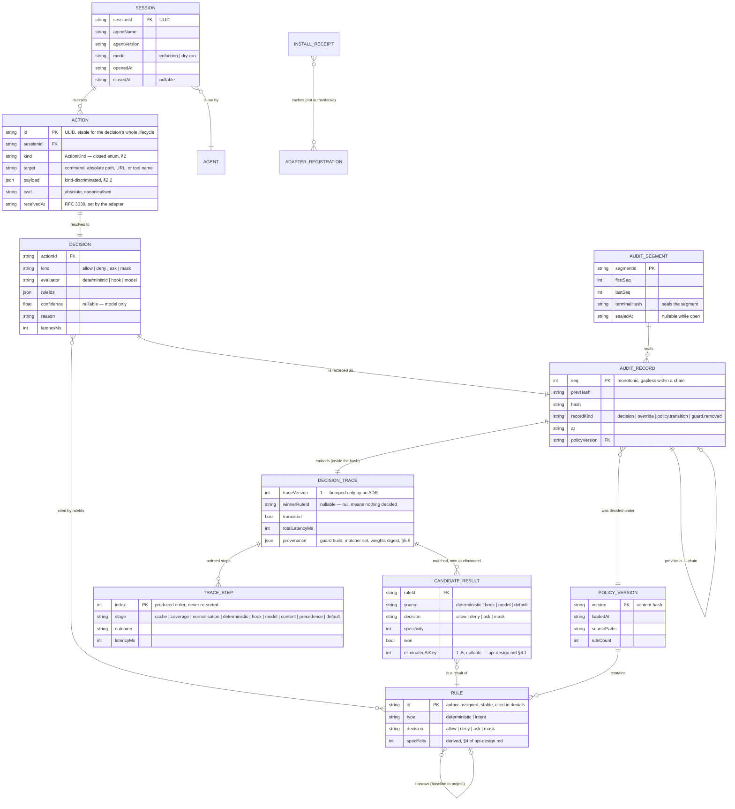
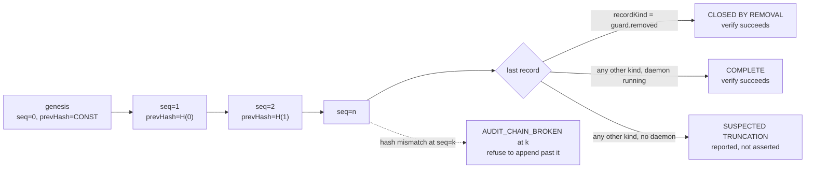

# 03 — System Design: Data Model

**Status**: Draft
**Last updated**: 2026-10-02
**Approved by**: _pending_

> **Phase-gate note.** Drafted ahead of the Phase 3 prerequisite (**UX Design approved**) at the
> product owner's explicit request; carries assumptions **A-1 … A-3** from
> [`architecture.md`](architecture.md). Schemas are written in TypeScript interface syntax as
> **notation** (A-3); under A-1 they are Rust `struct`/`enum` with `serde`. This document is
> **canonical** where it differs from [`../04-solution-design/component-design.md`](../04-solution-design/component-design.md).

This product has four kinds of data and they have genuinely different natures, which is why one
storage decision does not cover them:

| Entity | Lifetime | Mutability | Owner | Store |
|---|---|---|---|---|
| **Action** | one decision | immutable once normalised | the adapter creates, the engine owns | in memory; embedded in the audit record |
| **Policy** | until edited | replaced wholesale, never patched | **the user** | text file(s) on disk, git-committable |
| **AuditRecord** | forever | **append-only, immutable** | the engine | hash-chained segments |
| **Session / runtime state** | one agent session | mutable | the engine | memory only, deliberately not persisted |

---

## 1. Entity-relationship view



**`SESSION` is shown for completeness and is not persisted.** It is reconstructible from the audit
log (every record carries `sessionId`, `agent`, and `mode`), which is why keeping a second mutable
copy on disk would create a reconciliation problem for no gain — see §9 and
[`../04-solution-design/state-management.md`](../04-solution-design/state-management.md) §A.7.

---

## 2. The canonical `Action`

One canonical shape, produced by exactly one place per host (`CliAdapter.normalise`). Everything
downstream — rules, cache keys, audit records, the coverage matrix — is written against it, so a
vendor's payload shape is known in one directory and nowhere else (R-05).

### 2.1 `ActionKind` — a closed enum, and the coverage matrix's row set

```ts
type ActionKind =
  // process and filesystem
  | 'shell.exec'
  | 'fs.read' | 'fs.write' | 'fs.delete'
  // egress and generic host tools
  | 'net.request'
  | 'tool.call'
  // MCP — five distinct request classes, FR-28
  | 'mcp.tool'       // tools/call
  | 'mcp.resource'   // resources/read
  | 'mcp.prompt'     // prompts/get
  | 'mcp.sample'     // sampling/createMessage — inverts control, FR-29
  | 'mcp.elicit';    // elicitation/create
```

Eleven kinds. **This list is the row set of every adapter's coverage matrix** and it is closed by
design, discharging the Phase 3 obligation delegated by
[ADR-007](../05-adr/007-cli-integration-strategy.md) item 5. Three rules follow from it, and they are
the reason the enum is fixed here rather than grown as adapters are written:

1. **Every adapter declares a value for all eleven cells.** `Record<ActionKind, Coverage>` is total;
   a missing cell is a compile error under A-1, and the startup assertion refuses to serve an adapter
   whose matrix is incomplete.
2. **`unavailable` means deny** (FR-10). A kind the host cannot surface is not an unknown and not an
   allow — the pipeline's initial value is never replaced for it, and the denial reports
   `COVERAGE_GAP`.
3. **Adding a kind is a breaking change to every adapter**, deliberately. Growing the enum must force
   a decision about each host, because the alternative — a kind that silently inherits a neighbour's
   coverage — is exactly the false assurance R-04 names as worse than no guardrail.

### 2.2 `Action` and its kind-discriminated payload

```ts
interface Action {
  id: string;                       // ULID; stable across the decision's whole lifecycle
  sessionId: string;                // ULID
  agent: { name: string; version: string };
  kind: ActionKind;
  target: string;                   // canonical: argv[0], absolute path, URL, or tool name
  payload: ActionPayload;           // discriminated on `kind`
  cwd: string;                      // absolute, canonicalised
  receivedAt: string;               // RFC 3339 with offset, set by the adapter
}

type ActionPayload =
  | { kind: 'shell.exec';   argv: string[]; env: EnvNames; shell: boolean }
  | { kind: 'fs.read';      path: AbsolutePath; byteRange?: [number, number] }
  | { kind: 'fs.write';     path: AbsolutePath; bytes: number; create: boolean; append: boolean }
  | { kind: 'fs.delete';    path: AbsolutePath; recursive: boolean }
  | { kind: 'net.request';  method: string; url: string; host: string; bodyBytes: number }
  | { kind: 'tool.call';    tool: string; args: Json }
  | { kind: 'mcp.tool';     server: string; tool: string; args: Json }
  | { kind: 'mcp.resource'; server: string; uri: string }
  | { kind: 'mcp.prompt';   server: string; prompt: string; args: Json }
  | { kind: 'mcp.sample';   server: string; messageCount: number; maxTokens?: number }
  | { kind: 'mcp.elicit';   server: string; schemaSummary: string };

type EnvNames = string[];           // names only — never values; see §2.4
type AbsolutePath = string;         // canonicalised; constructor-enforced, §2.3
```

`payload.kind` repeats `Action.kind` so the union is self-describing on the wire and a mismatch
between the two is a **validation failure**, not a reinterpretation.

### 2.3 Normalisation is part of the security boundary, not a convenience

Two actions that reach the same OS effect must produce the same canonical `Action`, or a rule that
matches one silently misses the other. The normalisation contract, therefore:

| Field | Rule | Why it is load-bearing |
|---|---|---|
| `cwd`, every `AbsolutePath` | Resolved to an absolute real path: `~` expanded, `.`/`..` collapsed, symlinks resolved, trailing slashes dropped. `AbsolutePath` is a **newtype with a validating constructor** — an unnormalised string cannot be one. | `../../.ssh/id_rsa` and `~/.ssh/id_rsa` must both hit the credential-path rule. This is the single most likely bypass and it is why path normalisation is on the **never-mocked** list ([`../04-solution-design/testing-strategy.md`](../04-solution-design/testing-strategy.md) §3). |
| `argv` | Parsed from the host's representation into a real vector; `shell: true` records that a shell will re-interpret it. | A rule matching `rm -rf` must not be defeated by `sh -c 'rm  -rf'`. Where a shell string cannot be parsed unambiguously, the action is **not** guessed at — it is marked unparseable, which denies. |
| `host` (from `url`) | Extracted, lower-cased, IDNA-normalised, port preserved separately. | Egress rules match on host, and a punycode homograph must not read as a different host. |
| `env` | **Names only, never values.** | An env var value is the single most likely place a secret sits; the canonical action must not be the thing that copies it into the audit log. |
| `target` | A derived, stable summary used for display and indexing — never the sole matching surface. | Rules match on structured payload fields. `target` existing for readability must not become a second, weaker matcher. |

An action that cannot be normalised returns `NormalisationError` and **denies**; it is never passed
through partially parsed.

### 2.4 What an `Action` must never carry

- **No secret values**: no env values, no file contents, no request bodies — only sizes and names.
  Content screening (FR-13/FR-14) operates on a separate `content.*` call precisely so that content
  never has to enter the action record to be evaluated.
- **No host-specific residue**: no vendor request ids, no raw hook JSON. The adapter is where that
  dies; if it leaked through, `core/` would acquire knowledge of `adapters/`, which the layering rule
  forbids.

---

## 3. Policy

Policy is **the user's data in the user's file**, reviewable in a pull request. The product reads it,
validates it, and never rewrites it (`guard policy init` writes a default **once**, into a path that
does not yet exist).

```ts
interface Policy {
  apiVersion: 'guard/v1';           // explicit; an unknown value is rejected, never coerced
  rules: Rule[];
  hooks?: HookDefinition[];
  defaults?: { confidenceThreshold: number };   // may raise a rule's floor, never lower it
}

type Rule = DeterministicRule | IntentRule;

interface DeterministicRule {
  id: string;                       // author-assigned, stable — cited verbatim in denials (FR-15)
  type: 'deterministic';
  decision: DecisionKind;
  match: {
    kind?: ActionKind[];
    command?: Pattern;
    path?: Pattern;
    destination?: Pattern;
    content?: Pattern;
    server?: Pattern;               // MCP server identity, FR-28
  };
  reason: string;                   // what the author wants the agent and the human to read
}

interface IntentRule {
  id: string;
  type: 'intent';
  intent: string;                   // plain language — the product's whole premise (S-01)
  decision: DecisionKind;
  appliesTo?: ActionKind[];
  confidenceThreshold: number;      // 0 < t <= 1; below it the rule does not fire
  failOpen: false | { justification: string };
}

type DecisionKind = 'allow' | 'deny' | 'ask' | 'mask';

interface VersionedPolicy {
  version: string;                  // content hash of the merged, canonicalised policy
  loadedAt: string;
  sourcePaths: string[];            // baseline first, then project — order is precedence
  rules: Rule[];                    // merged and precedence-sorted at load, not per decision
  specificityIndex: SpecificityIndex;  // precomputed, api-design.md §6
}
```

### 3.1 Validation is total, and happens off the hot path

A policy is **either fully valid and activated, or rejected with the previous version left running.**
There is no partial activation. The checks, all of them at load time:

| Check | Failure code | Why at load time |
|---|---|---|
| Schema and `apiVersion` | `POLICY_INVALID` | An unknown version must not be interpreted optimistically |
| Rule id uniqueness and stability | `POLICY_INVALID` | Ids appear in denials and in the audit log; a duplicate makes evidence ambiguous |
| `confidenceThreshold` in `(0, 1]` | `POLICY_INVALID` | A threshold of `0` is a rule that always fires — almost certainly not what was meant |
| Pattern compiles, and is anchored where it matches paths | `POLICY_INVALID` | An unanchored path pattern over-matches silently |
| Project policy **narrows** baseline, never widens | `POLICY_WIDENS_BASELINE` | FR-05. Checked structurally against the precedence relation, not by comparing prose |
| No unresolvable precedence tie | `POLICY_CONFLICT` | A tie the total order cannot break would be a runtime coin-flip; see [`api-design.md`](api-design.md) §6 |
| `failOpen` justification non-empty | `POLICY_INVALID` | The justification *is* the control; an empty string would make `failOpen` a silent flag |

The whole load must complete in **< 500 ms for 200 rules** (Performance NFR), which it can because
precedence sorting and the specificity index are computed **once per version**, not per decision.

### 3.2 Versioning and the atomic swap

`version` is the **content hash of the merged, canonicalised policy** — not a user-supplied number —
so it is impossible to change the rules without changing the version, and two machines with the same
rules produce the same version. Activation is a single atomic pointer swap
([`../04-solution-design/state-management.md`](../04-solution-design/state-management.md) §A.2): a
decision in flight completes under the version it started with, and the transition is itself an audit
record (FR-26). The decision cache is keyed on the version (§5.3), so a reload invalidates it without
an explicit flush.

---

## 4. Content screening data

```ts
interface ContentScreenRequest {
  sessionId: string;
  actionId?: string;                // present when screening is tied to a pending action
  direction: 'outbound' | 'inbound';
  mediaType: string;
  content: string;
}

interface OutboundResult {           // FR-13 — changes the content
  decision: 'allow' | 'mask' | 'deny';
  masked: string;                    // the content to use
  findings: Finding[];
}

interface InboundResult {            // FR-14 — does NOT change the content
  content: string;                   // returned unchanged, always
  annotations: Finding[];
  suspicion: 'none' | 'possible' | 'likely';
}

interface Finding {
  detector: string;                  // stable id, appears in the audit record
  category: 'secret' | 'pii' | 'injection';
  confidence: number;
  span: [number, number];            // offsets into the content
  // NOTE: no `value` field, by construction — see below
}
```

**`Finding` has no `value` field and never will.** A finding describes *where* a secret is, not what
it is; a detector that returned the matched text would put every secret it found into the audit log,
which is the opposite of the requirement. Audit records store the detector id, the category and the
span (§5.1).

The asymmetry between `OutboundResult` and `InboundResult` is deliberate and matches
[`architecture.md`](architecture.md) §6.2: outbound screening is allowed to alter content; inbound
screening is only allowed to annotate it, because injection is **detected and logged, never described
as prevented** ([ADR-011](../05-adr/011-v1-scope-envelope.md)).

---

## 5. The audit record and its chain

This is the product's evidence record. Its properties are the requirement (FR-19 … FR-22, FR-20), so
the schema is constrained by what verification needs, not by what is convenient to write.

### 5.1 Record schema

```ts
type RecordKind = 'decision' | 'override' | 'policy.transition' | 'guard.removed';

interface AuditRecord {
  // chain
  seq: number;                      // monotonic, gapless within a chain
  prevHash: string;                 // hash of record seq-1; genesis uses a fixed constant
  hash: string;                     // H(canonical bytes of every field above `hash`)

  // identity and time
  recordKind: RecordKind;
  at: string;                       // RFC 3339 with offset, engine clock
  sessionId: string;
  actionId: string;                 // the ULID from the Action — the join key to everything

  // what was attempted
  agent: { name: string; version: string };
  kind: ActionKind;
  target: string;
  payload: MaskedPayload;           // the Action payload with findings replaced by spans

  // what was decided
  decision: DecisionKind;
  ruleIds: string[];
  evaluator: 'deterministic' | 'hook' | 'model';
  confidence?: number;              // model path only
  reason: string;
  latencyMs: number;

  // context
  policyVersion: string;
  mode: 'enforcing' | 'dry-run';
  findings?: Finding[];             // detector id + category + span; never a value
  override?: { actor: string; justification: string };   // FR-25
  removal?: { adaptersRemoved: string[]; purge: boolean };  // guard.removed only, FR-27

  // how it was reached — §5.5, FR-30. Required on recordKind 'decision'.
  trace: DecisionTrace;
  provenance: DecisionProvenance;
}
```

`trace` and `provenance` are **not optional on a decision record**. A record whose `recordKind` is
`decision` and whose `trace` is absent is malformed, which is what makes "every decision is
explainable" a schema property rather than an aspiration ([ADR-012](../05-adr/012-decision-trace.md)
item 2). `override`, `policy.transition` and `guard.removed` records carry `provenance` and omit
`trace`, because no evaluation happened.

### 5.2 The chain, and what verification can conclude



Four properties, each a requirement rather than a nicety:

1. **Single writer.** Only `AuditWriter` appends, and nothing on the RPC surface can
   ([`architecture.md`](architecture.md) §4.3). Concurrency is not managed, it is **absent** — which
   is what makes a gapless `seq` and a sound chain achievable at P95 < 5 ms.
2. **Durable before return.** The append is fsync'd before the decision reaches the agent (FR-19).
3. **Verify the tail on start; refuse to append past a break.** A broken chain is reported
   (`AUDIT_CHAIN_BROKEN` with the breaking `seq`) and the engine **does not continue the chain** — it
   starts a new one that references the break, so a tamper cannot be laundered by subsequent valid
   appends.
4. **A removal closes the chain explicitly.** `guard.removed` is the terminal record (FR-27,
   [ADR-006](../05-adr/006-audit-log-integrity.md) items 10–11) so that an ordinary uninstall is
   distinguishable from tail-truncation. Without it the product would accuse its own removal of
   tampering, and a real truncation would acquire a plausible excuse.

The hash covers the **canonical byte encoding** of every field preceding `hash`, with a fixed field
order and no optional-field ambiguity (an absent optional is encoded distinctly from a present-null).
Without a canonical encoding, "the same record" could hash two ways and verification would be
decorative.

Because the record now nests (`trace`, `provenance`, §5.5), the canonical encoding rules are stated
for nested values too, not just flat ones: **arrays are encoded in their produced order and never
sorted** (the trace's step order *is* information), nested objects follow the same fixed field order
as the top level, and an empty array is encoded distinctly from an absent one. The encoder is on the
never-mocked list and is property-tested for round-trip stability across platforms, because a
canonicalisation bug in a nested field would present as `AUDIT_CHAIN_BROKEN` on a log nobody tampered
with — the worst failure this product can produce, since it would teach the user to disbelieve the
chain.

### 5.3 Segments and rotation

```ts
interface AuditSegment {
  segmentId: string;                // monotonic; sortable
  firstSeq: number;
  lastSeq: number;                  // open while writing
  terminalHash: string;             // hash of lastSeq — seals the segment
  sealedAt: string | null;
  bytes: number;
}
```

Rotation **seals** a segment with its terminal hash, and the next segment's genesis `prevHash` is
that terminal hash — so the chain spans segments and rotation is not a licensed break. This is what
makes the **< 1 GB / 30 days** NFR compatible with FR-20: old segments can be archived or deleted
*with the consequence stated* (verification can then only prove the chain from the oldest retained
segment forward, and reports exactly that, rather than reporting a break).

### 5.4 The decision cache key

Not persisted, but its key is a data-model decision with correctness consequences:

```
cacheKey = H( canonical(normalised Action minus { id, receivedAt }) || policyVersion )
```

`id` and `receivedAt` are excluded because they differ for every attempt of the same action; every
other field is included because any of them can change the decision. **Never cached**: `ask`
outcomes (the human's answer is not a property of the action), hook decisions (a hook may consult
state the engine cannot see), and anything in dry-run mode. The cache is **scoped per session**, so
one session cannot inherit another's decisions. Detail:
[`../04-solution-design/state-management.md`](../04-solution-design/state-management.md) §A.3.

**A cache hit still produces a full record with a full trace** ([ADR-012](../05-adr/012-decision-trace.md)
item 8). The trace's first step is `cache.hit`, citing the `actionId` whose decision is being reused
and the `cacheKeyDigest`; the reused decision's own `ruleIds` and `evaluator` are copied onto the new
record, so a cached allow is never distinguishable from an evaluated one in enforcement terms and is
always distinguishable in evidence terms.

---

### 5.5 The decision trace — FR-30, and the schema that makes a decision reconstructible

Canonical schema for [ADR-012](../05-adr/012-decision-trace.md). The design constraint is that the
trace is **bounded by the schema, not by the policy's size**: every list has a cap, every entry is ids
and enums, and no entry carries matched content.

```ts
interface DecisionTrace {
  traceVersion: 1;                        // schema version; bumped only by an ADR
  steps: TraceStep[];                     // produced order, <= 16; never re-sorted
  candidates: CandidateResult[];          // every result that matched, winner included, <= 32
  winner: { ruleId: string | null; stepIndex: number };  // null = nothing decided (fail-closed deny)
  truncated: boolean;
  dropped?: { steps: number; candidates: number };       // present iff truncated
  totalLatencyMs: number;                 // equals AuditRecord.latencyMs; restated inside the hash
}

type TraceStep =
  | { stage: 'cache';         outcome: 'hit' | 'miss'; reusedActionId?: string; cacheKeyDigest: string; latencyMs: number }
  | { stage: 'coverage';      outcome: 'intercepted' | 'gap'; kind: ActionKind; latencyMs: number }
  | { stage: 'normalisation'; outcome: 'ok' | 'failed'; failureCode?: string; latencyMs: number }
  | { stage: 'deterministic'; rulesConsidered: number; rulesMatched: string[]; shortCircuited: boolean; latencyMs: number }
  | { stage: 'hook';          hookId: string; outcome: 'decided' | 'abstained' | 'timeout' | 'crashed'; exitCode?: number; latencyMs: number }
  | { stage: 'model';         ruleId: string; matches: boolean; confidence: number; threshold: number;
                              redactedActionDigest: string; summary: string;        // <= 200 chars, as sent (§7.3 of api-design.md)
                              outcome: 'decided' | 'below-threshold' | 'unavailable' | 'saturated' | 'malformed' | 'deadline';
                              latencyMs: number }
  | { stage: 'content';       direction: 'outbound' | 'inbound'; detectorIds: string[]; findingCount: number; latencyMs: number }
  | { stage: 'precedence';    comparisons: number; eliminated: Elimination[]; latencyMs: number }
  | { stage: 'default';       reason: 'no-evaluator-decided'; latencyMs: number };   // the fail-closed initial value surviving

interface CandidateResult {
  ruleId: string;
  source: 'deterministic' | 'hook' | 'model' | 'default';
  decision: DecisionKind;
  specificity: number;                    // the derived integer, §3
  layer: 'baseline' | 'project';
  declarationIndex: number;
  confidence?: number;                    // model path only
  won: boolean;
}

interface Elimination {
  ruleId: string;                         // the loser
  lostToRuleId: string | null;
  key: 1 | 2 | 3 | 4 | 5;                 // the precedence key that decided it — api-design.md §6.1
  keyName: 'decision-strength' | 'evaluator-authority' | 'specificity' | 'source-layer' | 'declaration-order';
}

interface DecisionProvenance {
  guardVersion: string;                   // build id, not marketing version
  matcherSetVersion: string;              // deterministic matcher implementation
  specificityWeightsVersion: string;      // §6.2 of api-design.md — changing a weight changes outcomes
  policyVersion: string;                  // content hash, restated here so provenance is self-contained
  detectorVersions: Record<string, string>;            // detectorId -> version
  model?: {                               // present iff a 'model' step ran
    runtimeId: string;
    modelId: string;
    weightsDigest: string;
    promptTemplateId: string;
    grammarVersion: string;
  };
  platform: { os: 'macos' | 'linux'; arch: string; kernel: string };
}
```

#### 5.5.1 Why each list is capped where it is

| Cap | Value | Reason |
|---|---|---|
| `steps` | **16** | The pipeline has nine distinct stages and no loops; 16 admits every reachable ordering plus per-rule model steps, and makes the worst case computable |
| `candidates` | **32** | A 200-rule policy can match an action with dozens of rules. 32 retains far more than any decision needs while bounding the record |
| `summary` | **200 chars** | Already the bound on what is sent to the model (`api-design.md` §7.1, §7.3); the trace stores what was sent, so the bounds are the same number by construction |
| encoded trace | **P99 ≤ 4 KB, hard 16 KB** | At 16 KB the writer truncates *by rule* (below) rather than failing the append — a decision must never be lost because its explanation was large |

**Truncation is by rule, not by tail.** Retained first, in order: the winning candidate; the
elimination that resolved at the earliest precedence key; every step whose `outcome` is an error or
`deny`-producing state; then remaining candidates by decision strength. `truncated: true` and
`dropped` are inside the hashed bytes, so a reader can always distinguish "nothing else matched" from
"more matched and was not kept".

#### 5.5.2 What the trace may never contain

Same boundary as `findings` (§4) and `RedactedAction`:

- No matched content, no file contents, no request bodies, no environment values, no argv beyond the
  normalised form.
- No prompt transcript and no model completion — `redactedActionDigest` plus `summary` identify the
  input; `guard replay` regenerates the prompt locally from the recorded action if a human needs it.
- No absolute home path (`summary` is cwd-relative, inherited from §7.3 of `api-design.md`).

This keeps the log safe to attach to a bug report, which is the state it will most often be shared
in — and it means adding a trace does not widen the blast radius of an unauthorised log read.

#### 5.5.3 The fail-closed deny is the case that most needs a trace

When nothing decided, `winner.ruleId` is `null` and the final step is
`{ stage: 'default', reason: 'no-evaluator-decided' }`, preceded by the step that explains *why*
nothing decided — a `coverage` gap, an `EVALUATOR_UNAVAILABLE` model step, a `hook` timeout, a
`normalisation` failure. Without this, the product's most common confusing outcome ("it denied and
cited no rule") would be its least explainable one, and
[ADR-009](../05-adr/009-fail-closed-default.md)'s design would read to a user as a bug.

---

## 6. Storage design

### 6.1 The audit store decision is a measurement, not a preference

[ADR-006](../05-adr/006-audit-log-integrity.md) delegated the store choice to Phase 3. Phase 3's
answer is to **fix the criteria and the benchmark, and let the measurement choose** — because the only
thing that actually matters is whether a durable append fits the budget on the target filesystems,
and that is not knowable from a library's documentation.

**Required properties** (a candidate failing any one is eliminated):

| # | Property | Reason |
|---|---|---|
| 1 | Append-only writes with an explicit durability barrier the caller controls | FR-19 ordering: fsync must happen *before* the response, under our control, not on a background flush |
| 2 | Single-writer, no server process, no network listener | ADR-003 item 4 — a store that opens a port is disqualified outright |
| 3 | Crash-safe tail: a torn final write is detectable and does not corrupt earlier records | Crash recovery < 5 s with no manual repair |
| 4 | Indexed reads on the five FR-21 dimensions without loading the segment | Audit query P95 < 1 s over 1 M records |
| 5 | Embeddable in a single static binary on macOS + Linux | One artefact to install and remove |
| 6 | Stable on-disk format with a documented version | Segments outlive the install (they survive `uninstall`) |

**The deciding benchmark** (a Sprint 1 spike, [`../07-implementation/implementation-plan.md`](../07-implementation/implementation-plan.md)
S1-T6): append 100 000 representative records single-threaded with durability forced per record, on
APFS (macOS) and ext4 **and** a `tmpfs`-free real disk (Linux), measuring **P95 and P99 append
latency** and resulting bytes per record. **Pass condition: P95 < 5 ms and P99 < 15 ms with fsync on,
and projected size < 1 GB / 30 days at the reference workload's rate.** A candidate that only passes
with durability relaxed **fails** — relaxing it would silently delete FR-19.

If no candidate passes, the fallback is specified rather than improvised: a **purpose-written
append-only segment format** (length-prefixed canonical records + a sidecar index), which satisfies
1–3 and 5–6 trivially and makes property 4 our own problem to solve. This is the fallback, not the
default, because an existing well-tested store is preferable to a new file format in a component whose
whole value is integrity.

### 6.2 Query indexes — the five FR-21 dimensions

| Dimension | Index | Supports |
|---|---|---|
| `sessionId` | hash → seq list | "what did this session do" (S-07), the TUI session view |
| `at` | ordered, primary scan order | time-range queries; `seq` is already time-ordered, so this is the natural clustering |
| `decision` | low-cardinality bitmap/filter | "show me every deny" — the most common query |
| `ruleIds` | inverted index, rule id → seq list | "what did rule R-014 block" (S-19), denial-rate-per-rule metrics |
| `kind` | low-cardinality filter | per-action-class analysis and coverage validation |

`ruleIds` indexes the **deciding** rules only. Searching by a *candidate* rule — "which decisions did
R-014 match without winning" — is a **post-index predicate over the trace** (§5.5), applied after an
indexed scan on another dimension, and `guard log` reports it as such: it is offered with a `--since`
or `--session` narrowing and documented as **O(records scanned)**, not O(matches). The alternative, a
sixth inverted index over `trace.candidates`, would roughly double index write cost on the audit append
path to serve a diagnostic query, trading the P95 < 5 ms append budget for convenience
([ADR-012](../05-adr/012-decision-trace.md) item 9).

**N+1 prevention is structural here.** Every query resolves to a **single indexed scan returning whole
records** — there is no per-record follow-up read, because the record is denormalised (§7) and needs no
joins. The TUI's live timeline uses `audit.stream` (server-push) rather than polling `audit.query`,
and its history view pages by `seq` range; neither issues a request per row.

### 6.3 Policy on disk

Two files, read in a fixed order: **baseline** then **project**. Both are plain text the user edits and
commits. The engine watches them (filesystem events, not polling — Idle CPU < 1 %) and reloads on
change, keeping the previous version active if the new one fails validation (§3.1).

### 6.4 The install receipt is a cache, not a source of truth

```ts
interface InstallReceipt {
  guardVersion: string;
  installedAt: string;
  adapters: { agent: string; hostConfigPaths: string[]; registeredAt: string }[];
  runtime: { provisioned: boolean; adopted: boolean; weightsPath?: string; bytes?: number };
  servicePath: string;
}
```

The receipt records what `install` did so `uninstall` can undo it — but **`CliAdapter.isRegistered`
probes the host's real configuration** and the probe is authoritative (FR-27,
[ADR-007](../05-adr/007-cli-integration-strategy.md) item 11). A deleted, stale, or backup-restored
receipt must not be able to orphan a live hook, because under fail-closed a hook the receipt does not
mention still denies every action. `runtime.adopted` distinguishes a runtime the product provisioned
from one the developer already ran, so `--purge` never deletes something we did not install
([ADR-005](../05-adr/005-pluggable-local-model-runtime.md) item 9).

---

## 7. Normalisation — 3NF, and where it is deliberately broken

The review criteria ask for 3NF or a justified denormalisation. Both apply here, to different entities.

**In 3NF**: `Policy`/`Rule` (every rule attribute depends on `Rule.id` alone; `specificity` is
*derived* and stored only in the precomputed index, never in the user's file, so there is no
transitive dependency in the source of truth) and `AuditSegment` (attributes depend on `segmentId`).
Actions and sessions are in-memory values with single owners, so normal forms do not bear on them.

**`AuditRecord` is deliberately denormalised**, and this is the one place it matters. It repeats
`agent.name`, `agent.version`, `kind`, `target`, the payload, `policyVersion` and the rule ids rather
than referencing a session row or a policy row. Four reasons, in order of weight:

1. **It is evidence, and evidence must be self-contained.** A record that referenced a policy row
   would describe a decision whose justification could later be edited away. The record states what
   the rules *were* at that instant; the policy file is free to change, and the audit log stays true.
2. **The referents are not durable.** `SESSION` is not persisted and the policy file is the user's to
   rewrite. There is no row to join to, so the "normalised" alternative would be a dangling reference.
3. **Append-only immutability removes the update anomaly that normalisation exists to prevent.**
   Nothing is ever updated, so redundancy cannot drift out of sync.
4. **It is what the P95 < 1 s query budget needs** — one indexed scan, no joins, no N+1 (§6.2).

The cost is accepted and bounded: more bytes per record, tracked against the **< 1 GB / 30 days**
budget by the benchmark in §6.1, with `payload` carrying sizes and names rather than content (§2.4)
so the repetition is of small fields.

---

## 8. Traceability

| Requirement | Where in this document |
|---|---|
| FR-01 … FR-03 (policy in plain language, layered) | §3 `IntentRule`, `DeterministicRule` |
| FR-04, FR-05 (validate; narrowing only) | §3.1 validation table, `POLICY_WIDENS_BASELINE` |
| FR-07 … FR-09 (intercept classes) | §2.1 `ActionKind`, §2.2 payload union |
| FR-10 (unmapped class denies) | §2.1 rule 2 — `unavailable` → deny, `COVERAGE_GAP` |
| FR-11 (accuracy gates) | corpus entries are `Action` + expected `DecisionKind` — §2.2 is the corpus schema |
| FR-13 (secret/PII masking) | §4 `OutboundResult`, `Finding` without a value field |
| FR-14 (inbound injection screening) | §4 `InboundResult` — annotates, never alters |
| FR-15 (denial names the rule) | §3 `Rule.id` stability; §5.1 `ruleIds`, `reason` |
| FR-16 (dry-run) | §5.1 `mode`; §5.4 dry-run never cached |
| FR-19 (zero decisions unlogged) | §5.2 property 2 — durable before return |
| FR-20 (tamper-evident) | §5.2 chain + §5.3 segment sealing |
| FR-21 (query dimensions) | §6.2 index table |
| FR-22 (export) | §5.1 is the export schema; stable field order from the canonical encoding |
| FR-23 (coverage matrix asserted) | §2.1 — total `Record<ActionKind, Coverage>` |
| FR-25 (override recorded) | §5.1 `override`, `recordKind: 'override'` |
| FR-26 (hot reload + version transition logged) | §3.2; §5.1 `recordKind: 'policy.transition'` |
| FR-27 (clean removal) | §5.1 `removal`, `guard.removed`; §6.4 receipt-as-cache |
| FR-28 (every MCP request class) | §2.1 five `mcp.*` kinds, five coverage cells |
| FR-29 (MCP responses are inbound content) | §4 `InboundResult`; `mcp.sample` as an action in §2.1 |
| FR-30 (every decision carries its trace) | §5.1 `trace`/`provenance` required on a decision record; §5.5 schema and caps |
| FR-31 (explain a recorded decision) | §5.5 — `steps`, `candidates`, `Elimination.key`; §5.5.3 for the fail-closed case |
| FR-32 (replay and divergence) | §5.5 `DecisionProvenance` + §5.4 cache-key digest — what a replay compares against |
| R-07 (engine state out of the agent's reach) | §9 — socket and config paths excluded from every `Confinement`; [`security.md`](security.md) §4.2 |

---

## 9. What is deliberately not persisted

| State | Why not |
|---|---|
| Sessions | Reconstructible from the audit log; a second mutable copy would be a reconciliation problem with no reader |
| Decision cache | Correctness must not depend on it; a cold cache is slower, never wronger. Persisting it would also persist decisions made under a policy version that may be gone |
| Pending `ask` prompts | A crash must not resurrect a half-answered prompt and apply a stale human answer; after a restart the action is re-decided, which under fail-closed means re-asked |
| Model queue contents | Queued work is in-flight work; on restart the actions are re-submitted by the host or denied |
| Metrics | Derived from the audit log on demand; a separate persisted counter could disagree with the evidence record, and then we would have to decide which to believe |

The rule behind all five: **the audit log is the only durable record of what happened, and the policy
file is the only durable record of what was intended.** Anything else on disk would be a second
opinion.

---

**Related**: [`architecture.md`](architecture.md) · [`api-design.md`](api-design.md) ·
[`security.md`](security.md) ·
[`../04-solution-design/state-management.md`](../04-solution-design/state-management.md) ·
[`../05-adr/006-audit-log-integrity.md`](../05-adr/006-audit-log-integrity.md) ·
[`../05-adr/007-cli-integration-strategy.md`](../05-adr/007-cli-integration-strategy.md)
