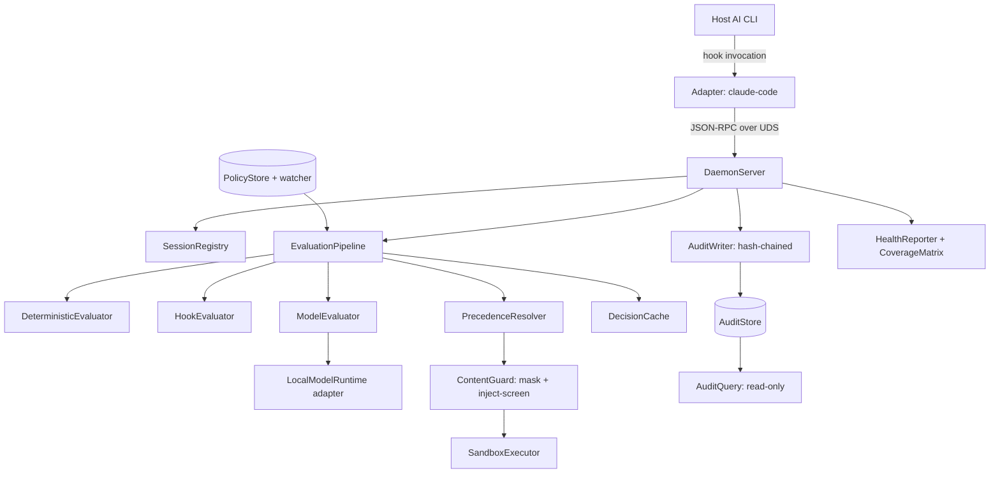

# 04 — Solution Design: Component Design

**Status**: Draft
**Last updated**: 2026-09-28
**Approved by**: _pending_

> **Phase-gate note.** `docs/04-solution-design/README.md` names **System Design approved** as
> the prerequisite, and Phases 2 and 3 are still ⬜ Not started. This document was drafted ahead
> of that gate at the product owner's explicit request. Everything in
> [§0 Assumed architecture](#0-assumed-architecture-pending-phase-3) is therefore an
> **assumption, not a decision** — Phase 3 must ratify it (or supersede this document). The
> component boundaries below are derived from the Discovery requirements
> ([`../01-discovery/requirements.md`](../01-discovery/requirements.md)) and are stable against
> most of the open questions; the two that would force a rewrite are flagged inline.

---

## 0. Assumed architecture (pending Phase 3)

Phase 4 cannot be written without an architecture to translate. The minimum set of assumptions,
each traceable to a Discovery requirement:

| # | Assumption | Driven by | If Phase 3 decides otherwise |
|---|---|---|---|
| A-1 | A long-lived local **daemon** holds the policy, the loaded model handle, and the log writer; per-action work is a request to it. | Cold start < 2 s excl. model, < 15 s incl. (NFR); model load cannot be per-action | Structural rewrite. Per-invocation processes cannot meet the model-path latency budget. |
| A-2 | Each supported CLI gets a thin **adapter** — an executable the host invokes through its own hook interface — that normalises the host payload into one canonical `Action` and calls the daemon over a Unix domain socket. | FR-07, FR-08, R-05 (contain vendor breakage in one adapter) | Adapter layer changes shape; the core is unaffected. |
| A-3 | Transport is **JSON-RPC over a Unix domain socket** with filesystem permissions, not a TCP port. | Security NFR (agent must not reach the engine), Privacy NFR | Transport swap only; `DecisionService` contract unchanged. |
| A-4 | Evaluation is a **pipeline of evaluators** in fixed precedence: deterministic → hooks → model, short-circuiting on first decision. | FR-03, FR-11, ≥ 80 % actions resolved without the model | None — this is required by FR-11 regardless. |
| A-5 | The **audit log** is an append-only, hash-chained local store with a query index; the record is durable before the decision returns. | FR-19–FR-22, "zero decisions unlogged" | Storage engine swap behind `AuditStore`. |
| A-6 | The **UI surface** (P2) is a separate Next.js app reading the daemon's read-only query API — it is not in the enforcement path. | ADR-001 binding for UI; Q-06 open | If Q-06 says no UI in v1, §3 is deferred wholesale; §1–2 stand. |

### Enforcement-core language — open, recommendation offered

Not settled by ADR-001, which governs UI only. Per `.ai/rules/general.md`, options with a
recommendation rather than an assumption:

| Option | For | Against |
|---|---|---|
| **Rust** *(recommended)* | Adapter process start in single-digit ms, needed for the P95 < 10 ms overhead budget; first-class bindings to OS sandbox primitives (Seatbelt, Landlock, seccomp); single static binary makes one-command install (S-09) trivial; memory floor leaves room under the < 5 GB model budget | Slowest to write; smallest overlap with the ADR-001 TypeScript skill set |
| **Go** | Fast start, easy static binaries, simpler than Rust | Weaker/less direct access to OS confinement APIs; GC pauses are a P99 risk against the 50 ms deterministic budget |
| **Node + TypeScript** | One language across core and UI; fastest to build; shares types with the Next.js surface | Node process start alone (~40–80 ms) blows the per-action overhead budget unless every adapter is native anyway; OS sandbox integration needs native modules, reintroducing the build complexity Rust would have given outright |

**Recommendation**: Rust for adapter + daemon, TypeScript/Next.js for the UI, with the wire
contract as the boundary. To be recorded as **ADR-002** in Phase 3. The module design below is
written to be language-neutral; type notation is TypeScript-flavoured for readability, and the
canonical form of every contract is the JSON schema in `api-design.md` (Phase 3).

---

## 1. Application structure

```
src/
├── app/                        # Next.js App Router — UI surface only (ADR-001)
│   ├── (dashboard)/            # Audit log, session detail, metrics
│   ├── (policy)/               # Policy editor and dry-run diff
│   └── api/                    # Route handlers proxying the daemon's read API
├── core/                       # Enforcement core — no UI, no Next.js import ever
│   ├── action/                 # Canonical Action model + normalisation
│   ├── policy/                 # Parse, validate, merge, precedence, hot reload
│   ├── evaluate/               # Evaluator pipeline: deterministic, hook, model
│   ├── content/                # Secret/PII masking, prompt-injection screening
│   ├── sandbox/               # Confinement boundary + execution
│   ├── audit/                  # Hash-chained append store, query, export
│   └── daemon/                 # Socket server, session registry, health
├── adapters/                   # One per host CLI; the only vendor-aware code
│   ├── contract/               # The interface every adapter satisfies
│   ├── claude-code/
│   ├── codex-cli/
│   └── mcp-proxy/              # Fallback path for CLIs with no hook interface (FR-09)
├── shared/
│   ├── api/                    # Generated wire clients from the JSON schemas
│   ├── ui/                     # Presentational components
│   └── utils/
├── config/                     # Runtime config resolution and defaults
└── types/                      # Contracts shared between core, adapters, UI
```

**The one structural rule**: `core/` must not import from `adapters/` or `app/`. Dependencies
point inward. An adapter that needs new information adds a field to the canonical `Action`; it
does not reach into the evaluator.

---

## 2. Enforcement core — module tree



### 2.1 Canonical action model — `core/action`

The single normalisation point. Every adapter produces this; every evaluator consumes only this.

```ts
type ActionKind =
  | 'shell.exec' | 'fs.read' | 'fs.write' | 'fs.delete'
  | 'net.request' | 'tool.call' | 'mcp.call';

interface Action {
  id: string;                       // ULID, stable across the decision's whole lifecycle
  sessionId: string;
  agent: { name: string; version: string };   // for the coverage matrix and R-05 version pinning
  kind: ActionKind;
  target: string;                   // command, absolute path, URL, or tool name
  payload: ActionPayload;           // kind-discriminated; see api-design.md
  cwd: string;
  receivedAt: string;               // RFC 3339, set by the adapter
}
```

**Responsibility**: one file per `ActionKind` normaliser plus a discriminated-union validator.
Paths are absolute and symlink-resolved here, before any rule sees them — a rule matching
`/repo/**` must not be evadable via `./../repo`. This is a correctness requirement, not a
convenience: it is the difference between R-04 mitigated and R-04 present.

### 2.2 Policy — `core/policy`

| Component | Responsibility | Key interface |
|---|---|---|
| `PolicyParser` | Read policy file → `Policy`; reject malformed or undefined-hook references (FR-04) | `parse(src: string): Result<Policy, PolicyError[]>` |
| `PolicyMerger` | Layer baseline over project policy, enforcing narrow-only (FR-05) | `merge(baseline, project): Result<Policy, WidenViolation[]>` |
| `PrecedenceResolver` | Deterministic conflict resolution; records winning rule ids (FR-03) | `resolve(candidates: RuleMatch[]): Decision` |
| `PolicyStore` | Holds the active `Policy` + its content hash; version counter | `current(): VersionedPolicy` |
| `PolicyWatcher` | Hot reload on change, log the version transition (FR-26) | `onChange(cb)` |

```ts
type DecisionKind = 'allow' | 'deny' | 'ask' | 'mask';

interface IntentRule {                 // FR-01 — no tool/command/glob required
  id: string;
  intent: string;                      // plain language
  decision: DecisionKind;
  appliesTo?: ActionKind[];
  confidenceThreshold: number;         // below it → 'ask' (R-01 mitigation)
  failOpen: false | { justification: string };   // fail-closed default; opt-out is explicit
}

interface DeterministicRule {          // FR-02
  id: string;
  decision: DecisionKind;
  match: {
    kind?: ActionKind[];
    command?: Pattern; path?: Pattern; destination?: Pattern; content?: Pattern;
  };
}
```

**Precedence** (fixed, documented, testable): `deny` beats `mask` beats `ask` beats `allow`;
within a decision, deterministic beats hook beats model; within deterministic, a more specific
match beats a less specific one; within equal specificity, baseline beats project. A tie at every
level is a bug, so the resolver asserts total ordering and fails policy validation if two rules
are indistinguishable.

### 2.3 Evaluation pipeline — `core/evaluate`

```ts
interface Evaluator {
  readonly name: 'deterministic' | 'hook' | 'model';
  evaluate(action: Action, policy: VersionedPolicy): Promise<EvaluatorResult | null>;
}

interface EvaluatorResult {
  decision: DecisionKind;
  ruleIds: string[];
  confidence?: number;       // model only
  reason: string;            // human-readable, surfaced in the denial (FR-15)
  latencyMs: number;
}
```

- `DeterministicEvaluator` — pure, synchronous, no I/O. Pre-compiled matchers indexed by
  `ActionKind` so evaluation is not a linear scan over 200 rules (P95 < 20 ms).
- `HookEvaluator` — spawns user hook programs with the action on stdin (FR-06). Every hook has a
  hard timeout; a timed-out or crashed hook yields **deny**, never a skip, and the failure is a
  distinct audit event.
- `ModelEvaluator` — only reached when nothing above decided (FR-11). Constrained decoding to the
  `DecisionKind` enum plus a confidence and a reason; the model's output is parsed as data and can
  never name an action to take (Security NFR). Model input carries the action and the intent rules
  and is explicitly framed as untrusted content.
- `DecisionCache` — keyed on `(normalised action, policy version)`, bounded LRU, per session. The
  main lever for R-03: a repeated `fs.read` of the same file in one session costs a lookup.
- `EvaluationPipeline` — orchestrates, enforces the fail-closed rule (FR-10, S-08), stamps the
  evaluator and latency onto the record, and honours dry-run by computing and logging but
  returning `allow` (FR-16).

**Fail-closed is implemented as a default, not a branch**: the pipeline's initial decision value
is `deny` with reason `evaluator-unavailable`, and evaluators can only replace it. There is no
code path where absence of a decision yields an allow.

### 2.4 Content guard — `core/content`

| Component | Responsibility |
|---|---|
| `StructuredSecretDetector` | Format-recognisable credentials (≥ 99 % recall, ≤ 1 % FP — FR-13). Deterministic patterns + entropy + checksum validation where the format has one. |
| `SemanticPiiDetector` | Model-assisted PII (≥ 90 % recall — FR-13) |
| `Masker` | Replaces spans with **stable** placeholders (`«secret:ghp_…a91f»`) so a masked value is identical across a session and the agent is not confused by shifting text (S-05 acceptance) |
| `InjectionScreener` | Inbound screening of file reads, command output, fetched pages (FR-14, S-16) |

Masking runs on outbound content *after* the allow decision and *before* the action executes or
the content leaves; screening runs on inbound content *after* execution and before the result
returns. Both are in the diagram in `../01-discovery/requirements.md`.

### 2.5 Sandbox — `core/sandbox`

```ts
interface SandboxExecutor {
  execute(action: Action, confinement: Confinement): Promise<ExecutionResult>;
  boundary(): BoundaryDescription;   // feeds the published threat model (FR-18)
}

interface Confinement {
  fs: { read: AbsolutePath[]; write: AbsolutePath[] };
  net: { allow: HostPattern[] };
  proc: { allowExec: boolean; allowFork: boolean };
}
```

The concrete primitive is a **Phase 3 decision gated on Q-02 (platforms) and Q-03 (threat
model)**, and this is the one place where an unanswered open question genuinely blocks design
rather than detail. `BoundaryDescription` exists so the product can state what it does not stop
(FR-18) as data rather than prose, and so the health check can report a weaker boundary honestly.

**Invariant**: the engine's own policy file, config, and audit log are never in
`confinement.fs.write`, for any policy. This is asserted in `Confinement`'s constructor, not left
to policy authoring — R-07 depends on it being unexpressible rather than merely discouraged.

### 2.6 Audit — `core/audit`

```ts
interface AuditRecord {
  seq: number;
  prevHash: string; hash: string;          // hash chain (FR-20)
  at: string; sessionId: string; actionId: string;
  agent: { name: string; version: string };
  kind: ActionKind; target: string;
  payload: MaskedPayload;                  // masked per policy (FR-19)
  decision: DecisionKind;
  ruleIds: string[]; evaluator: string;
  latencyMs: number; policyVersion: string;
  mode: 'enforcing' | 'dry-run';
  override?: { actor: string; justification: string };   // FR-25
}
```

- `AuditWriter` — append + chain. **A decision is not returned until its record is durable**; a
  write failure is itself a deny (Availability NFR).
- `AuditStore` — local embedded store with indexes on the five FR-21 query dimensions; documented
  rotation to hold the < 1 GB/30 days budget.
- `AuditQuery` — **read-only** interface. The UI and CLI reader get only this; nothing outside
  `AuditWriter` can write.
- `AuditExporter` — structured stream for an external pipeline (FR-22, S-14).

### 2.7 Daemon — `core/daemon`

`DaemonServer` (socket + JSON-RPC), `SessionRegistry` (per-session state, dry-run flag, cache),
`HealthReporter` (FR-23: engine status, model-runtime availability, policy version, coverage),
`CoverageMatrix` (per-CLI interceptable action classes; asserted at startup, and a gap
short-circuits the pipeline to deny for that class per FR-10 — R-04's mitigation lives here).

### 2.8 Adapter contract — `adapters/contract`

```ts
interface CliAdapter {
  readonly agent: string;
  readonly supportedVersions: SemverRange;      // R-05: unknown version detected at startup
  readonly coverage: Record<ActionKind, 'intercepted' | 'unavailable'>;
  normalise(hostPayload: unknown): Result<Action, NormalisationError>;
  renderDenial(d: Denial): HostResponse;        // FR-15, in the host's own shape
  install(): Promise<InstallReport>;            // S-09 one-command enable
}
```

One adapter per CLI, each the only place a vendor's payload shape is known. A vendor's breaking
change touches one directory — the containment R-05 needs.

---

## 3. UI surface — component tree (P2, gated on Q-06)

Applies only if Q-06 puts a UI in v1. Next.js App Router, RSC by default per ADR-001. The UI
reads `AuditQuery` and writes only the policy file; **it is never in the enforcement path**, so
its availability cannot affect a decision.

```
AppShell (server)
├── NavRail (client — keyboard-navigable, aria-current)
├── /  DashboardPage (server)
│   ├── HealthBanner (server)            props: { health: HealthReport }
│   ├── DecisionRateChart (client)       props: { series: RateSeries }
│   ├── EvaluatorMixTile (server)        props: { mix: EvaluatorMix }
│   ├── LatencyPercentileTile (server)   props: { p50, p95, p99, budgetMs }
│   └── TopDenialsTable (server)         props: { rows: DenialByRule[] }
├── /sessions  SessionListPage (server)
│   ├── SessionFilterBar (client)        state: URL-synced filters
│   └── SessionTable (server)            props: { page: Page<SessionSummary> }
├── /sessions/[id]  SessionDetailPage (server)
│   ├── SessionHeader (server)
│   ├── DecisionTimeline (client)        props: { records: AuditRecord[] }
│   │   └── DecisionRow (client)         props: { record, expanded, onToggle }
│   │       ├── DecisionBadge (server)   — icon + text, never colour alone (WCAG)
│   │       ├── RuleChipList (server)    props: { ruleIds, onSelect }
│   │       └── MaskedPayloadView (client) props: { payload: MaskedPayload }
│   └── ChainIntegrityNotice (server)    props: { verified: boolean; brokenAtSeq?: number }
├── /policy  PolicyEditorPage (server)
│   ├── PolicyLayerTabs (client)         props: { baseline, project }
│   ├── RuleList (client)                props: { rules, selectedId, onSelect }
│   ├── RuleEditor (client)              props: { rule, errors, onChange }
│   ├── ValidationPanel (server action)  props: { result: ValidationResult }
│   └── DryRunDiff (server)              props: { wouldChange: DecisionDelta[] }   — S-10/S-20
└── /policy/simulate  SimulatePage (server)
    └── ActionSimulator (client)         props: { onEvaluate }  — evaluate a hypothetical action
```

**Server vs client split**: everything that only renders queried data is a Server Component;
client components are exactly those with interaction state (filters, expansion, editing). This
keeps the audit log — potentially a million records — off the client bundle and satisfies
ADR-001's RSC-by-default consequence.

**Accessibility, per component** (Accessibility NFR): `DecisionBadge` pairs an icon and a text
label with its colour; `DecisionTimeline` is a keyboard-navigable list with roving tabindex, not
a div soup; new decisions arriving announce via an `aria-live="polite"` region;
`ValidationPanel` errors are associated to their field with `aria-describedby`; focus is visible
and never removed. Contrast ≥ 4.5:1 for body text in both themes.

---

## 4. Traceability

| Requirement | Component |
|---|---|
| FR-01, FR-02, FR-04, FR-05 | `core/policy` |
| FR-03 | `PrecedenceResolver` |
| FR-06 | `HookEvaluator` |
| FR-07 – FR-10 | `adapters/*`, `CoverageMatrix`, `EvaluationPipeline` |
| FR-11, FR-12 | `EvaluationPipeline`, `ModelEvaluator`, `DecisionCache` |
| FR-13, FR-14 | `core/content` |
| FR-15 | `CliAdapter.renderDenial` |
| FR-16 | `EvaluationPipeline` dry-run mode |
| FR-17, FR-18 | `core/sandbox` |
| FR-19 – FR-22 | `core/audit` |
| FR-23 | `HealthReporter` |
| FR-24 | `CliAdapter.install` |
| FR-25 | `SessionRegistry` + `AuditRecord.override` |
| FR-26 | `PolicyWatcher` |

---

## 5. Blocking questions for this phase

| # | Question | Blocks |
|---|---|---|
| Q-02 / Q-03 | Platforms and threat model | §2.5 cannot be finished; `Confinement` shape may change |
| Q-04 | First target CLI | Which `adapters/*` is built in Sprint 1 |
| Q-06 | UI in v1? | Whether §3 is v1 work or deferred |
| ADR-002 | Enforcement-core language | Build tooling, package layout, and whether `types/` is genuinely shared or generated |

**Related**: [`state-management.md`](state-management.md) ·
[`routing.md`](routing.md) · [`testing-strategy.md`](testing-strategy.md) ·
[`../01-discovery/requirements.md`](../01-discovery/requirements.md)
