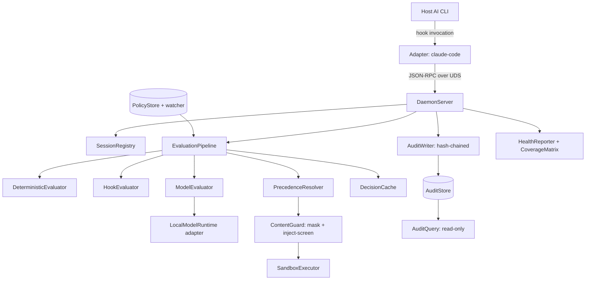

# 04 — Solution Design: Component Design

**Status**: Draft
**Last updated**: 2026-10-02
**Approved by**: _pending_

> **Phase-gate note.** `docs/04-solution-design/README.md` names **System Design approved** as
> the prerequisite, and Phases 2 and 3 are still ⬜ Not started. This document was drafted ahead
> of that gate at the product owner's explicit request. Everything in
> [§0 Assumed architecture](#0-assumed-architecture-pending-phase-3) is therefore an
> **assumption, not a decision** — each is now written up as a **Proposed ADR** in
> [`../05-adr/`](../05-adr/README.md) (ADR-002 … ADR-009), and Phase 3 must accept those or
> supersede this document. The
> component boundaries below are derived from the Discovery requirements
> ([`../01-discovery/requirements.md`](../01-discovery/requirements.md)) and are stable against
> most of the open questions; the two that would force a rewrite are flagged inline.

---

## 0. Assumed architecture (pending Phase 3)

Phase 4 cannot be written without an architecture to translate. The minimum set of assumptions,
each traceable to a Discovery requirement:

| # | Assumption | Now proposed as | Driven by | If Phase 3 decides otherwise |
|---|---|---|---|---|
| A-1 | A long-lived local **daemon** holds the policy, the loaded model handle, and the log writer; per-action work is a request to it. | [ADR-003](../05-adr/003-local-daemon-over-unix-socket.md) | Cold start < 2 s excl. model, < 15 s incl. (NFR); model load cannot be per-action | Structural rewrite. Per-invocation processes cannot meet the model-path latency budget. |
| A-2 | Each supported CLI gets a thin **adapter** — an executable the host invokes through its own hook interface — that normalises the host payload into one canonical `Action` and calls the daemon over a Unix domain socket. | [ADR-007](../05-adr/007-cli-integration-strategy.md) | FR-07, FR-08, R-05 (contain vendor breakage in one adapter) | Adapter layer changes shape; the core is unaffected. |
| A-3 | Transport is **JSON-RPC over a Unix domain socket** with filesystem permissions, not a TCP port. | [ADR-003](../05-adr/003-local-daemon-over-unix-socket.md) | Security NFR (agent must not reach the engine), Privacy NFR | Transport swap only; `DecisionService` contract unchanged. |
| A-4 | Evaluation is a **pipeline of evaluators** in fixed precedence: deterministic → hooks → model, short-circuiting on first decision. | [ADR-004](../05-adr/004-layered-policy-model.md), [ADR-009](../05-adr/009-fail-closed-default.md) | FR-03, FR-11, ≥ 80 % actions resolved without the model | None — this is required by FR-11 regardless. |
| A-5 | The **audit log** is an append-only, hash-chained local store with a query index; the record is durable before the decision returns. | [ADR-006](../05-adr/006-audit-log-integrity.md) | FR-19–FR-22, "zero decisions unlogged" | Storage engine swap behind `AuditStore`. |
| A-6 | The **UI surface** is a **read-only TUI** (S-24), in-process, reading the daemon's read-only query API and never in the enforcement path. | [ADR-010](../05-adr/010-supersede-adr-001-no-web-server-ui.md) (supersedes ADR-001), [ADR-011](../05-adr/011-v1-scope-envelope.md) | **Confirmed 2026-10-02** (Q-06). No web UI exists | §3 below was written for a web UI and is **withdrawn as a build target** — kept only for the component inventory and accessibility notes it still contributes to the TUI. §1–2 stand. |

### Enforcement-core language — now [ADR-002](../05-adr/002-enforcement-core-language.md) (Proposed)

Not settled by ADR-001, which governs UI only. Per `.ai/rules/general.md`, the options were
weighed rather than assumed; the conclusion is now filed as ADR-002:

| Option | For | Against |
|---|---|---|
| **Rust** *(recommended)* | Adapter process start in single-digit ms, needed for the P95 < 10 ms overhead budget; first-class bindings to OS sandbox primitives (Seatbelt, Landlock, seccomp); single static binary makes one-command install (S-09) trivial; memory floor leaves room under the < 5 GB model budget | Slowest to write; smallest overlap with a TypeScript skill set |
| **Go** | Fast start, easy static binaries, simpler than Rust | Weaker/less direct access to OS confinement APIs; GC pauses are a P99 risk against the 50 ms deterministic budget |
| **Node + TypeScript** | One language across core and UI; fastest to build; shares types with the Next.js surface | Node process start alone (~40–80 ms) blows the per-action overhead budget unless every adapter is native anyway; OS sandbox integration needs native modules, reintroducing the build complexity Rust would have given outright |

**Recommendation**: Rust for adapter + daemon, TypeScript/Next.js for the UI, with the wire
contract as the boundary — recorded as [**ADR-002**](../05-adr/002-enforcement-core-language.md),
Proposed, with its rejected alternatives (Node, Go, C/C++, split shim) argued there. The module design below is
written to be language-neutral; type notation is TypeScript-flavoured for readability, and the
canonical form of every contract is the JSON schema in `api-design.md` (Phase 3).

---

## 1. Application structure

```
src/
├── app/                        # Next.js App Router — UI surface only (ADR-001)
│   ├── (dashboard)/            # Audit log, session detail, metrics
│   ├── (policy)/               # Policy editor and dry-run diff
│   └── api/                    # Route handlers proxying the daemon's read API
├── core/                       # Enforcement core — no UI, no Next.js import ever
│   ├── action/                 # Canonical Action model + normalisation
│   ├── policy/                 # Parse, validate, merge, precedence, hot reload
│   ├── evaluate/               # Evaluator pipeline: deterministic, hook, model
│   ├── content/                # Secret/PII masking, prompt-injection screening
│   ├── sandbox/               # Confinement boundary + execution
│   ├── audit/                  # Hash-chained append store, query, export
│   └── daemon/                 # Socket server, session registry, health
├── adapters/                   # One per host CLI; the only vendor-aware code
│   ├── contract/               # The interface every adapter satisfies
│   ├── claude-code/
│   ├── codex-cli/
│   └── mcp-proxy/              # Fallback path for CLIs with no hook interface (FR-09)
├── shared/
│   ├── api/                    # Generated wire clients from the JSON schemas
│   ├── ui/                     # Presentational components
│   └── utils/
├── config/                     # Runtime config resolution and defaults
└── types/                      # Contracts shared between core, adapters, UI
```

**The one structural rule**: `core/` must not import from `adapters/` or `app/`. Dependencies
point inward. An adapter that needs new information adds a field to the canonical `Action`; it
does not reach into the evaluator.

---

## 2. Enforcement core — module tree



### 2.1 Canonical action model — `core/action`

The single normalisation point. Every adapter produces this; every evaluator consumes only this.

```ts
type ActionKind =
  | 'shell.exec' | 'fs.read' | 'fs.write' | 'fs.delete'
  | 'net.request' | 'tool.call'
  | 'mcp.tool' | 'mcp.resource' | 'mcp.prompt' | 'mcp.sample' | 'mcp.elicit';

interface Action {
  id: string;                       // ULID, stable across the decision's whole lifecycle
  sessionId: string;
  agent: { name: string; version: string };   // for the coverage matrix and R-05 version pinning
  kind: ActionKind;
  target: string;                   // command, absolute path, URL, or tool name
  payload: ActionPayload;           // kind-discriminated; see api-design.md
  cwd: string;
  receivedAt: string;               // RFC 3339, set by the adapter
}
```

The five `mcp.*` kinds are deliberately not one `mcp.call` (FR-28). `tools/call`,
`resources/read`, `prompts/get`, `sampling/createMessage` and `elicitation/create` are different
capabilities with different blast radii — a resource read is an exfiltration path and a sampling
request inverts control by letting the server drive agent inference — so each needs its own
normaliser, its own rule surface, and **its own cell in the per-adapter coverage matrix**. Collapsed
into one kind, an adapter that intercepts only `tools/call` would report `mcp.call: 'intercepted'`
and silently give false assurance over the other four: R-04 by construction.

**Responsibility**: one file per `ActionKind` normaliser plus a discriminated-union validator.
Paths are absolute and symlink-resolved here, before any rule sees them — a rule matching
`/repo/**` must not be evadable via `./../repo`. This is a correctness requirement, not a
convenience: it is the difference between R-04 mitigated and R-04 present.

### 2.2 Policy — `core/policy`

| Component | Responsibility | Key interface |
|---|---|---|
| `PolicyParser` | Read policy file → `Policy`; reject malformed or undefined-hook references (FR-04) | `parse(src: string): Result<Policy, PolicyError[]>` |
| `PolicyMerger` | Layer baseline over project policy, enforcing narrow-only (FR-05) | `merge(baseline, project): Result<Policy, WidenViolation[]>` |
| `PrecedenceResolver` | Deterministic conflict resolution; records winning rule ids (FR-03) | `resolve(candidates: RuleMatch[]): Decision` |
| `PolicyStore` | Holds the active `Policy` + its content hash; version counter | `current(): VersionedPolicy` |
| `PolicyWatcher` | Hot reload on change, log the version transition (FR-26) | `onChange(cb)` |

```ts
type DecisionKind = 'allow' | 'deny' | 'ask' | 'mask';

interface IntentRule {                 // FR-01 — no tool/command/glob required
  id: string;
  intent: string;                      // plain language
  decision: DecisionKind;
  appliesTo?: ActionKind[];
  confidenceThreshold: number;         // below it → 'ask' (R-01 mitigation)
  failOpen: false | { justification: string };   // fail-closed default; opt-out is explicit
}

interface DeterministicRule {          // FR-02
  id: string;
  decision: DecisionKind;
  match: {
    kind?: ActionKind[];
    command?: Pattern; path?: Pattern; destination?: Pattern; content?: Pattern;
  };
}
```

**Precedence** (fixed, documented, testable): `deny` beats `mask` beats `ask` beats `allow`;
within a decision, deterministic beats hook beats model; within deterministic, a more specific
match beats a less specific one; within equal specificity, baseline beats project. A tie at every
level is a bug, so the resolver asserts total ordering and fails policy validation if two rules
are indistinguishable.

### 2.3 Evaluation pipeline — `core/evaluate`

```ts
interface Evaluator {
  readonly name: 'deterministic' | 'hook' | 'model';
  evaluate(action: Action, policy: VersionedPolicy): Promise<EvaluatorResult | null>;
}

interface EvaluatorResult {
  decision: DecisionKind;
  ruleIds: string[];
  confidence?: number;       // model only
  reason: string;            // human-readable, surfaced in the denial (FR-15)
  latencyMs: number;
  step: TraceStep;           // FR-30 — the stage's own account of itself; not optional
  candidates: CandidateResult[];   // every rule that matched here, winner included
}
```

`step` and `candidates` are **part of the return value, not a logging side-effect**
([ADR-012](../05-adr/012-decision-trace.md)). An evaluator that produced a decision without them would
compile but fail the pipeline invariant test, which is the point: the obligation to account for a
decision belongs to whoever made it, and an evaluator is the only component that still knows what it
considered. Canonical schemas for `TraceStep` and `CandidateResult`:
[`../03-system-design/data-model.md`](../03-system-design/data-model.md) §5.5.

- `DeterministicEvaluator` — pure, synchronous, no I/O. Pre-compiled matchers indexed by
  `ActionKind` so evaluation is not a linear scan over 200 rules (P95 < 20 ms).
- `HookEvaluator` — spawns user hook programs with the action on stdin (FR-06). Every hook has a
  hard timeout; a timed-out or crashed hook yields **deny**, never a skip, and the failure is a
  distinct audit event.
- `ModelEvaluator` — only reached when nothing above decided (FR-11); runtime is pluggable behind a port per [ADR-005](../05-adr/005-pluggable-local-model-runtime.md). Constrained decoding to the
  `DecisionKind` enum plus a confidence and a reason; the model's output is parsed as data and can
  never name an action to take (Security NFR). Model input carries the action and the intent rules
  and is explicitly framed as untrusted content.
- `DecisionCache` — keyed on `(normalised action, policy version)`, bounded LRU, per session. The
  main lever for R-03: a repeated `fs.read` of the same file in one session costs a lookup.
- `EvaluationPipeline` — orchestrates, enforces the fail-closed rule (FR-10, S-08), stamps the
  evaluator and latency onto the record, and honours dry-run by computing and logging but
  returning `allow` (FR-16).
- `TraceBuilder` — owns the pre-sized step buffer, applies the §5.5 caps, and performs **truncation by
  rule** (keep the winner, the earliest-key elimination, and every error/deny-producing step) with
  `truncated` and `dropped` set inside the hashed bytes. It is the only component permitted to drop
  anything from a trace, and it cannot drop silently (FR-30).
- `ProvenanceStamp` — assembled once at startup and after each policy or runtime change (guard build,
  matcher set, specificity weights, detector versions, `LocalModelRuntime.identity()`), then copied
  onto each record. Recomputing it per decision would put a digest on the hot path for information that
  only changes at load time.
- `DecisionExplainer` / `DecisionReplayer` — the FR-31/FR-32 read surfaces. The explainer takes a record
  and renders it, touching no policy and no runtime; the replayer re-runs the recorded action through
  **the same pipeline instance type** with the audit writer and the cache writer disabled, so a replay
  cannot write what it is inspecting.

**Fail-closed is implemented as a default, not a branch** ([ADR-009](../05-adr/009-fail-closed-default.md)): the pipeline's initial decision value
is `deny` with reason `evaluator-unavailable`, and evaluators can only replace it. There is no
code path where absence of a decision yields an allow.

### 2.4 Content guard — `core/content`

| Component | Responsibility |
|---|---|
| `StructuredSecretDetector` | Format-recognisable credentials (≥ 99 % recall, ≤ 1 % FP — FR-13). Deterministic patterns + entropy + checksum validation where the format has one. |
| `SemanticPiiDetector` | Model-assisted PII (≥ 90 % recall — FR-13) |
| `Masker` | Replaces spans with **stable** placeholders (`«secret:ghp_…a91f»`) so a masked value is identical across a session and the agent is not confused by shifting text (S-05 acceptance) |
| `InjectionScreener` | Inbound screening of file reads, command output, fetched pages (FR-14, S-16) |

Masking runs on outbound content *after* the allow decision and *before* the action executes or
the content leaves; screening runs on inbound content *after* execution and before the result
returns. Both are in the diagram in `../01-discovery/requirements.md`.

### 2.5 Sandbox — `core/sandbox`

```ts
interface SandboxExecutor {
  execute(action: Action, confinement: Confinement): Promise<ExecutionResult>;
  boundary(): BoundaryDescription;   // feeds the published threat model (FR-18)
}

interface Confinement {
  fs: { read: AbsolutePath[]; write: AbsolutePath[] };
  net: { allow: HostPattern[] };
  proc: { allowExec: boolean; allowFork: boolean };
}
```

The concrete primitive is gated on Q-02 (platforms) and Q-03 (threat model); what *is* decided —
OS-native primitives only, boundary-as-data, a test per claim, and no absolute isolation claim — is
[ADR-008](../05-adr/008-sandbox-confinement-primitive.md), and this is the one place where an unanswered open question genuinely blocks design
rather than detail. `BoundaryDescription` exists so the product can state what it does not stop
(FR-18) as data rather than prose, and so the health check can report a weaker boundary honestly.

**Invariant**: the engine's own policy file, config, and audit log are never in
`confinement.fs.write`, for any policy. This is asserted in `Confinement`'s constructor, not left
to policy authoring — R-07 depends on it being unexpressible rather than merely discouraged.

### 2.6 Audit — `core/audit`

```ts
interface AuditRecord {
  seq: number;
  prevHash: string; hash: string;          // hash chain (FR-20)
  at: string; sessionId: string; actionId: string;
  agent: { name: string; version: string };
  kind: ActionKind; target: string;
  payload: MaskedPayload;                  // masked per policy (FR-19)
  decision: DecisionKind;
  ruleIds: string[]; evaluator: string;
  latencyMs: number; policyVersion: string;
  mode: 'enforcing' | 'dry-run';
  override?: { actor: string; justification: string };   // FR-25
  trace: DecisionTrace;                    // FR-30 — required on a decision record
  provenance: DecisionProvenance;          // FR-30 — what could change the outcome
}
```

- `AuditWriter` — append + chain. **A decision is not returned until its record is durable**; a
  write failure is itself a deny (Availability NFR).
- `AuditStore` — local embedded store with indexes on the five FR-21 query dimensions; documented
  rotation to hold the < 1 GB/30 days budget.
- `AuditQuery` — **read-only** interface. The UI and CLI reader get only this; nothing outside
  `AuditWriter` can write. Candidate-rule and provenance filters are post-index predicates over the
  trace, documented as such ([`../03-system-design/data-model.md`](../03-system-design/data-model.md) §6.2).
- `AuditExporter` — structured stream for an external pipeline (FR-22, S-14).

### 2.7 Daemon — `core/daemon`

`DaemonServer` (socket + JSON-RPC), `SessionRegistry` (per-session state, dry-run flag, cache),
`HealthReporter` (FR-23: engine status, model-runtime availability, policy version, coverage),
`CoverageMatrix` (per-CLI interceptable action classes; asserted at startup, and a gap
short-circuits the pipeline to deny for that class per FR-10 — R-04's mitigation lives here).

### 2.8 Adapter contract — `adapters/contract`

```ts
interface CliAdapter {
  readonly agent: string;
  readonly supportedVersions: SemverRange;      // R-05: unknown version detected at startup
  readonly coverage: Record<ActionKind, 'intercepted' | 'unavailable'>;
  normalise(hostPayload: unknown): Result<Action, NormalisationError>;
  renderDenial(d: Denial): HostResponse;        // FR-15, in the host's own shape
  install(): Promise<InstallReport>;            // S-09 one-command enable
  uninstall(): Promise<RemovalReport>;          // S-25, FR-27 — de-register from host config
  isRegistered(): Promise<boolean>;             // FR-27 verification gate; probes host config
  plannedChanges(op: 'install' | 'uninstall'): Promise<FileChange[]>;  // FR-27 `--print`
}
```

One adapter per CLI, each the only place a vendor's payload shape is known. A vendor's breaking
change touches one directory — the containment R-05 needs.

`install` and `uninstall` are **required in pairs**: an adapter that can write itself into a host
CLI's configuration but cannot remove itself does not satisfy the contract, because the residue it
leaves behind is a registered hook with no engine, which under
[ADR-009](../05-adr/009-fail-closed-default.md) denies every action the host attempts. Both methods
are **idempotent**, and `uninstall` resolves to `removed` or `already-absent` rather than failing
when the host config has been hand-edited.

`isRegistered` is what makes the teardown ordering in
[`routing.md` §2.1](routing.md#21-removal-semantics-guard-uninstall) enforceable: the daemon is
stopped only once every adapter reports `false`. It probes the host CLI's real configuration rather
than trusting the install receipt, so a deleted or stale receipt cannot orphan a live hook.
`plannedChanges` backs `guard uninstall --print` and must perform no writes.

---

## 3. UI surface — component tree

> **Withdrawn as a build target (Q-06 answered 2026-10-02).** This section was written for a web UI
> on ADR-001's Next.js server. v1's UI is a **read-only TUI** inside the same binary
> ([ADR-010](../05-adr/010-supersede-adr-001-no-web-server-ui.md) item 2,
> [ADR-011](../05-adr/011-v1-scope-envelope.md)), so **nothing below is built as written**: there is
> no server/client split, no RSC boundary, and no Server Action write path.
>
> It is retained rather than deleted because two things in it carry over to the TUI and are worth not
> re-deriving — the **view inventory** (dashboard, session list, session detail/timeline, policy
> *viewer*) and the **accessibility notes** on non-colour decision encoding and keyboard navigation,
> which become the §1a checks in [`testing-strategy.md`](testing-strategy.md). The TUI's own
> component tree is Phase 3 work and is not invented here.

The TUI reads `AuditQuery` and, per ADR-010 item 3, is **read-only** — policy writes go through the
CLI. It is never in the enforcement path, so its availability cannot affect a decision.

```
AppShell (server)
├── NavRail (client — keyboard-navigable, aria-current)
├── /  DashboardPage (server)
│   ├── HealthBanner (server)            props: { health: HealthReport }
│   ├── DecisionRateChart (client)       props: { series: RateSeries }
│   ├── EvaluatorMixTile (server)        props: { mix: EvaluatorMix }
│   ├── LatencyPercentileTile (server)   props: { p50, p95, p99, budgetMs }
│   └── TopDenialsTable (server)         props: { rows: DenialByRule[] }
├── /sessions  SessionListPage (server)
│   ├── SessionFilterBar (client)        state: URL-synced filters
│   └── SessionTable (server)            props: { page: Page<SessionSummary> }
├── /sessions/[id]  SessionDetailPage (server)
│   ├── SessionHeader (server)
│   ├── DecisionTimeline (client)        props: { records: AuditRecord[] }
│   │   └── DecisionRow (client)         props: { record, expanded, onToggle }
│   │       ├── DecisionBadge (server)   — icon + text, never colour alone (WCAG)
│   │       ├── RuleChipList (server)    props: { ruleIds, onSelect }
│   │       └── MaskedPayloadView (client) props: { payload: MaskedPayload }
│   └── ChainIntegrityNotice (server)    props: { verified: boolean; brokenAtSeq?: number }
├── /policy  PolicyEditorPage (server)
│   ├── PolicyLayerTabs (client)         props: { baseline, project }
│   ├── RuleList (client)                props: { rules, selectedId, onSelect }
│   ├── RuleEditor (client)              props: { rule, errors, onChange }
│   ├── ValidationPanel (server action)  props: { result: ValidationResult }
│   └── DryRunDiff (server)              props: { wouldChange: DecisionDelta[] }   — S-10/S-20
└── /policy/simulate  SimulatePage (server)
    └── ActionSimulator (client)         props: { onEvaluate }  — evaluate a hypothetical action
```

**Server vs client split** *(does not survive ADR-010 — retained to record the intent)*: the
reasoning was that anything only rendering queried data is a Server Component, keeping a
million-record log off the client bundle. With no server runtime, the equivalent requirement is
that the client never loads an unbounded result set: pagination and filtering happen in the
daemon's `audit.query`, not in the browser.

**Accessibility, per component** (Accessibility NFR): `DecisionBadge` pairs an icon and a text
label with its colour; `DecisionTimeline` is a keyboard-navigable list with roving tabindex, not
a div soup; new decisions arriving announce via an `aria-live="polite"` region;
`ValidationPanel` errors are associated to their field with `aria-describedby`; focus is visible
and never removed. Contrast ≥ 4.5:1 for body text in both themes.

---

## 4. Traceability

| Requirement | Component |
|---|---|
| FR-01, FR-02, FR-04, FR-05 | `core/policy` |
| FR-03 | `PrecedenceResolver` |
| FR-06 | `HookEvaluator` |
| FR-07 – FR-10 | `adapters/*`, `CoverageMatrix`, `EvaluationPipeline` |
| FR-11, FR-12 | `EvaluationPipeline`, `ModelEvaluator`, `DecisionCache` |
| FR-13, FR-14 | `core/content` |
| FR-15 | `CliAdapter.renderDenial` |
| FR-16 | `EvaluationPipeline` dry-run mode |
| FR-17, FR-18 | `core/sandbox` |
| FR-19 – FR-22 | `core/audit` |
| FR-23 | `HealthReporter` |
| FR-24 | `CliAdapter.install` |
| FR-25 | `SessionRegistry` + `AuditRecord.override` |
| FR-26 | `PolicyWatcher` |
| FR-27 | `CliAdapter.uninstall` / `.isRegistered` / `.plannedChanges`, `core/audit` terminal record, daemon lifecycle |
| FR-28 | `core/action` `mcp.*` normalisers (one per MCP request class), `CliAdapter.coverage` |
| FR-29 | `core/content` inbound screening of MCP server responses, `mcp.sample` normaliser |
| FR-30 | `TraceBuilder`, `ProvenanceStamp`, every `Evaluator` (each returns its own step), `PrecedenceResolver` (returns its eliminations) |
| FR-31 | `DecisionExplainer` + `AuditQuery` — no policy or runtime dependency |
| FR-32 | `DecisionReplayer` over the same pipeline with the audit and cache writers disabled |

---

## 5. Blocking questions for this phase

Q-02, Q-03, Q-04 and Q-06 were answered on 2026-10-02 — §2.5's primitive is Seatbelt on macOS and
Landlock + seccomp + netns on Linux, both adapters are v1, and §3 is withdrawn in favour of a TUI
([ADR-011](../05-adr/011-v1-scope-envelope.md)). Q-01 and Q-09 were answered later the same day
([ADR-013](../05-adr/013-model-and-language-resolution.md)): the model is **Laya**, and the product
is **single-language Rust** — `types/` is hand-written once, with no generation step, and
`ModelRuntime`'s memory budget and constrained-decoding availability are evaluated against Laya's
own published figures rather than an unnamed model. Nothing in this phase is blocked on either
question any more.

One narrower point ADR-013 raised is still open: how Laya is served, since its only published
runtime is Node and it is not Ollama-servable
([ADR-005](../05-adr/005-pluggable-local-model-runtime.md) item 2). It does not block this
document — `ModelRuntime`'s port contract is the same either way.

**Related**: [`state-management.md`](state-management.md) ·
[`routing.md`](routing.md) · [`testing-strategy.md`](testing-strategy.md) ·
[`../01-discovery/requirements.md`](../01-discovery/requirements.md)
