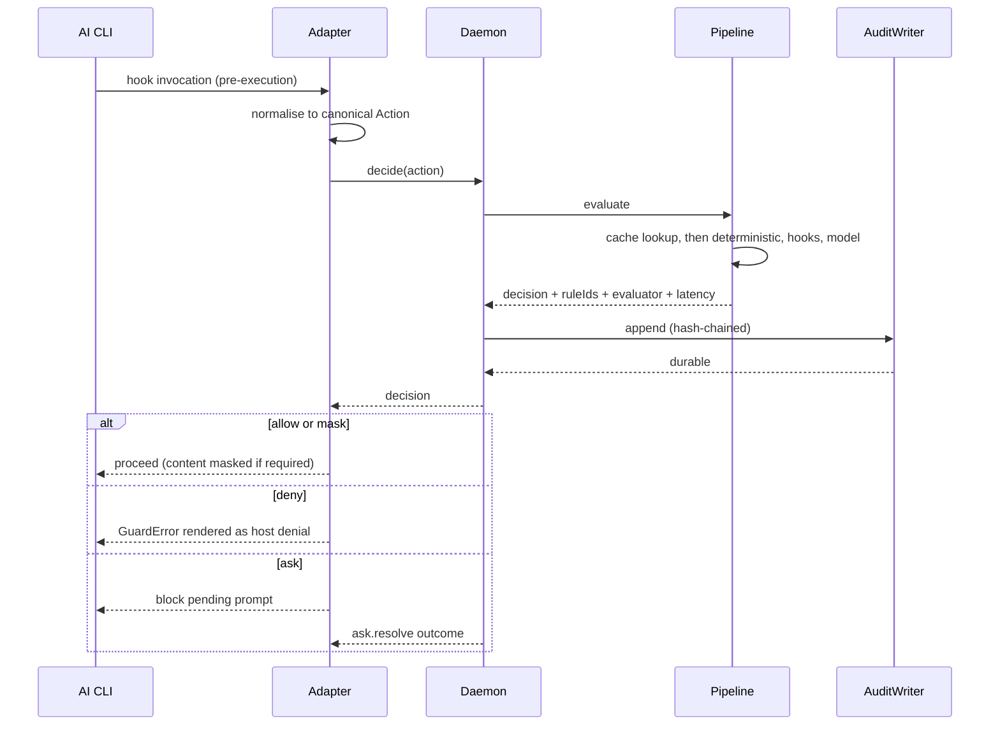

# 04 — Solution Design: Routing

**Status**: Draft
**Last updated**: 2026-09-28
**Approved by**: _pending_

> **Phase-gate note.** Drafted ahead of the Phase 3 gate at the product owner's request; rests on
> the assumptions in [`component-design.md` §0](component-design.md#0-assumed-architecture-pending-phase-3).
> The wire contracts below are a Phase 4 *shape*; their canonical schemas belong in Phase 3's
> `api-design.md`.

This product has three routable surfaces. The UI route table that the Phase 4 template asks for is
the least important of them, so it comes third.

1. **Daemon RPC surface** — the enforcement path. Latency-budgeted, authenticated by filesystem
   permissions, split read/write.
2. **CLI command surface** — how a developer and a CI job drive the tool.
3. **Web UI routes** (P2, gated on Q-06).

---

## 1. Daemon RPC surface

Transport: JSON-RPC 2.0 over a Unix domain socket at
`$XDG_RUNTIME_DIR/ai-guard-bot/guard.sock` (macOS: `~/Library/Application Support/...`), mode
`0600`, owned by the invoking user. **No TCP listener**, which forecloses remote reach and keeps
the Privacy NFR verifiable rather than argued.

### 1.1 Method table

| Method | Caller | Direction | Budget | Notes |
|---|---|---|---|---|
| `session.open` | Adapter | write | < 50 ms | Registers agent identity + version; returns session id and the coverage report. Rejects an unsupported agent version (R-05). |
| `decide` | Adapter | write | **P95 < 20 ms deterministic / < 300 ms model** | The hot path. One action in, one decision out. Returns only after the audit record is durable. |
| `content.outbound` | Adapter | write | P95 < 50 ms | Mask secrets/PII in content about to leave (FR-13). |
| `content.inbound` | Adapter | write | P95 < 50 ms | Screen a result for prompt injection (FR-14). |
| `ask.resolve` | CLI / UI | write | — | Answers a pending `ask` with allow-once or deny; records actor + justification (FR-25). |
| `session.close` | Adapter | write | < 50 ms | Finalises the session; flushes metrics. |
| `policy.reload` | CLI | write | < 500 ms | Explicit reload; the watcher does this implicitly (FR-26). |
| `policy.validate` | CLI / UI | read | < 500 ms | Parse + merge + narrow-only check without activating (FR-04, FR-05). |
| `policy.simulate` | CLI / UI | read | — | Evaluate a hypothetical action, or replay recent history against a candidate policy (S-10, S-20). |
| `policy.current` | CLI / UI | read | < 20 ms | Active policy, content hash, version. |
| `audit.query` | CLI / UI | read | P95 < 1 s over 1 M records | FR-21 dimensions: session, time range, decision, rule id, action type. |
| `audit.verify` | CLI / UI | read | — | Walks the hash chain; returns verified or the breaking `seq` (FR-20). |
| `audit.stream` | CLI / UI | read | — | Server-push of new records for the live timeline. |
| `audit.export` | CLI | read | — | Structured export to an external pipeline (FR-22). |
| `health` | Any | read | < 20 ms | Engine status, model-runtime availability, policy version, per-CLI coverage (FR-23). |
| `metrics` | Any | read | < 50 ms | Decisions/s by outcome, evaluator mix, latency percentiles, denial rate per rule, override count. |

### 1.2 Authorisation

There is one local user, so there is no authn/authz model in the usual sense — and saying so
explicitly matters more than inventing one. What the surface does enforce:

- **Socket permissions are the authentication.** `0600`, user-owned. Anyone who can open the
  socket already has the user's privileges.
- **Read/write split is enforced at the method level.** The UI's route handlers and the audit
  reader are permitted only the `read` methods in the table above. No caller outside an adapter can
  invoke `decide`, and nothing at all can write an audit record — that is `AuditWriter`'s private
  capability.
- **The guarded agent cannot reach the socket.** The sandbox's `Confinement` excludes the socket
  path and the engine's config directory for every possible policy
  (`component-design.md` §2.5 invariant). This is R-07's mitigation, and it is a construction, not
  a rule an author could forget.
- **Every mutating method is audited**, including `policy.reload` and `ask.resolve`, with the
  actor recorded.

### 1.3 Error schema

One shape for every failure, on every surface — RPC, CLI, and UI (`.ai/instructions.md` quality
gate: consistent error schemas).

```ts
interface GuardError {
  code: string;          // stable, namespaced: 'POLICY_INVALID', 'RULE_VIOLATION',
                         // 'EVALUATOR_UNAVAILABLE', 'EVALUATOR_SATURATED',
                         // 'COVERAGE_GAP', 'AGENT_VERSION_UNSUPPORTED',
                         // 'AUDIT_CHAIN_BROKEN', 'POLICY_WIDENS_BASELINE',
                         // 'POLICY_CONFLICT', 'HOOK_TIMEOUT'
  message: string;       // human-readable, actionable — tells the reader what to do instead
  ruleIds?: string[];    // FR-15
  details?: Record<string, unknown>;
  actionId?: string;
  retryable: boolean;
}
```

The denial returned to the agent is this object rendered into the host's own response shape by
`CliAdapter.renderDenial`. Codes are stable across versions — S-04's premise is that the agent
parses them and adapts, which fails the moment a code is renamed.

### 1.4 Hot-path sequence



The audit append sits **before** the response, not after. That ordering is the whole of the
"zero decisions unlogged" guarantee.

---

## 2. CLI command surface

| Command | Purpose | Story |
|---|---|---|
| `guard install [--agent <name>]` | One-command install and enable, including model-runtime provisioning; prints the coverage matrix | S-09, FR-24 |
| `guard status` | Health, policy version, per-CLI coverage, enforcing vs dry-run | FR-23 |
| `guard policy init` | Write an opinionated safe default policy — the zero-authoring path | R-06, persona P4 |
| `guard policy validate [file]` | Parse, merge, narrow-only check; non-zero exit on failure (CI-usable) | FR-04, FR-05, S-18 |
| `guard policy diff` | What the candidate policy would have decided differently over recent history | S-10, S-20 |
| `guard policy reload` | Explicit hot reload | FR-26 |
| `guard log [--session --from --to --decision --rule --kind]` | Query the audit log | FR-21, S-07 |
| `guard log verify` | Hash-chain verification; non-zero exit on a break | FR-20 |
| `guard log export [--format]` | Structured export | FR-22, S-14 |
| `guard dry-run <command…>` | Run an agent session with enforcement off but logging on | FR-16, S-10 |
| `guard allow-once <actionId> --reason <text>` | Resolve a pending `ask` | FR-25, S-15 |
| `guard ui` | Start the local UI (P2, Q-06) | S-19 |

Conventions: exit `0` allow/success, `1` operational error, `2` policy invalid, `3` denied —
scriptable. Human output respects `NO_COLOR` and works without colour; `--json` on every read
command for machine use (Accessibility NFR).

---

## 3. Web UI routes (P2, gated on Q-06)

Next.js App Router. Localhost-bound only. Auth column reads "local socket" for every row — there
is no login, because there is no remote access and no second user; inventing a login would imply a
security boundary that does not exist.

| Path | Component | Rendering | Loader | Error boundary |
|---|---|---|---|---|
| `/` | `DashboardPage` | RSC, `revalidate: 30` | `health` + `metrics` | Route-level → "engine unreachable" state |
| `/sessions` | `SessionListPage` | RSC, dynamic (URL filters) | `audit.query` grouped by session | Route-level |
| `/sessions/[id]` | `SessionDetailPage` | RSC shell + streamed timeline | `audit.query` by session, `audit.verify` | Route-level; `notFound()` on unknown id |
| `/policy` | `PolicyEditorPage` | RSC shell + client editor | `policy.current` | Route-level; keeps the unsaved draft |
| `/policy/simulate` | `SimulatePage` | RSC shell + client form | `policy.current` | Route-level |
| `/settings` | `SettingsPage` | RSC | local preferences + `policy.current` paths | Route-level |
| `/api/*` | Route handlers | Server only | Proxy to daemon **read methods only** | Returns `GuardError` unchanged |

### 3.1 Route-level rules

- **No client component calls the daemon.** Everything goes through a Server Component or a route
  handler, so the socket path and the read-only restriction cannot be bypassed from the browser.
- **Route handlers are a read-only proxy**, with the permitted method list allowlisted in code, not
  derived from the request. The single exception is the policy-save Server Action, which writes the
  policy file (not an audit record) with optimistic concurrency on the content hash
  (`state-management.md` §B.3).
- **Filters are URL state** (`state-management.md` §B.4), so every view is deep-linkable —
  `/sessions?decision=deny&rule=R-014&from=…` is the shareable artefact Priya hands to a developer.
- **Error boundaries are per route segment**, and the daemon-unreachable state is an explicit
  render, never an empty table. A UI that shows an empty audit log because it could not reach the
  engine misleads the person relying on it.
- **Layouts**: one root `AppShell` with `NavRail`; `/policy/*` shares a layout carrying the
  unsaved-draft guard across its two routes.
- **Navigation accessibility**: skip-to-content link, `aria-current` on the active nav item, focus
  moved to the `<h1>` on route change, and route transitions announced in an `aria-live` region.

### 3.2 Route-to-story map

| Route | Stories |
|---|---|
| `/` | S-06, S-17, FR-23 |
| `/sessions`, `/sessions/[id]` | S-06, S-07, S-19 |
| `/policy` | S-01, S-10, S-18, S-19, S-20 |
| `/policy/simulate` | S-10, S-20 |
| `/settings` | S-21 |

---

## 4. Blocking questions

| # | Question | Blocks |
|---|---|---|
| Q-04 | First target CLI | Which adapter implements §1.1 in Sprint 1 |
| Q-06 | UI in v1? | Whether §3 is v1 work |
| Q-02 | Platforms | Socket path convention and the install command's per-OS behaviour |
| ADR-002 | Core language | RPC codec and code-generation approach for `shared/api` |

**Related**: [`component-design.md`](component-design.md) ·
[`state-management.md`](state-management.md) · [`testing-strategy.md`](testing-strategy.md)
