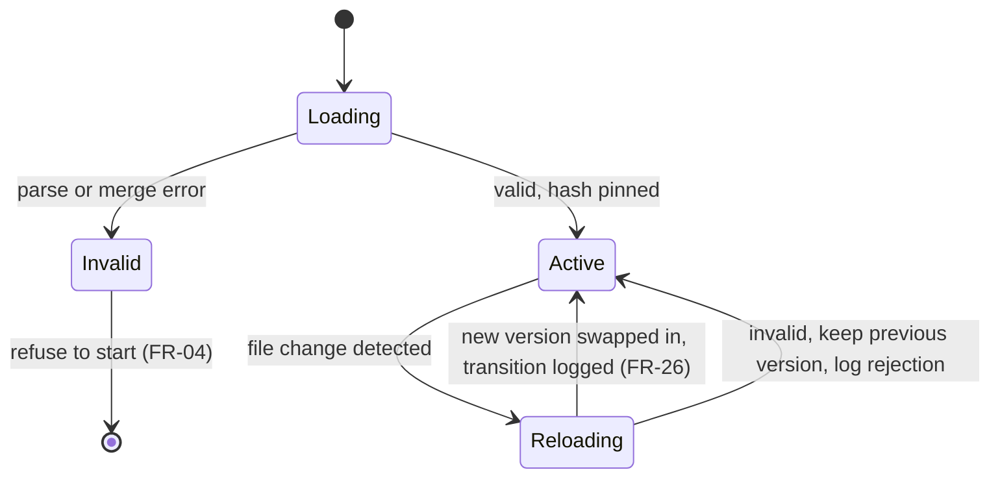

# 04 — Solution Design: State Management

**Status**: Draft
**Last updated**: 2026-10-02
**Approved by**: _pending_

> **Phase-gate note.** Drafted ahead of the Phase 3 gate at the product owner's request; rests on
> the assumptions in [`component-design.md` §0](component-design.md#0-assumed-architecture-pending-phase-3),
> each of which is now filed as a Proposed ADR in [`../05-adr/`](../05-adr/README.md).

This product has **two distinct state problems**, and conflating them would be the main design
error available here:

1. **Enforcement-core state** — authoritative, correctness-critical, lives in the daemon. A bug
   here means a wrong allow.
2. **UI state** — derived, disposable, lives in the UI process (a read-only TUI per Q-06). A bug here means
   a confusing screen.

The core never reads UI state. The UI never holds authoritative state.

---

## Part A — Enforcement-core state

### A.1 State inventory

| State | Owner | Lifetime | Durability | Concurrency |
|---|---|---|---|---|
| Active policy + content hash + version counter | `PolicyStore` | Daemon process | Read from disk; hash pinned at load | Single writer (`PolicyWatcher`), many readers; swapped atomically |
| Session registry (session id → mode, cache, agent identity, coverage) | `SessionRegistry` | Agent session | In-memory only | One entry per session; entries independent |
| Decision cache | Per-session, in `SessionRegistry` | Session, or until policy version changes | In-memory only | Per-session, no cross-session sharing |
| Audit chain head (`seq`, `prevHash`) | `AuditWriter` | Daemon process, restored from store on start | Durable | **Strictly serialised — single writer, no exceptions** |
| Audit records | `AuditStore` | Until rotation | Durable, append-only | Many readers, one writer |
| Model runtime handle / warm state | `LocalModelRuntime` | Daemon process | Ephemeral | Bounded concurrency (see A.5) |
| Health + coverage snapshot | `HealthReporter` | Recomputed on read | None | Read-only derivation |
| Pending `ask` prompts | `SessionRegistry` | Until answered or timeout | None | One in flight per session |
| Install receipt (adapters registered, host config paths touched, runtime/weights provisioned) | `Installer` | **Across installs, outlives the daemon** | Durable | Written by `guard install` / `guard uninstall` only; never during a session |
| Host CLI configuration (hook entry, MCP server entry) | **The user**, mutated by the adapter | Across installs | Durable, **not ours** | Written only by `install`/`uninstall`; hand-editable at any time |

Everything durable is on disk and owned by exactly one writer. Everything in memory is
reconstructible or safely lost — the fail-closed default (`component-design.md` §2.3) means
losing in-memory state costs denials, never silent allows.

### A.2 Policy state — atomic version swap

The hazard: a policy reload mid-flight producing a decision evaluated half against the old rules
and half against the new.

**Rule**: a policy is **immutable once loaded**. Reload builds a whole new `VersionedPolicy` and
swaps the pointer atomically. Every in-flight evaluation captured its `VersionedPolicy` reference
at entry and finishes against that one. The version is stamped on the audit record (FR-19), so
the log answers "which rules judged this action?" exactly.

A failed reload **keeps the previous policy** and logs the rejection. It never falls back to
"no policy", which would mean deny-everything and a halted session for a typo.

### A.3 Decision cache — the correctness-sensitive optimisation

The cache is the primary mitigation for risk R-03 (latency), which makes it the most dangerous
component in the system: a stale hit is a wrong decision.

- **Key**: `hash(normalised action) + policyVersion`. Normalisation is the §2.1 canonical form
  with symlink-resolved absolute paths — not the raw command string, so `cat ./x` and
  `cat /repo/x` share a key and neither can impersonate the other.
- **Policy version in the key** means a reload invalidates the whole cache implicitly. There is no
  invalidation logic to get wrong.
- **Never cached**: `ask` outcomes (they carry a one-off human answer), any decision from a hook
  evaluator (hooks may consult external state), and anything from a session in dry-run mode.
- **Scope**: per session. Cross-session sharing would let one agent's approved action serve
  another agent with a different confinement.
- **Bounded**: LRU with a fixed entry cap, so a long session cannot grow past the < 250 MB engine
  memory budget.
- Cache hits are logged as full audit records with the originally deciding rule ids — a hit is still
  a decision and FR-19 admits no gaps. **Phase 3 is canonical on how**: `evaluator` carries the
  *original* evaluator rather than a `'cache'` value (the enum stays
  `deterministic | hook | model`), and the hit is visible instead as the trace's first step —
  `{ stage: 'cache', outcome: 'hit', reusedActionId, cacheKeyDigest }`
  ([`../03-system-design/data-model.md`](../03-system-design/data-model.md) §5.4, §5.5). The reason
  for that split: enforcement must not behave differently because a decision was cached, so the
  decision fields are identical; evidence must still distinguish the two, so the trace records it.
  A `'cache'` evaluator value would have made every query by evaluator mix wrong in a long session.
- The cache **never serves a decision whose provenance differs from the current stamp.** The key
  includes `policyVersion`; a guard upgrade, a matcher-set change, or a model swap changes the
  provenance stamp and clears the cache. Otherwise a cached hit could be attributed, in evidence, to
  a build that did not produce it — and `guard replay` would report an `unexplained` divergence that
  was really a stale cache.

### A.4 Audit chain — single-writer serialisation

The hash chain is a linked list: record *n* hashes record *n−1*. Two concurrent writers produce a
fork, which reads as tampering (FR-20) and destroys Priya's trust in the log
(`../01-discovery/user-personas.md`, P3).

**Design**: all appends funnel through one writer task owning `(seq, prevHash)`. Callers await the
durable ack; that await is the same one that gates returning the decision to the agent. On
startup, the writer re-reads the tail, verifies the chain, and refuses to append past a break —
it reports the break instead, since appending onto a broken chain would launder the tampering.

### A.5 Concurrency and back-pressure

Four concurrent agent sessions (Scalability NFR) against one model runtime that cannot serve four
requests at native latency.

- Deterministic evaluation: unbounded concurrency; it is pure and CPU-cheap.
- Model evaluation: a **bounded queue with a fixed worker count** sized to the runtime. Queue wait
  counts toward the P95 < 300 ms budget and is recorded separately from inference time, so a
  latency regression can be attributed rather than guessed at.
- Queue overflow: **deny** with reason `evaluator-saturated`, plus a distinct metric. Denying
  under load is correct here — the alternative, allowing under load, makes the guardrail weakest
  exactly when the machine is busiest.
- Per-session fairness: round-robin across sessions so one agent's burst cannot starve another's.

### A.6 Installed state — the only state we do not own

Two entries in A.1 sit outside the daemon's lifetime, and one of them is not ours: the host CLI's
configuration. Everything else in this document is state the product can rebuild from disk or
safely lose; a hook entry in the developer's settings file is state **we wrote into someone else's
file** and must be able to retract (FR-27, [ADR-007](../05-adr/007-cli-integration-strategy.md)
items 10–12).

The hazard: treating the install receipt as the authority on what is installed. The receipt can be
deleted, restored from a backup, or be stale after a hand-edit, and the fail-closed default means a
hook the receipt does not mention still denies every action. So:

- **The receipt is a cache, not a source of truth.** `guard uninstall` enumerates adapters from the
  receipt **and** probes every known host-config location; `CliAdapter.isRegistered` answers from
  the host's real configuration (`component-design.md` §2.8).
- **Removal is driven by the probe, and verified by it.** The daemon is stopped only once every
  adapter probes `false`; a probe that still returns `true` aborts the removal with the daemon
  running (`routing.md` §2.1).
- **Host config is edited surgically.** The file is the developer's, may be hand-maintained, and
  must come back with their other entries and their formatting intact — removal deletes our entry,
  never rewrites the document.
- **Policy file, audit log and model weights survive removal** unless `--purge` is given; their
  paths are printed. The log in particular is evidence, not product state
  ([ADR-006](../05-adr/006-audit-log-integrity.md) item 11).

### A.7 What is deliberately not persisted

Session registry, decision cache, pending prompts, and model warm state are all in-memory. A
daemon restart therefore loses them — and that is the desired behaviour: fresh state re-derives
from the policy on disk, and the < 5 s crash-recovery target (Availability NFR) is met without
any state-recovery machinery that could itself restore a stale allow.

---

## Part B — UI state (a read-only TUI)

> **Re-based 2026-10-02 (Q-06).** Written assuming ADR-001's Next.js server (RSC, Server Actions);
> ADR-001 is superseded by
> [ADR-010](../05-adr/010-supersede-adr-001-no-web-server-ui.md) and v1's UI is a **read-only TUI**
> in the same binary ([ADR-011](../05-adr/011-v1-scope-envelope.md)). Read this part with three
> substitutions, under which the state inventory and the loading/error requirements below remain
> valid as written:
>
> - "Server Action" → **an RPC to the daemon over the existing Unix socket.**
> - "browser" / "client bundle" → **the TUI process**, which shares the CLI's binary and config, so
>   there is no hydration boundary and no serialisation of state across a network hop.
> - Every **policy-write flow belongs to the CLI**, not here (ADR-010 item 3): the TUI has no write
>   path, which removes optimistic updates and draft reconciliation from this part entirely.
>
> What genuinely does not survive is any state that existed only to bridge a server/client split.
> A TUI holds its view state in process memory for the lifetime of one invocation.

### B.1 Global state — what, why, tool

**Almost none, deliberately.** The authoritative store is the daemon; a client-side global cache
of audit records would be a second source of truth about a security log.

| Candidate | Decision |
|---|---|
| Audit records, sessions, metrics | **Not global.** Fetched in Server Components per request. |
| Health / coverage banner | **Not global.** Server Component with a short revalidate. |
| Theme, density, timezone, column preferences | **Global, client** — `localStorage` + a small React context. Per-viewer convenience, no server round-trip. |
| Policy editor draft | **Not global** — form state, see B.3. |

**Tool**: React context for the preference slice only. No Redux/Zustand/Jotai — there is no
cross-tree mutable domain state to justify one, and adding a store would invite exactly the
client-side mirror of the audit log this section rules out.

### B.2 Server state — caching and invalidation

| Data | Fetch | Cache | Invalidation |
|---|---|---|---|
| Session list, audit records | Server Component → daemon read API | Request-scoped; historical records are immutable so they cache freely by `(sessionId, seq-range)` | Never for closed sessions; tag-based revalidate for the active one |
| Live decisions in an open session | Streamed to a client component | Not cached | Append-only stream; the client only ever appends |
| Health / coverage | Server Component | `revalidate: 5` seconds | Time-based |
| Metrics aggregates | Server Component | `revalidate: 30` seconds | Time-based |
| Policy content | Server Component | Tagged `policy` | `revalidateTag('policy')` after a successful save |

Two properties make this simple: audit records are **immutable and append-only**, so cache
invalidation for history is not a problem that exists; and the only mutation the UI performs is
saving the policy, which has exactly one tag.

The read API is read-only by construction (`AuditQuery`, `component-design.md` §2.6). No UI route
can write an audit record, so no UI bug can corrupt the log.

### B.3 Form state

Two forms, handled differently on purpose.

**Policy editor** — the higher-stakes form in the product.
- Local component state for the draft; **never** synced to the server on keystroke.
- Validation is the *real* `PolicyParser` invoked via a Server Action, not a re-implemented
  client-side validator — a second validator would eventually disagree with the engine, and the
  engine's answer is the one that governs.
- Save is a Server Action with optimistic concurrency on the policy's content hash: if the file
  changed underneath (the daemon hot-reloaded, or the developer edited it in an editor), the save
  is refused and the conflict is shown. Last-write-wins on a security policy is unacceptable.
- Unsaved-draft protection: a `beforeunload` guard plus an in-app dirty indicator.
- Post-save, the editor shows the `DryRunDiff` — which decisions in recent history would have
  changed (S-10, S-20) — before the developer trusts the new rules.

**Action simulator** — plain client state, Server Action for evaluation, results not persisted.

### B.4 URL state

The URL is the source of truth for anything a user would share, bookmark, or reload into:

| State | Param |
|---|---|
| Session filter (agent, time range) | `?agent=&from=&to=` |
| Decision filter | `?decision=deny,ask` |
| Rule filter | `?rule=R-014` |
| Timeline cursor / page | `?cursor=` |
| Selected rule in the editor | `?rule=` |
| Expanded decision row | `?open=<actionId>` |

Filters live in the URL, not in a store, so a deep link to "all denials of rule R-014 last
Tuesday" is shareable — exactly what Priya needs when handing a finding to a developer. Written
with `router.replace` for filter tweaks (no history spam) and `router.push` for navigation.

### B.5 Local UI state

Genuinely ephemeral only: row expansion (mirrored to `?open=` for the focused row), menu and
popover open/closed, hover, scroll position, transient toasts. `useState` in the owning client
component; nothing lifted higher than it needs to be.

### B.6 Loading and error states

| State | Treatment |
|---|---|
| Initial load | Streamed RSC with skeletons sized to the real row height — no layout shift |
| Filter change | Pending indicator on the table only; filter controls stay interactive |
| Daemon unreachable | Full-page explicit state: *the engine is not running; enforcement status unknown*. Never an empty table, which would read as "no agent activity" — the dangerous misreading. |
| Chain integrity broken | Persistent, non-dismissible banner with the breaking `seq`; not a toast |
| Empty result | Distinguishes "no records match this filter" from "no records exist" |

The daemon-unreachable case is a product requirement, not a nicety: a UI that renders an empty
audit log when it simply cannot reach the engine actively misleads the person relying on it.

---

## Part C — Traceability

| Requirement | Where |
|---|---|
| FR-03 (rule precedence recorded) | A.2 version stamping |
| FR-11 (model off the hot path) | A.3 decision cache, A.5 bounded queue |
| FR-16 (dry-run) | A.1 session registry mode; B.3 dry-run diff |
| FR-19, FR-20 (log, tamper detection) | A.4 single-writer chain |
| FR-30 (trace in every record) | A.3 cache-hit step and provenance-scoped key; A.4 one append covering verdict and trace |
| FR-31, FR-32 (explain, replay) | A.3 — replay runs with the cache writer disabled, so inspecting history cannot seed future decisions |
| FR-21 (query) | B.2, B.4 URL-encoded filters |
| FR-23 (health) | A.1, B.2 |
| FR-26 (hot reload) | A.2 atomic swap |
| NFR latency budgets | A.3, A.5 |
| NFR memory (< 250 MB engine) | A.3 bounded LRU |
| NFR accessibility | B.6 loading/error states; `component-design.md` §3 |
| R-03 (latency → uninstall) | A.3, A.5 |
| R-07 (agent weakens its guard) | A.4, B.2 read-only API |
| FR-24, FR-27 (install / removal) | A.1 install receipt + host config rows; A.6 installed state |

**Related**: [`component-design.md`](component-design.md) · [`routing.md`](routing.md) ·
[`testing-strategy.md`](testing-strategy.md) · ADRs
[004](../05-adr/004-layered-policy-model.md) (policy immutability, precedence),
[005](../05-adr/005-pluggable-local-model-runtime.md) (bounded model queue),
[006](../05-adr/006-audit-log-integrity.md) (single-writer hash chain),
[009](../05-adr/009-fail-closed-default.md) (deny on saturation)
