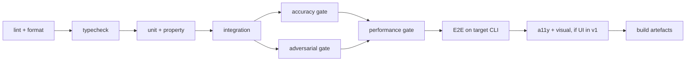

# 04 — Solution Design: Testing Strategy

**Status**: Draft
**Last updated**: 2026-09-28
**Approved by**: _pending_

> **Phase-gate note.** Drafted ahead of the Phase 3 gate at the product owner's request; rests on
> the assumptions in [`component-design.md` §0](component-design.md#0-assumed-architecture-pending-phase-3).
> Concrete tool choices below marked *(pending ADR-002)* depend on the enforcement-core language.

---

## 0. What makes testing this product unusual

A normal web app's tests answer "does the feature work?". Here, three of the tests answer "is the
product's central claim true?", and they cannot be conventional unit tests:

| Claim | How it is tested |
|---|---|
| Nothing reaches the OS unevaluated (S-02, FR-07, R-04) | **Red-team action set** at the E2E layer, run against the real host CLI |
| Intent rules decide correctly (S-01, FR-11) | **Accuracy gate** against a versioned labelled corpus, treated as a test that can fail the build |
| It is fast enough not to be switched off (R-03) | **Performance gate** against a fixed reference workload, with budgets from the NFR table |

These three are first-class CI gates, not a benchmark someone runs occasionally. A product that
passes its unit tests and fails any of them is not shippable, because each corresponds to the
reason a user would abandon it.

A fourth property is untestable by assertion and is handled differently: the sandbox boundary. No
test suite proves a sandbox unescapable. What is tested is that `BoundaryDescription` matches
observed behaviour — every boundary the product *claims* is verified, and claims not backed by a
passing test are removed from the published threat model (FR-18).

---

## 1. Layer table

| Layer | Tool | What to test |
|---|---|---|
| **Unit** | *(pending ADR-002)*: `cargo test` if Rust; Vitest for the TS/UI side | Action normalisation (path resolution, symlink escape, unicode, absolute/relative equivalence); rule matchers; **precedence resolver total-ordering**; policy parse/merge narrow-only logic; hash-chain link computation; masker span replacement and placeholder stability; cache key derivation |
| **Property-based** | `proptest` / `fast-check` | Precedence is a total order over any rule set; masking is idempotent (`mask(mask(x)) == mask(x)`); normalisation is idempotent and collision-free for distinct targets; a chain of *n* appends always verifies |
| **Integration** | Real daemon over a real socket, real embedded audit store, **stubbed model runtime with recorded responses** | `decide` end to end per `ActionKind`; fail-closed on evaluator kill; hot reload with in-flight decisions; hook timeout → deny; bounded-queue saturation → deny; durable-before-return ordering; read-only enforcement on the read API |
| **Accuracy** | Custom harness over the versioned corpus | FR-11: ≥ 95 % deny recall, ≤ 2 % false-deny. FR-13: ≥ 99 % structured-secret recall, ≤ 1 % FP, ≥ 90 % semantic-PII recall |
| **Adversarial / red-team** | Scripted action set + real host CLI | Every known route around interception; policy self-weakening; audit tampering; prompt-injection payloads (S-16) |
| **Performance** | `criterion` / `k6`-style local harness on the fixed reference workload | Every budget in the NFR table, P50/P95/P99, plus the ≥ 80 %-without-model share |
| **E2E** | Real target CLI driven headlessly against a scratch repo | The critical journeys in §5 |
| **UI component** | Testing Library + Vitest *(P2, Q-06)* | `DecisionBadge` non-colour encoding, timeline keyboard nav, editor validation surfacing, daemon-unreachable state |
| **Visual** | Playwright screenshots *(P2, Q-06)* | Dashboard, session timeline, policy editor — light/dark, 3 viewports |
| **Accessibility** | `axe-core` in component + E2E *(P2, Q-06)* | WCAG 2.1 AA: zero serious/critical violations, keyboard-only journeys, contrast |

Tests are written alongside implementation, never deferred (`.ai/workflow.md`).

---

## 2. The three gates in detail

### 2.1 Accuracy gate — `tests/corpus/`

- **Corpus**: ≥ 500 labelled actions (FR-11), versioned in-repo, covering every `ActionKind` and
  every rule category, with the deny-class deliberately over-represented on catastrophic cases
  (credential paths, destructive commands, egress to unknown hosts).
- Each entry: the canonical `Action`, the policy it is judged under, the expected decision, and a
  one-line rationale so a label can be argued with rather than trusted.
- **Held-out slice** never consulted while tuning prompts or thresholds, so the reported numbers are
  not measured on what was optimised against.
- **CI behaviour**: a run below the FR-11/FR-13 thresholds **fails the build**. A regression in
  false-deny rate fails even if deny recall improved — R-01 says a too-strict guard is uninstalled,
  which is the same outcome as no guard.
- Corpus changes require a rationale in the PR, since moving the corpus is a way to pass the gate
  without improving the product.
- **False-deny cases are the richest source of new corpus entries**, harvested from dry-run
  sessions (S-10, S-20).

### 2.2 Adversarial gate — `tests/adversarial/`

Named cases, each derived from a Discovery risk. A new case is added for every escape found, and
the case stays forever.

| Case group | Attempts | Expected |
|---|---|---|
| **Interception bypass** (R-04) | Relative and symlinked paths past a path rule; command substitution and shell chaining (`;`, `&&`, backticks, `$()`); a shell spawned to run the blocked command; an interpreter one-liner performing the blocked file write; an unknown `ActionKind` | Normalisation collapses the evasion, or the coverage gap denies (FR-10). Never an allow. |
| **Self-weakening** (R-07) | Write to the policy file; write to the audit log; delete the socket; `chmod` the config dir; set an env var pointing at a permissive policy | Denied and logged as high-severity, in every case, under every policy |
| **Audit tampering** (FR-20) | Edit a record in place; delete a middle record; truncate the tail; replay an old chain | `audit.verify` reports the break with the correct `seq`; the writer refuses to append past it |
| **Prompt injection** (S-16, R-02) | Injected instructions in a read file, in command output, in a fetched page, telling the agent to disable the guard or exfiltrate a secret | Screened and flagged/stripped per policy; any resulting action is still independently evaluated |
| **Model manipulation** | Injection aimed at the `ModelEvaluator` prompt itself, attempting a free-form or allow response | Constrained decoding rejects anything outside `DecisionKind`; malformed output → deny |
| **Saturation** (A.5) | Flood the model queue from four sessions | Denials with `EVALUATOR_SATURATED`, never allows; per-session fairness holds |
| **Boundary claims** (FR-18) | For each claim in `BoundaryDescription`, attempt exactly that | Claim holds, or the claim is deleted from the threat model |

### 2.3 Performance gate — `tests/perf/`

- **Reference workload**: one fixed, recorded agent session (a multi-file refactor with test runs —
  Dana's actual usage), replayed deterministically. Recorded once, version-pinned, changed only
  deliberately.
- Asserts every row of the NFR performance table, plus: the ≥ 80 % resolved-without-model share,
  engine RSS < 250 MB, idle CPU < 1 %, and 4 concurrent sessions within budget.
- Model-path timing is reported as **queue wait and inference time separately** so a regression is
  attributable rather than guessed at (`state-management.md` §A.5).
- Run on a pinned machine class; **P95 regression > 10 % fails the build**. A tolerance band, not an
  absolute number, avoids flapping on a noisy runner while still catching real drift.

---

## 3. Test doubles

| Dependency | Double | Why |
|---|---|---|
| Local model runtime | Recorded-response stub, keyed by prompt hash | Integration tests must be deterministic and fast; the real model is exercised only in the accuracy and performance gates |
| Host AI CLI | Recorded hook payloads per supported version | Cheap per-version regression coverage for R-05; the real CLI runs in E2E |
| Filesystem | Real, in a per-test temp dir | Path normalisation and symlink handling are exactly what must not be mocked |
| Sandbox primitive | Real | Mocking the confinement boundary would test nothing worth testing |
| Clock | Injected | Deterministic timestamps and timeout tests |
| Audit store | Real embedded store in a temp dir | Durability ordering is under test |

**Never mocked**: the precedence resolver, the hash chain, path normalisation, or the confinement
boundary. Each is a place where a mock would make a test pass while the property it stands for is
broken.

---

## 4. Coverage targets

| Area | Target | Rationale |
|---|---|---|
| `core/policy`, `core/evaluate`, `core/action` | **95 % line, 90 % branch** | A branch here is a wrong decision |
| `core/audit`, `core/sandbox` | **95 % line** | Integrity and confinement |
| `core/content` | 90 % line, **plus the accuracy gate** — coverage alone means nothing for a detector | Recall is the real metric |
| `adapters/*` | 90 % line, every supported host version fixtured | R-05 |
| `app/` (UI, P2) | 80 % line; 100 % of error/empty/loading states rendered | Per `.ai/rules/review-criteria.md` |
| Overall | ≥ 90 % line | — |

Coverage is a floor, not the goal. The gates in §2 are what actually decide whether the product
works; a 100 %-covered engine that fails the corpus is broken.

---

## 5. Critical E2E journeys

Each maps to a P0 story and runs against the real target CLI in a scratch repo.

1. **Install to enforcing** — clean machine, `guard install`, agent session, first decision recorded.
   Asserts the < 5 min budget (S-09).
2. **Intent rule blocks a real action** — a 5-line plain-language policy; the agent attempts to read
   `.env` and is denied with the right rule id and a readable reason (S-01, S-04).
3. **Deny is legible to the agent** — the host surfaces the `GuardError` as tool feedback and the
   agent adapts rather than retrying identically (S-04).
4. **Secret never leaves** — a file containing a live-format credential is read; the outbound
   content is masked; the placeholder is stable across the session (S-05).
5. **Fail-closed under failure** — kill the model runtime mid-session: subsequent
   model-path actions are denied, and the reason says why (S-08).
6. **Full session reconstruction** — after a real session, `guard log` answers what was attempted,
   what was denied, and under which rule; `guard log verify` passes (S-06, S-07).
7. **Dry-run then enforce** — dry-run a new rule, review the diff, enforce, confirm behaviour
   matches the diff (S-10, Q-08).
8. **Override and record** — a false positive is allowed once; the override, actor, and
   justification appear as a distinct log event (S-15, FR-25).
9. **Hot reload mid-session** — edit the policy while the agent works; the version transition is
   logged and in-flight decisions are judged under the version they started with (FR-26).
10. **Coverage gap is honest** — configure an adapter with a missing action class; startup reports
    it and that class is denied rather than silently allowed (FR-10, R-04).

---

## 6. CI pipeline

- Every stage is blocking. There is no "allowed to fail" stage, because each one stands for a
  reason the product would be abandoned.
- Stages A–D run on every push; the accuracy, adversarial, and performance gates run on every PR to
  the default branch and nightly.
- `guard policy validate` runs against the shipped default policy in CI, so the zero-authoring path
  (R-06, persona P4) cannot silently break.
- No network in the test environment for the accuracy and integration stages — this is how FR-12
  ("no network call in the decision path") is *proven* rather than asserted: the tests pass with
  networking disabled, or FR-12 is false.
- Sprint 1 wires `lint → test → build` (`docs/07-implementation/sprint-001-plan.md`) and populates
  the currently-empty `package.json` scripts; the later gates are added as their subjects are built.

---

## 7. Traceability

| Requirement / risk | Test |
|---|---|
| FR-01, FR-11 | Accuracy gate §2.1 |
| FR-03 | Unit + property: precedence total ordering |
| FR-04, FR-05 | Integration: policy load, narrow-only merge |
| FR-07 – FR-10, R-04 | Adversarial "interception bypass"; E2E 10 |
| FR-12 | CI network-disabled stages §6 |
| FR-13 | Accuracy gate; E2E 4 |
| FR-14, S-16 | Adversarial "prompt injection" |
| FR-15, S-04 | Integration + E2E 3 |
| FR-16 | E2E 7 |
| FR-17, FR-18, R-02 | Adversarial "boundary claims" |
| FR-19 – FR-22, FR-20 | Integration durability ordering; adversarial "audit tampering"; E2E 6 |
| FR-23 | Integration health; E2E 10 |
| FR-24, S-09 | E2E 1 |
| FR-25 | E2E 8 |
| FR-26 | E2E 9 |
| R-01 | Accuracy gate, false-deny regression rule |
| R-03 | Performance gate §2.3 |
| R-05 | Per-version adapter fixtures |
| R-06 | CI validation of the default policy |
| R-07 | Adversarial "self-weakening" |
| Accessibility NFR | a11y layer, `axe-core`, keyboard-only E2E |

---

## 8. Blocking questions

| # | Question | Blocks |
|---|---|---|
| ADR-002 | Enforcement-core language | Unit/property/perf tool choices |
| Q-04 | First target CLI | Which host the E2E journeys run against |
| Q-02 / Q-03 | Platforms and threat model | CI matrix; which boundary claims exist to verify |
| Q-06 | UI in v1? | Whether the component/visual/a11y layers are v1 work |

**Related**: [`component-design.md`](component-design.md) ·
[`state-management.md`](state-management.md) · [`routing.md`](routing.md) ·
[`../01-discovery/requirements.md`](../01-discovery/requirements.md)
