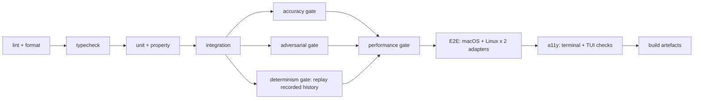

# 04 — Solution Design: Testing Strategy

**Status**: Draft
**Last updated**: 2026-10-02
**Approved by**: _pending_

> **Phase-gate note.** Drafted ahead of the Phase 3 gate at the product owner's request; rests on
> the assumptions in [`component-design.md` §0](component-design.md#0-assumed-architecture-pending-phase-3),
> each of which is now filed as a Proposed ADR in [`../05-adr/`](../05-adr/README.md).
> Tool choices below marked *(pending ADR-002)* depend on
> [ADR-002](../05-adr/002-enforcement-core-language.md) being accepted.

---

## 0. What makes testing this product unusual

A normal web app's tests answer "does the feature work?". Here, four of the tests answer "is the
product's central claim true?", and they cannot be conventional unit tests:

| Claim | How it is tested |
|---|---|
| Nothing reaches the OS unevaluated (S-02, FR-07, R-04) | **Red-team action set** at the E2E layer, run against the real host CLI |
| Intent rules decide correctly (S-01, FR-11) | **Accuracy gate** against a versioned labelled corpus, treated as a test that can fail the build |
| It is fast enough not to be switched off (R-03) | **Performance gate** against a fixed reference workload, with budgets from the NFR table |
| Every decision can be explained and reproduced (S-26, FR-30 – FR-32) | **Determinism gate** replaying recorded history: the same inputs under the same provenance must reach the same verdict by the same path, and every divergence must be attributable |

These four are first-class CI gates, not a benchmark someone runs occasionally. A product that
passes its unit tests and fails any of them is not shippable, because each corresponds to the
reason a user would abandon it.

The fourth is the newest and the least intuitive: it is not a test of a feature but of a property of
every other test's subject. A decision that cannot be explained is indistinguishable, to the person
holding the log, from a decision that was wrong — so "the engine decided correctly" is only a
checkable claim if the engine also records how. That is why an `unexplained` divergence fails the
build rather than being filed ([ADR-012](../05-adr/012-decision-trace.md)).

A further property is untestable by assertion and is handled differently: the sandbox boundary. No
test suite proves a sandbox unescapable. What is tested is that `BoundaryDescription` matches
observed behaviour — every boundary the product *claims* is verified, and claims not backed by a
passing test are removed from the published threat model (FR-18).

---

## 1. Layer table

| Layer | Tool | What to test |
|---|---|---|
| **Unit** | *(pending ADR-002)*: `cargo test` if Rust; Vitest for the TS/UI side | Action normalisation (path resolution, symlink escape, unicode, absolute/relative equivalence); rule matchers; **precedence resolver total-ordering**; policy parse/merge narrow-only logic; hash-chain link computation; masker span replacement and placeholder stability; cache key derivation |
| **Property-based** | `proptest` / `fast-check` | Precedence is a total order over any rule set; **every loser in a resolved candidate set carries exactly one eliminating precedence key, and that key genuinely accounts for the loss**; masking is idempotent (`mask(mask(x)) == mask(x)`); normalisation is idempotent and collision-free for distinct targets; a chain of *n* appends always verifies; **the canonical encoder round-trips any well-formed trace byte-identically, and truncation never drops the winning step or the decisive candidate** |
| **Integration** | Real daemon over a real socket, real embedded audit store, **stubbed model runtime with recorded responses** | `decide` end to end per `ActionKind`; fail-closed on evaluator kill; hot reload with in-flight decisions; hook timeout → deny; bounded-queue saturation → deny; durable-before-return ordering; read-only enforcement on the read API |
| **Accuracy** | Custom harness over the versioned corpus | FR-11: ≥ 95 % deny recall, ≤ 2 % false-deny. FR-13: ≥ 99 % structured-secret recall, ≤ 1 % FP, ≥ 90 % semantic-PII recall |
| **Adversarial / red-team** | Scripted action set + real host CLI | Every known route around interception; policy self-weakening; audit tampering; prompt-injection payloads (S-16) |
| **Performance** | `criterion` / `k6`-style local harness on the fixed reference workload | Every budget in the NFR table, P50/P95/P99, plus the ≥ 80 %-without-model share |
| **Determinism / replay** | Custom harness driving `decision.replay` over a permanently-retained corpus of recorded audit logs, on both OS legs | FR-32: deterministic and cache paths replay bit-identically under matching provenance; every divergence is attributed to `policy`, `provenance` or `model-nondeterminism` — never `unexplained`; every historical `traceVersion` still renders |
| **E2E** | **Both** v1 adapters driven headlessly against a scratch repo — Claude Code via its hook interface and the MCP proxy (Q-04) — **on macOS and Linux** | The critical journeys in §5, each run twice per OS, once per adapter |
| **TUI component** | Headless terminal emulator (`expectrl`/`vt100`-class) rendering to a virtual screen, asserted as a text grid | Audit-view filtering and paging, key map, focus movement, empty and daemon-unreachable states, `DECISION` tokens present as text |
| **Snapshot** | Golden text grids of each TUI view at 80×24 and 120×40, plus CLI output snapshots with and without `NO_COLOR` | Layout does not break at the narrow width; styled and unstyled output carry the same information |
| **Accessibility** | Terminal-surface checks (see §3a) — not `axe-core`, which has no DOM to inspect here | WCAG 2.1 AA as it applies to a terminal: no colour-only meaning, keyboard-only operation, contrast of the chosen palette, and the `guard audit query` equivalent path |

Tests are written alongside implementation, never deferred (`.ai/workflow.md`).

### 1a. Accessibility testing for a terminal product

Q-06 fixed v1's surfaces as the **CLI and a read-only TUI**, so there is no browser and no DOM: the
usual `axe-core` + Playwright pairing has nothing to inspect, and claiming it as coverage would be
false assurance. WCAG 2.1 AA still applies, and these are the mechanical checks that stand in for it.

| Check | How it is tested | Pass condition |
|---|---|---|
| **No colour-only meaning** (1.4.1) | Render every decision output with styling stripped (`NO_COLOR=1`, non-TTY) and diff the information content against the styled render | Each outcome carries its literal token — `ALLOW`/`DENY`/`ASK`/`MASK` — and each denial names rule id and remedy, in both renders |
| **Contrast ≥ 4.5:1** (1.4.3) | Compute the contrast ratio of every colour pair the product emits against the default light and dark profiles of macOS Terminal, iTerm2, GNOME Terminal and Windows Terminal | No pair below 4.5:1 for body text, 3:1 for non-text indicators; failures block the palette, not the release note |
| **Keyboard operable end to end** (2.1.1) | Drive the TUI through the headless terminal with keystrokes only, visiting every view and every action | Every view reachable and every action performable; no state requires a mouse event |
| **Visible, non-colour focus** (2.4.7) | Golden text grid of each view with focus on each focusable element | The focused element is distinguishable in the *text* grid (marker, inverse, border), not by colour attribute alone |
| **Screen-reader equivalent path** (1.3.1, 4.1.2) | For each TUI query, assert `guard audit query` with the equivalent flags returns the same rows in linear text | Row-for-row identical result sets; a full-screen TUI is not reliably announceable, so this path is the conformance route, and it is tested, not merely documented |
| **Timed interaction** (2.2.1) | The FR-13 interactive `ask` prompt under a simulated slow responder | The prompt states its timeout and default outcome in text, and the timeout is configurable |
| **Resize / reflow** (1.4.10) | Snapshot each view at 80×24 and 120×40 | No truncation of a decision reason or rule id at the narrow width |

Accessibility is a blocking CI stage on the same footing as the accuracy gate, not a nightly report.

---

## 2. The four gates in detail

### 2.1 Accuracy gate — `tests/corpus/`

- **Corpus**: ≥ 500 labelled actions (FR-11), versioned in-repo, covering every `ActionKind` and
  every rule category, with the deny-class deliberately over-represented on catastrophic cases
  (credential paths, destructive commands, egress to unknown hosts).
- Each entry: the canonical `Action`, the policy it is judged under, the expected decision, and a
  one-line rationale so a label can be argued with rather than trusted.
- **Held-out slice** never consulted while tuning prompts or thresholds, so the reported numbers are
  not measured on what was optimised against.
- **CI behaviour**: a run below the FR-11/FR-13 thresholds **fails the build**. A regression in
  false-deny rate fails even if deny recall improved — R-01 says a too-strict guard is uninstalled,
  which is the same outcome as no guard.
- Corpus changes require a rationale in the PR, since moving the corpus is a way to pass the gate
  without improving the product.
- **False-deny cases are the richest source of new corpus entries**, harvested from dry-run
  sessions (S-10, S-20).

### 2.2 Adversarial gate — `tests/adversarial/`

Named cases, each derived from a Discovery risk. A new case is added for every escape found, and
the case stays forever.

| Case group | Attempts | Expected |
|---|---|---|
| **Interception bypass** (R-04) | Relative and symlinked paths past a path rule; command substitution and shell chaining (`;`, `&&`, backticks, `$()`); a shell spawned to run the blocked command; an interpreter one-liner performing the blocked file write; an unknown `ActionKind` | Normalisation collapses the evasion, or the coverage gap denies (FR-10). Never an allow. |
| **Self-weakening** (R-07) | Write to the policy file; write to the audit log; delete the socket; `chmod` the config dir; set an env var pointing at a permissive policy | Denied and logged as high-severity, in every case, under every policy |
| **Audit tampering** (FR-20) | Edit a record in place; delete a middle record; truncate the tail; replay an old chain | `audit.verify` reports the break with the correct `seq`; the writer refuses to append past it |
| **Prompt injection** (S-16, R-02) | Injected instructions in a read file, in command output, in a fetched page, telling the agent to disable the guard or exfiltrate a secret | Screened and flagged/stripped per policy; any resulting action is still independently evaluated |
| **Model manipulation** | Injection aimed at the `ModelEvaluator` prompt itself, attempting a free-form or allow response | Constrained decoding rejects anything outside `DecisionKind`; malformed output → deny |
| **Saturation** (A.5) | Flood the model queue from four sessions | Denials with `EVALUATOR_SATURATED`, never allows; per-session fairness holds |
| **Boundary claims** (FR-18) | For each claim in `BoundaryDescription`, attempt exactly that | Claim holds, or the claim is deleted from the threat model |
| **Trace tampering** (FR-30) | Strip `trace` from a record and re-hash; rewrite a `keyName` so a loser appears to have lost on specificity; reorder `candidates`; reorder `steps`; forge a `winner.stepIndex`; set `truncated: false` on a truncated trace | Every one is an `AUDIT_CHAIN_BROKEN` at the altered `seq`, because the trace is inside the hash. A record whose `trace` is absent on `recordKind: 'decision'` is rejected as malformed even if its own hash is self-consistent |
| **Trace exfiltration** (FR-30 no-content rule) | Drive values that would be attractive to leak — a secret in a command argument, a credential in a read file, a long prompt — then grep every produced trace for them | No match, in any field. The `summary` stays within its 200-char redacted bound. A match is a release blocker, not a bug to triage: the trace is the artefact designed to be shared ([security.md](../03-system-design/security.md) §7) |
| **Trace growth** | Construct an action that matches the maximum number of rules, with the deepest hook and model fan-out the schema permits | Caps hold, `truncated: true` is set, the decisive candidate and the winning step survive truncation, and the encoded record stays under the 16 KB absolute bound |

### 2.3 Performance gate — `tests/perf/`

- **Reference workload**: one fixed, recorded agent session (a multi-file refactor with test runs —
  Dana's actual usage), replayed deterministically. Recorded once, version-pinned, changed only
  deliberately.
- Asserts every row of the NFR performance table, plus: the ≥ 80 % resolved-without-model share,
  engine RSS < 250 MB, idle CPU < 1 %, and 4 concurrent sessions within budget.
- Model-path timing is reported as **queue wait and inference time separately** so a regression is
  attributable rather than guessed at (`state-management.md` §A.5).
- Run on a pinned machine class; **P95 regression > 10 % fails the build**. A tolerance band, not an
  absolute number, avoids flapping on a noisy runner while still catching real drift.
- **Trace overhead is a measured row, not an assumption** (FR-30): trace construction P95 < 1 ms /
  P99 < 2 ms, added append cost P95 < 1 ms, encoded trace P50 ≤ 512 B / P99 ≤ 4 KB, and the
  **< 1 GB / 30 days** log-growth budget extrapolated from the reference workload's bytes-per-decision.
  The log budget is the one most at risk from this feature, so it is asserted rather than argued.

### 2.4 Determinism gate — `tests/replay/`

The gate that makes FR-32 a property rather than a command. It replays **recorded history** — the
reference workload's own audit log, plus a pinned corpus of previously-recorded sessions — through the
current build:

| Assertion | Threshold |
|---|---|
| Deterministic-path and cache-path replays with identical provenance and policy | **100 % identical.** Any `unexplained` divergence fails the build — this is the FR-32 bit-identical claim |
| Every decision record carries a trace with ≥ 1 step and a winning step | **100 %**; a record failing this is a pipeline defect, not a data issue |
| Every eliminated candidate carries a precedence key that accounts for it | **100 %** — tied to the resolver's totality property test |
| Canonical encoding round-trips the nested record byte-identically across macOS and Linux | **100 %** on both CI legs; a mismatch would present as `AUDIT_CHAIN_BROKEN` on an untampered log |
| `guard explain` renders every `traceVersion` the product has ever written | **100 %**, with a fixture per version retained permanently |
| Model-path replay | Reported with confidence delta, **not** asserted identical ([ADR-012](../05-adr/012-decision-trace.md) item 7) |

A divergence attributed to `policy` or `provenance` is printed and passes; `model-nondeterminism` passes
only when the deciding step is a model step **and** the weights digest matches. That last condition is
what stops the attribution from becoming a universal excuse.

---

## 3. Test doubles

| Dependency | Double | Why |
|---|---|---|
| Local model runtime | Recorded-response stub, keyed by prompt hash | Integration tests must be deterministic and fast; the real model is exercised only in the accuracy and performance gates |
| Host AI CLI | Recorded hook payloads per supported version | Cheap per-version regression coverage for R-05; the real CLI runs in E2E |
| Filesystem | Real, in a per-test temp dir | Path normalisation and symlink handling are exactly what must not be mocked |
| Sandbox primitive | Real | Mocking the confinement boundary would test nothing worth testing |
| Clock | Injected | Deterministic timestamps and timeout tests |
| Audit store | Real embedded store in a temp dir | Durability ordering is under test |
| Trace builder and canonical encoder | Real | The bytes they produce are inside the hash; a double would test a different log format than the one that ships |
| Provenance stamp | Real, with injected version inputs | The *values* are fixtures so divergence attribution can be provoked; the assembly and the digesting are not |

**Never mocked**: the precedence resolver, the hash chain, path normalisation, the confinement
boundary, **or the trace builder and canonical encoder**. Each is a place where a mock would make a
test pass while the property it stands for is broken. The trace joins this list for a specific
reason: its bytes are covered by the chain hash, so a stubbed encoder would let CI agree with itself
about a format no shipped build produces ([ADR-012](../05-adr/012-decision-trace.md) item 1).

A single-purpose double is allowed in exactly one place: the **replayer** runs the real pipeline with
the audit writer and the cache writer disabled, which is not a mock of either but a constructor
argument the production daemon never passes (§2.3 of [component-design.md](component-design.md)).
That substitution is itself tested — a replay that appends a record, or populates the cache, fails.

---

## 4. Coverage targets

| Area | Target | Rationale |
|---|---|---|
| `core/policy`, `core/evaluate`, `core/action` | **95 % line, 90 % branch** | A branch here is a wrong decision |
| `core/audit`, `core/sandbox` | **95 % line** | Integrity and confinement |
| `core/trace` (builder, truncation, canonical encoder, explain renderer, replayer) | **95 % line, 90 % branch, plus the determinism gate** | An untested truncation path silently drops the one candidate that explains the decision; an untested encoder breaks the chain |
| `core/content` | 90 % line, **plus the accuracy gate** — coverage alone means nothing for a detector | Recall is the real metric |
| `adapters/*` | 90 % line, every supported host version fixtured | R-05 |
| `app/` (UI, P2) | 80 % line; 100 % of error/empty/loading states rendered | Per `.ai/rules/review-criteria.md` |
| Overall | ≥ 90 % line | — |

Coverage is a floor, not the goal. The gates in §2 are what actually decide whether the product
works; a 100 %-covered engine that fails the corpus is broken.

---

## 5. Critical E2E journeys

Each maps to a P0 story and runs against the real target CLI in a scratch repo.

1. **Install to enforcing** — clean machine, `guard install`, agent session, first decision recorded.
   Asserts the < 5 min budget (S-09).
2. **Intent rule blocks a real action** — a 5-line plain-language policy; the agent attempts to read
   `.env` and is denied with the right rule id and a readable reason (S-01, S-04).
3. **Deny is legible to the agent** — the host surfaces the `GuardError` as tool feedback and the
   agent adapts rather than retrying identically (S-04).
4. **Secret never leaves** — a file containing a live-format credential is read; the outbound
   content is masked; the placeholder is stable across the session (S-05).
5. **Fail-closed under failure** — kill the model runtime mid-session: subsequent
   model-path actions are denied, and the reason says why (S-08).
6. **Full session reconstruction** — after a real session, `guard log` answers what was attempted,
   what was denied, and under which rule; `guard log verify` passes (S-06, S-07).
7. **Dry-run then enforce** — dry-run a new rule, review the diff, enforce, confirm behaviour
   matches the diff (S-10, Q-08).
8. **Override and record** — a false positive is allowed once; the override, actor, and
   justification appear as a distinct log event (S-15, FR-25).
9. **Hot reload mid-session** — edit the policy while the agent works; the version transition is
   logged and in-flight decisions are judged under the version they started with (FR-26).
10. **Coverage gap is honest** — configure an adapter with a missing action class; startup reports
    it and that class is denied rather than silently allowed (FR-10, R-04).
11. **Uninstall leaves a working CLI** — from the enforcing state of journey 1, run
    `guard uninstall`; assert the host CLI's configuration contains no guard hook, an agent session
    runs with **zero** guard-originated denials, the daemon and socket are gone, the policy file and
    audit log remain at the printed paths, and `guard log verify` passes and ends on the
    `guard.removed` record (S-25, FR-27, ADR-006 item 10). Variants, all asserting the same
    post-state: `--agent <name>` with a second adapter installed (the other stays enforcing);
    re-running `guard uninstall` on an already-removed install (exit `0`, every component reported
    `already absent`); removal after the host config was hand-edited to drop the hook; `--print`
    (exit `0` and **no** file modified — asserted by hashing the config tree before and after);
    and `--purge` (policy, log and weights gone, confirmation required).
12. **Teardown is crash-safe** — kill the process at each step of the removal sequence and assert
    the host CLI is left either fully guarded or fully unguarded, never with a registered hook and
    an absent engine; re-running `guard uninstall` after each kill reaches the clean end state
    (FR-27, ADR-009 item 12). This is the adversarial half of journey 11 and runs in the
    adversarial gate (§2.2), not only as an E2E.
13. **The decision explains itself** — from journey 2's denial, `guard explain <actionId>` names the
    winning rule, every candidate that matched, and the precedence key that eliminated each loser,
    **without re-evaluating anything** (asserted by running it with the model runtime stopped and the
    policy file deleted — it reads the record alone). Then `guard replay <actionId>` exits `0` with
    `identical`; editing the policy and replaying `--against` the recorded version still exits `0`,
    while replaying against the *new* version exits `4` with attribution `policy`. A `--no-model`
    replay of a model-path decision reports `unreplayable`, not `identical` (S-26, FR-30 – FR-32).
14. **A cache hit is still explainable** — repeat an identical action; the second decision's trace
    opens with a `cache` hit step citing the reused `actionId`, `guard explain` on it reaches the same
    winning rule, and replaying it is bit-identical ([ADR-012](../05-adr/012-decision-trace.md)
    item 8). This is the journey that would catch a cache that returns a verdict without its grounds.

---

## 6. CI pipeline

**The matrix (Q-02, Q-04).** Stages C, D, F, R, H and I run on **macOS and Linux**, on runners with a
real kernel, because the confinement primitives under test are kernel features: Seatbelt on macOS,
Landlock + seccomp + network namespaces on Linux. A container-only Linux runner cannot exercise
Landlock reliably and is not an acceptable substitute — if hosted runners cannot do this, that is a
Sprint-1 finding that changes the platform answer rather than something to paper over
([ADR-011](../05-adr/011-v1-scope-envelope.md) derived decision 2). **No Windows job exists**, and
no Windows boundary claim is published, so there is nothing to verify there.

Stage H runs the full journey set **twice per OS** — once through the Claude Code hook adapter and
once through the MCP proxy — which is what makes the vendor-agnostic claim tested rather than
asserted.

- Every stage is blocking. There is no "allowed to fail" stage, because each one stands for a
  reason the product would be abandoned.
- Stages A–D run on every push; the accuracy, adversarial, and performance gates run on every PR to
  the default branch and nightly.
- **The accuracy gate is a release blocker, not a target** (Q-08, R-01): with the product enforcing
  from the first action there is no dry-run period in which a false deny is harmless, so the shipped
  default policy must clear the FR-11 bar against the corpus before any release.
- **The determinism gate runs on both OS legs and compares their encoded traces to each other**, not
  only to themselves. Byte-identical replay within one platform would still permit a macOS log the
  Linux build reads as `AUDIT_CHAIN_BROKEN`; the cross-leg comparison is what makes the canonical
  encoding canonical ([data-model.md](../03-system-design/data-model.md) §5.2).
- The determinism gate's recorded corpus is **append-only and permanently retained**: traces written
  by every past release stay in it, so `traceVersion` compatibility (FR-30) is verified against real
  historical bytes rather than regenerated fixtures. Deleting a recorded session to make the gate pass
  is a change to the gate and needs the same review as changing a threshold.
- `guard policy validate` runs against the shipped default policy in CI, so the zero-authoring path
  (R-06, persona P4) cannot silently break.
- No network in the test environment for the accuracy and integration stages — this is how FR-12
  ("no network call in the decision path") is *proven* rather than asserted: the tests pass with
  networking disabled, or FR-12 is false.
- Sprint 1 wires `lint → test → build` (`docs/07-implementation/sprint-001-plan.md`) and populates
  the currently-empty `package.json` scripts; the later gates are added as their subjects are built.

---

## 7. Traceability

| Requirement / risk | Test |
|---|---|
| FR-01, FR-11 | Accuracy gate §2.1 |
| FR-03 | Unit + property: precedence total ordering |
| FR-04, FR-05 | Integration: policy load, narrow-only merge |
| FR-07 – FR-10, R-04 | Adversarial "interception bypass"; E2E 10 |
| FR-12 | CI network-disabled stages §6 |
| FR-13 | Accuracy gate; E2E 4 |
| FR-14, S-16 | Adversarial "prompt injection" |
| FR-15, S-04 | Integration + E2E 3 |
| FR-16 | E2E 7 |
| FR-17, FR-18, R-02 | Adversarial "boundary claims" |
| FR-19 – FR-22, FR-20 | Integration durability ordering; adversarial "audit tampering"; E2E 6 |
| FR-23 | Integration health; E2E 10 |
| FR-24, S-09 | E2E 1 |
| FR-25 | E2E 8 |
| FR-26 | E2E 9 |
| FR-27, S-25 | E2E 11; adversarial teardown-crash matrix (E2E 12) |
| FR-30, S-26 | Determinism gate §2.4 trace-invariant assertions; `core/trace` property tests; E2E 13, 14 |
| FR-31 | E2E 13 (explain with the model stopped and the policy deleted); performance gate §2.3 explain budget |
| FR-32 | Determinism gate §2.4 (`unexplained` divergence fails the build; exit `4` on a real policy change); E2E 13 |
| R-01 | Accuracy gate, false-deny regression rule |
| R-03 | Performance gate §2.3 |
| R-05 | Per-version adapter fixtures |
| R-06 | CI validation of the default policy |
| R-07 | Adversarial "self-weakening" |
| Accessibility NFR | §1a terminal/TUI checks, blocking in CI stage I |
| S-24 (TUI audit viewer) | TUI component + snapshot layers; the `guard audit query` equivalence check in §1a |

---

## 8. Blocking questions

Q-02, Q-03, Q-04 and Q-06 were answered on 2026-10-02 and are reflected above
([ADR-011](../05-adr/011-v1-scope-envelope.md)). Q-01 and Q-09 were answered later the same day
([ADR-013](../05-adr/013-model-and-language-resolution.md)): the model is **Laya**, so the
accuracy-gate corpus thresholds are now meaningful against a named baseline, and the product is
**single-language Rust**, so there is no Vitest-side toolchain — unit/property/perf tooling is
Rust-only. Nothing in this document is blocked any more.

One narrower point stays open past this document: how Laya is served
([ADR-005](../05-adr/005-pluggable-local-model-runtime.md) item 2, raised by
[ADR-013](../05-adr/013-model-and-language-resolution.md)). It does not change which gates exist or
their thresholds, only the harness that produces Laya's own numbers for §2.3.

**Related**: [`component-design.md`](component-design.md) ·
[`state-management.md`](state-management.md) · [`routing.md`](routing.md) ·
[`../01-discovery/requirements.md`](../01-discovery/requirements.md) ·
[`../05-adr/README.md`](../05-adr/README.md) — the four CI gates in §2 are how
[ADR-004](../05-adr/004-layered-policy-model.md), [ADR-007](../05-adr/007-cli-integration-strategy.md),
[ADR-008](../05-adr/008-sandbox-confinement-primitive.md),
[ADR-009](../05-adr/009-fail-closed-default.md) and
[ADR-012](../05-adr/012-decision-trace.md) are held to their claims
