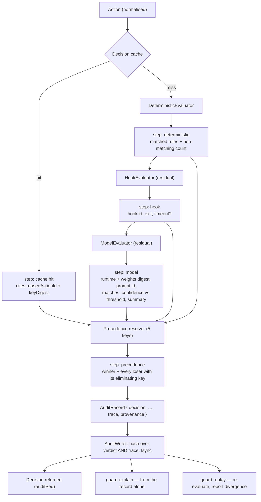

# ADR-012: The decision trace — every decision carries its own reconstruction

## Status
Proposed — raised 2026-10-02 while reviewing Phase 3 against the observability requirements

## Context

The product's third promise is full observability of what an agent attempted and what the guard did
about it ([`project-brief.md`](../../.ai/context/project-brief.md),
[ADR-006](006-audit-log-integrity.md)). As specified through Phase 3, an audit record answers
**what was decided**: `decision`, `ruleIds`, `evaluator`, `confidence?`, `reason`, `latencyMs`,
`policyVersion` ([`../03-system-design/data-model.md`](../03-system-design/data-model.md) §5.1).

That is the outcome, not the reasoning. Four questions a developer will actually ask of this product
cannot be answered from such a record:

1. **"Why did *this* rule win?"** The precedence relation is a five-key total order
   ([`../03-system-design/api-design.md`](../03-system-design/api-design.md) §6.1), so a decision is
   the result of a comparison. The record keeps the winner and discards the comparison — including
   the fact that a *model* deny overrode a *deterministic* allow, which is the single most
   surprising thing the order does (key 1 before key 2) and the one most likely to be reported as a
   bug.
2. **"Why did it decide differently than yesterday?"** `policyVersion` identifies the policy, but a
   decision also depends on the matcher implementation, the specificity weights, the detector
   versions, the model weights, the prompt template, and the decoding grammar. A guard upgrade can
   change an outcome with the policy byte-identical, and nothing in the record would show it.
3. **"Was the model even asked?"** A cache hit, a short-circuit at the deterministic layer, and a
   model `matches: false` are three different histories that produce the same `allow` row.
4. **"Can I reproduce it?"** R-01's mitigation path (argue with a false deny, then tune) and the
   false-deny budget in the accuracy gate both assume a decision can be re-run and examined. Today
   the only reproduction route is to re-submit the action to a daemon that may now be running
   different code against a different policy — which answers a different question.

This matters more here than in an ordinary service because of what the log is *for*. Under
[ADR-006](006-audit-log-integrity.md) the record is **evidence**: hash-chained, durable before the
decision returns, survivable to an auditor (persona P3). Evidence that records a verdict without its
grounds is weak evidence, and the fail-closed design ([ADR-009](009-fail-closed-default.md))
guarantees a steady supply of denials whose grounds a user will want to inspect — including denials
that happened because *nothing* decided.

The forces pulling the other way are real and quantified, which is why this is an ADR and not a
schema edit: the deterministic hot path is **P95 < 20 ms**, the audit append is **P95 < 5 ms**, and
log growth is budgeted at **< 1 GB / 30 days**
([`../03-system-design/architecture.md`](../03-system-design/architecture.md) §9). An unbounded
explanation blob violates the third and threatens the first two.

## Decision

**Every decision record carries a bounded, structured `DecisionTrace` that is sufficient to
reconstruct how the decision was reached, inside the hash chain, written on the same append.**

1. **One record, one append, one hash.** The trace is a field of `AuditRecord`, not a side-car file
   and not a second stream. It is covered by `hash`, so an explanation cannot be edited independently
   of the verdict it explains, and `audit.verify` proves both or neither.

2. **Always on.** There is no verbose flag, no sampling, and no debug level. Tracing is not a
   diagnostic mode because the decision a developer needs explained is never the one they predicted
   in advance. The trace is produced by the pipeline fold itself — each evaluator stage appends its
   step as it runs — so a traced decision and an untraced decision are not two code paths.

3. **The trace records the comparison, not just the winner.** For each candidate result that matched
   and lost, the trace names the rule, its decision, and **the precedence key that eliminated it**
   (one of the five keys of `api-design.md` §6.1). "Deterministic allow on `R-fs-07` lost to model
   deny on `R-intent-02` at key 1 (decision strength)" is a sentence the product must be able to
   produce from the record alone.

4. **Provenance is part of the decision, not of the installation.** Every record carries the
   identity of every component whose version can change an outcome: guard build, matcher-set
   version, specificity-weights version, policy version, detector versions, and — on the model path
   — runtime id, model id, weights digest, prompt-template id, and decoding-grammar version. This is
   what makes question 2 answerable and what lets the accuracy gate attribute a regression.

5. **Bounded, with truncation stated inside the hash.** Hard caps (§ below, and
   `data-model.md` §5.5): **≤ 32 candidate entries, ≤ 16 trace steps, ≤ 4 KB encoded at P99, 16 KB
   absolute**. On overflow the trace keeps the decisive entries, sets `truncated: true`, and records
   the dropped counts — inside the hashed bytes. A silently shortened explanation would be worse
   than a short one.

6. **No value ever enters the trace.** The trace carries detector ids, categories and spans, never
   matched content — the same rule already applied to `findings` and to `RedactedAction`
   (`api-design.md` §7.3). The model path records the bounded `summary` the model actually saw plus
   a digest of the redacted action, never a prompt transcript and never a raw payload.

7. **Replay is a first-class, supported operation**, exposed as `decision.explain` /
   `decision.replay` and `guard explain` / `guard replay`
   ([`../03-system-design/api-design.md`](../03-system-design/api-design.md) §3.1, §4):
   - `explain` reconstructs the reasoning **from the record alone**. It never consults the live
     policy, so it answers "why was this decided *then*" and cannot be contaminated by a later edit.
   - `replay` re-evaluates the recorded action against a named policy version and **reports
     divergence**. Divergence is a result, not an error: expected when the policy or the model
     changed, and a defect signal when neither did.
   - **The deterministic and cache paths must replay bit-identically.** A divergence with identical
     provenance on those paths is a correctness bug and fails CI. The model path is reported with its
     confidence delta and is **not** asserted identical, because a local runtime is not required to
     be bitwise reproducible across hosts — claiming otherwise would be a claim the tests cannot
     support ([ADR-008](008-sandbox-confinement-primitive.md) item 3's rule, applied to this layer).

8. **A cache hit is a traced decision too**, citing the `actionId` of the decision it reuses and the
   cache-key digest. Otherwise the R-03 optimisation would be a hole in the evidence, and question 3
   would be unanswerable precisely in the sessions with the most activity.

9. **Query stays five-dimensional.** FR-21's indexed dimensions are unchanged
   (`data-model.md` §6.2); trace-level filters (candidate rule, eliminating key, provenance field)
   are **post-index predicates** with a documented cost, not new indexes. Making the trace queryable
   by every field would trade the P95 < 1 s query budget for a capability nobody asked for.

### The budget this decision accepts

| Property | Budget | Why it holds |
|---|---|---|
| Trace construction, deterministic path | **P95 < 1 ms, P99 < 2 ms**, inside the existing P95 < 20 ms | Steps are pushed onto a pre-sized buffer during evaluation; nothing is re-computed to build it |
| Added audit append cost | **P95 < 1 ms**, inside the existing P95 < 5 ms | One larger buffer, same single `fsync`; no extra write |
| Encoded trace size | **P50 ≤ 512 B, P99 ≤ 4 KB, hard cap 16 KB** | Caps in item 5; ids and enums, never content |
| Log growth with traces | **still < 1 GB / 30 days** | Measured as a release gate, not assumed — the gate is in `testing-strategy.md` §2.3 |
| `explain` latency | **P95 < 50 ms** | A single record read plus local formatting; no evaluation |
| `replay` latency | deterministic **P95 < 100 ms**; model path inherits **P95 < 300 ms** | Same resolver, same evaluators, no I/O beyond the record |

### Shape

## Rationale

- **The explanation has the same evidentiary status as the verdict, so it belongs in the same
  signed object.** ADR-006 exists because terminal scrollback is not evidence. A trace in a
  rotating debug file would reproduce exactly that failure one level down: the verdict would be
  tamper-evident and the reasoning would not, and a dispute is always about the reasoning.

- **"Always on" is the only setting that answers the question that gets asked.** Tracing behind a
  flag answers "what does the guard do when I am watching". The expensive incidents are the ones
  nobody was watching — a false deny mid-session, a surprising allow found weeks later by an
  auditor. Given the budget above, the cost of always-on is a few hundred bytes and well under a
  millisecond; the cost of flag-gated tracing is that the interesting decision is the untraced one.

- **Determinism is already claimed; this makes it checkable.** ADR-004 asserts that the same action
  under the same policy yields the same decision. Until now that was an assertion with no artefact
  behind it. `replay` turns it into a test that runs over real recorded history, which is a
  materially stronger gate than a synthetic corpus — and it closes the loop on
  [ADR-004](004-layered-policy-model.md)'s "explainable and reproducible" claim.

- **Provenance converts "it regressed" into "this component regressed".** With a side project's
  intermittent cadence (Q-07) the gap between a behaviour change and its investigation may be weeks.
  Recording which matcher set, detector version and weights digest produced a decision is what makes
  a weeks-late investigation finish in minutes instead of a bisect.

- **Bounding by construction, not by hope.** The caps are small integers chosen so that the
  worst-case record is bounded by the schema rather than by the policy's size: a 200-rule policy
  where 150 rules match one action yields a 32-entry trace with a stated dropped count, not a
  150-entry one. The decisive entries — the winner, and the loser that lost at the earliest key —
  are retained by rule, so truncation never removes the answer to "why did this win".

- **It costs nothing in the threat model and gains a little.** The trace carries no values, so it
  does not enlarge the blast radius of someone reading the log. It *does* make a model-manipulation
  attempt visible after the fact: a record showing `matches: true, confidence 0.97` on an action a
  human reads as benign is the signal that the injection case (declared *detected, never prevented*
  under ADR-011) is actually detectable.

## Consequences

**Easier**

- Arguing with a denial (R-01, S-15): `guard explain <actionId>` prints the rule, the comparison and
  the provenance, so the fix is a rule edit rather than a guess.
- Tuning the policy: `guard policy diff` gains a real baseline, since candidate rules and eliminating
  keys are recorded rather than re-derived under today's policy.
- The accuracy gate (FR-11) and the false-deny budget become attributable: a regression names the
  component whose version moved.
- Reviewing the injection-detection claim: every screened action carries detector ids and categories.

**Harder**

- `AuditRecord` grows a nested structure, so the canonical encoding rules (`data-model.md` §5.2)
  must cover nested optionals and arrays, not just flat optional fields. Canonicalisation bugs become
  chain-verification bugs, which is why the encoder is on the never-mocked list and is property-tested
  round-trip.
- Every evaluator now has a reporting obligation as well as a deciding one. An evaluator that decides
  without appending its step is a defect, enforced by a pipeline invariant test (`steps ≥ 1` and the
  winning step present for every record), not by convention.
- The storage budget is tighter. It becomes a measured release gate rather than an estimate.
- Two more RPC methods and two more CLI commands to keep contract-tested (`api-design.md` §9).

**Required now**

1. Discovery gains **FR-30 … FR-32** and the Observability NFR gains trace, provenance and replay
   lines — amendments to a Draft document, not a new phase
   ([`../01-discovery/requirements.md`](../01-discovery/requirements.md)).
2. `data-model.md` §5.5 carries the canonical `DecisionTrace` schema; `api-design.md` §3.1/§3.3/§4
   carry `decision.explain`, `decision.replay`, `guard explain`, `guard replay`.
3. The replay-determinism job and the trace-invariant property tests join
   [`../04-solution-design/testing-strategy.md`](../04-solution-design/testing-strategy.md).
4. Sprint 1 ships the trace with the first decision, not after it: a decision path that ever ran
   untraced produces records that `explain` cannot read, and a schema version that has to be
   special-cased forever.

## Rejected Alternatives

- **Keep `reason: string` and nothing more (the status quo through Phase 3).** Cheapest, and it
  satisfies FR-15's literal text. Rejected because a prose reason cannot be queried, cannot
  distinguish a cache hit from a model `matches: false`, and cannot show which rule *lost*. It also
  rots: the reason is written by whichever evaluator won, so its vocabulary varies by code path
  exactly where consistency is needed most.

- **A side-car trace log, not hash-chained.** Simple, keeps the evidence record small, and could be
  rotated aggressively. Rejected because it splits the verdict from its grounds across two artefacts
  with different integrity guarantees: the grounds become editable without breaking the chain, and
  a missing side-car file is indistinguishable from a decision that was never explained. For a
  product whose pitch is that the log is evidence, that is the wrong trade at any size saving.

- **Verbose tracing behind `--trace` or a log level, sampled in normal operation.** The conventional
  answer, and genuinely cheaper. Rejected on the central asymmetry: the decisions worth explaining
  are unpredictable and usually already past. Sampling guarantees that the one record a user brings
  to a bug report is the one without a trace. The measured cost of always-on (< 1 ms, a few hundred
  bytes) does not justify the capability loss.

- **Capture the full model prompt and completion.** Maximal explanatory power, and the obvious thing
  to want when a classification looks wrong. Rejected twice over: it is unbounded against the log
  budget, and it re-introduces content into a file users share when filing bugs — undoing the
  redaction boundary of `api-design.md` §7.3. The bounded `summary` plus a digest of the redacted
  action identifies the input without transporting it; a user who needs the exact prompt can
  regenerate it with `guard replay`, locally, from the recorded action.

- **Re-derive the explanation at query time by re-running the current policy.** No storage cost at
  all, and always consistent with the installed guard. Rejected because it answers the wrong
  question: it reports what *today's* policy and today's build would decide about yesterday's
  action. In the one scenario that matters — "this behaviour changed, when and why" — it is
  guaranteed to hide the change. `replay` offers this deliberately as a *comparison* against the
  recorded trace, which is the same computation with the answer kept honest.

- **OpenTelemetry spans as the trace representation, exported to a collector.** Standard tooling,
  and FR-22 already requires an export stream. Rejected as the *primary* representation: spans are
  a timing model, lossy about structure (a precedence comparison is not a span tree), their exporters
  assume a network sink the product does not have (no listener, no egress — ADR-003), and they are
  dropped under pressure by design. The trace is a record field; **projecting** it onto spans for
  FR-22 export remains available and is a strictly later concern.

---
**ADR Number**: 012
**Date**: 2026-10-02
**Author**: Claude (proposed) — pending product-owner review
**Depends on**: [ADR-004](004-layered-policy-model.md) (precedence is what the trace records),
[ADR-006](006-audit-log-integrity.md) (the chain the trace lives inside),
[ADR-009](009-fail-closed-default.md) (a deny with no decider must still be explainable)
**Not blocked on Q-01 or Q-09**: the trace schema names the model's identity and weights digest as
*fields*, so it is complete before the model is chosen; it is language-agnostic, so Q-09 does not
move it.
