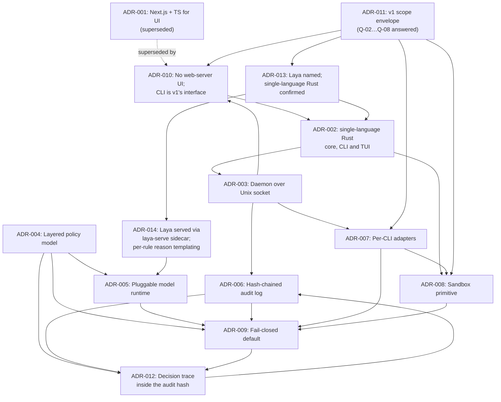

# 05 — Architecture Decision Records

**Status**: 🟡 Draft — ADR-001 **Superseded** by ADR-010; ADR-002 … ADR-014 Proposed, awaiting human review
**Last updated**: 2026-10-04, after the product owner resolved ADR-013's open point on how Laya is
served (recorded in [ADR-014](014-laya-serving-resolution.md)) and confirmed ADR-011 item 7's
wording — following the Q-01/Q-09 resolution session of 2026-10-02
([ADR-013](013-model-and-language-resolution.md)) and the earlier requirements-confirmation
session the same day (recorded in [ADR-011](011-v1-scope-envelope.md))

## Purpose
Record every significant architectural decision with context, rationale, and rejected alternatives.

## ADR Index

| # | Title | Status | Date |
|---|-------|--------|------|
| [001](001-use-react-and-typescript.md) | Use React + TypeScript with Next.js App Router | ~~Accepted~~ **Superseded by 010** | 2026-05-10 |
| [002](002-enforcement-core-language.md) | Rust for the enforcement core, TypeScript for the UI | Proposed — **amended**: single-language Rust, confirmed 2026-10-02 | 2026-09-28 |
| [003](003-local-daemon-over-unix-socket.md) | A long-lived local daemon addressed over a Unix domain socket | Proposed | 2026-09-28 |
| [004](004-layered-policy-model.md) | Layered policy — deterministic rules decide first, intent rules fill the gap | Proposed | 2026-09-28 |
| [005](005-pluggable-local-model-runtime.md) | Pluggable local model runtime with constrained decoding | Proposed — model named (Laya) 2026-10-02; served via sidecar, resolved 2026-10-04 ([014](014-laya-serving-resolution.md)) | 2026-09-28 |
| [006](006-audit-log-integrity.md) | Hash-chained, single-writer audit log, durable before the decision returns | Proposed | 2026-09-28 |
| [007](007-cli-integration-strategy.md) | Per-CLI adapters over documented hook interfaces, with a coverage matrix | Proposed | 2026-09-28 |
| [008](008-sandbox-confinement-primitive.md) | Sandbox confinement — OS-native primitives, and no absolute isolation claim | Proposed — **unblocked**; Seatbelt + Landlock/seccomp | 2026-09-28 |
| [009](009-fail-closed-default.md) | Fail-closed by default, implemented as a default value rather than a branch | Proposed | 2026-09-28 |
| [010](010-supersede-adr-001-no-web-server-ui.md) | Supersede ADR-001 — no web-server UI; the CLI is v1's interface | Proposed — amended, Q-06 closed with a TUI | 2026-10-02 |
| [011](011-v1-scope-envelope.md) | v1 scope envelope — platforms, adapters, interface, posture | Proposed | 2026-10-02 |
| [012](012-decision-trace.md) | Every decision carries its own trace, inside the audit hash | Proposed — raised by Phase 3; blocked on neither Q-01 nor Q-09 | 2026-10-02 |
| [013](013-model-and-language-resolution.md) | Laya named as the local model; single-language Rust confirmed | Proposed — records the product owner's resolution session; the open point it raised on how Laya is served is resolved by [014](014-laya-serving-resolution.md) | 2026-10-02 |
| [014](014-laya-serving-resolution.md) | Laya served via its own `laya-serve` sidecar; reasons templated from per-rule checks | Proposed — records the product owner's resolution session | 2026-10-04 |

## Scope note on ADR-001 — superseded

ADR-001 was inherited from the project scaffold and predates the project brief. It **binds
nothing**: its stated forces (SSR, static generation, SEO, Vercel deployment, a BFF) do not
describe a local guardrail daemon, and as written it conflicts with ADR-003's rule that no TCP
listener exists in the product in any configuration.
[ADR-010](010-supersede-adr-001-no-web-server-ui.md) supersedes it — deciding the constraints any
UI must satisfy (static assets, no server runtime, no listener, read-only) while deferring the
stack choice to Q-06. TypeScript for UI client code survived as a preference only until
[ADR-013](013-model-and-language-resolution.md) confirmed single-language Rust on 2026-10-02 — it
does not survive that.

ADR-002's "TypeScript for the UI" half therefore no longer rests on ADR-001 (it rested briefly on
ADR-010 item 4, then was dropped outright by ADR-013). ADR-002's enforcement-core decision is
unaffected either way — ADR-001 never governed that layer.

## Decision dependency graph

ADR-012 is the one two-way edge in the graph, and deliberately so: it *depends* on ADR-006's record
and chain, and it also *changes* what ADR-006's record contains. The alternative — a separate
side-car log — was rejected in ADR-012 precisely because it would have made the dependency one-way
at the cost of leaving the explanation outside the chain.

## What each ADR answers

| ADR | The question it settles | Primary driver |
|---|---|---|
| 002 | What language is the enforcement core, which no earlier ADR addressed? | P95 < 10 ms adapter overhead; OS confinement APIs |
| 003 | What holds the policy, model, and audit chain between actions, and how is it reached? | Model load cost; single audit writer; R-07 |
| 004 | How can plain-language rules be the authoring surface without a small model being the sole gate on irreversible actions? | **R-01**, FR-11 |
| 005 | Which local model, and how is its output prevented from becoming an instruction? | Q-01, FR-12, R-02 |
| 006 | What makes the audit log evidence rather than a debug file? | FR-19–FR-22, persona P3 |
| 007 | How are CLIs we do not control intercepted, and what happens where coverage is incomplete? | R-04, R-05, FR-08 |
| 008 | What is the confinement boundary, and what will the product claim about it? | FR-17, FR-18, R-02 |
| 009 | What happens to an action when the engine cannot evaluate it? | S-08, FR-10, Availability NFR |
| 010 | Does the product ship a UI, and may it ship a web server to do it? | ADR-003's no-listener invariant; R-07; persona P3; Q-06 |
| 011 | What is actually in v1 — which platforms, which adapters, which interface, enforcing from when? | The product owner's answers of 2026-10-02 |
| 012 | The log says *what* was decided — what makes it say *how*, and how is yesterday's decision reproduced? | FR-30–FR-32, S-26; ADR-006's chain; ADR-004's precedence order |
| 013 | Which model is "laya," and does the product collapse to one language now that the UI is a TUI? | Q-01, Q-09 |
| 014 | How is Laya served without a Node runtime, and where does a denial's reason string come from if Laya emits no free text? | ADR-013's open point; FR-11–FR-14; the P95/P99 latency budget |

## Blocked on human input

**As of 2026-10-04, no open question remains — Discovery-level or ADR-level.** Q-02 … Q-08 were
answered in the product owner's confirmation session ([ADR-011](011-v1-scope-envelope.md)); Q-01
and Q-09, the two that session left open, were answered later the same day
([ADR-013](013-model-and-language-resolution.md)): the model is **Laya**, and the product is
**single-language Rust**. That answer raised one narrower open point of its own — how Laya is
served, and where a denial's reason string comes from if Laya emits no free text — which the
owner resolved on 2026-10-04 ([ADR-014](014-laya-serving-resolution.md)): Laya runs via its own
`laya-serve` reference server as a provisioned local sidecar, reasons are templated by the engine
from whichever per-rule `noul` check(s) crossed threshold, and every decision's rule-checks are
batched into one call. [ADR-011](011-v1-scope-envelope.md) item 7's wording (Sprint-1 deliverable
vs. v1 release blocker sequenced across the pre-release sprints) was confirmed the same session —
see that ADR's Decision section.

**No ADR is currently blocked on an unanswered question.** ADR-012 was never blocked on either:
it treats the model's identity as a recorded *field* (`runtimeId`, `modelId`, `weightsDigest`)
rather than a known value, so naming Laya changes what a provenance stamp contains but not
whether one exists; and it specifies a schema and a set of properties, not a language, so the
Rust decision changes the implementation and not the decision.

Resolved: Q-02 and Q-03 (ADR-008, unblocked — Seatbelt on macOS, Landlock + seccomp + netns on
Linux, Windows unsupported), Q-04 (ADR-007 — Claude Code adapter plus the MCP proxy), Q-05, Q-06
(ADR-010 — TUI), Q-07, Q-08, Q-01 and Q-09 (ADR-013 — Laya; single-language Rust), and the
serving-mechanism/reason-string/batching open point ADR-013 raised (ADR-014).

Phase 3 approval (gate **H-1**, `../07-implementation/implementation-plan.md`) is the one
remaining step, and it is a human sign-off action rather than a further open question: the owner
reads the four Phase 3 documents and the ADR disposition table and accepts or corrects them.

## Template
See `.ai/templates/adr.md`. Every ADR records **Rejected Alternatives**, not just the decision.

---
**Note**: ADRs are created throughout the lifecycle, not just in this phase. Add them whenever a
meaningful decision is made. A decision that changes later is **superseded** by a new ADR rather
than edited in place.
