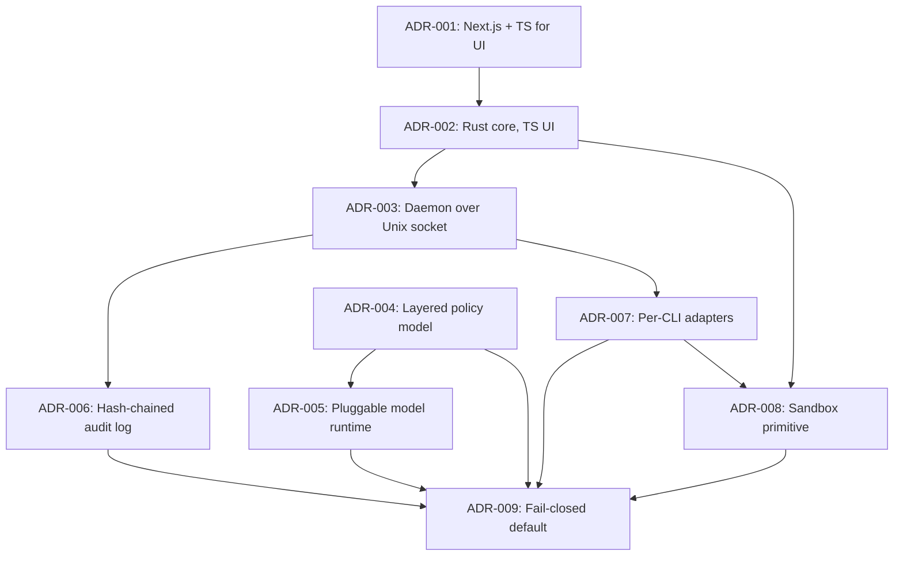

# 05 — Architecture Decision Records

**Status**: 🟡 Draft — ADR-001 Accepted; ADR-002 … ADR-009 Proposed, awaiting human review

## Purpose
Record every significant architectural decision with context, rationale, and rejected alternatives.

## ADR Index

| # | Title | Status | Date |
|---|-------|--------|------|
| [001](001-use-react-and-typescript.md) | Use React + TypeScript with Next.js App Router | **Accepted** | 2026-05-10 |
| [002](002-enforcement-core-language.md) | Rust for the enforcement core, TypeScript for the UI | Proposed | 2026-09-28 |
| [003](003-local-daemon-over-unix-socket.md) | A long-lived local daemon addressed over a Unix domain socket | Proposed | 2026-09-28 |
| [004](004-layered-policy-model.md) | Layered policy — deterministic rules decide first, intent rules fill the gap | Proposed | 2026-09-28 |
| [005](005-pluggable-local-model-runtime.md) | Pluggable local model runtime with constrained decoding | Proposed | 2026-09-28 |
| [006](006-audit-log-integrity.md) | Hash-chained, single-writer audit log, durable before the decision returns | Proposed | 2026-09-28 |
| [007](007-cli-integration-strategy.md) | Per-CLI adapters over documented hook interfaces, with a coverage matrix | Proposed | 2026-09-28 |
| [008](008-sandbox-confinement-primitive.md) | Sandbox confinement — OS-native primitives, and no absolute isolation claim | Proposed — primitive **blocked on Q-02, Q-03** | 2026-09-28 |
| [009](009-fail-closed-default.md) | Fail-closed by default, implemented as a default value rather than a branch | Proposed | 2026-09-28 |

## Scope note on ADR-001

ADR-001 is **Accepted and binding for every UI surface** — policy editor, audit log viewer,
dashboard. It was written for a web application and does not govern the enforcement core, whose
language and runtime `.ai/context/project-brief.md` records as an open question. ADR-002 decides
that layer and **does not supersede or narrow ADR-001**.

## Decision dependency graph

## What each ADR answers

| ADR | The question it settles | Primary driver |
|---|---|---|
| 002 | What language is the enforcement core, given ADR-001 governs only the UI? | P95 < 10 ms adapter overhead; OS confinement APIs |
| 003 | What holds the policy, model, and audit chain between actions, and how is it reached? | Model load cost; single audit writer; R-07 |
| 004 | How can plain-language rules be the authoring surface without a small model being the sole gate on irreversible actions? | **R-01**, FR-11 |
| 005 | Which local model, and how is its output prevented from becoming an instruction? | Q-01, FR-12, R-02 |
| 006 | What makes the audit log evidence rather than a debug file? | FR-19–FR-22, persona P3 |
| 007 | How are CLIs we do not control intercepted, and what happens where coverage is incomplete? | R-04, R-05, FR-08 |
| 008 | What is the confinement boundary, and what will the product claim about it? | FR-17, FR-18, R-02 |
| 009 | What happens to an action when the engine cannot evaluate it? | S-08, FR-10, Availability NFR |

## Blocked on human input

| ADR | Blocked on | Effect |
|---|---|---|
| 008 | **Q-02** (platforms), **Q-03** (erring vs actively-escaping agent) | The primitive per platform cannot be fixed; the ADR's *claims* half is decidable and decided |
| 005 | **Q-01** (model/runtime: "laya" read as Llama-class) | Approvable as written; accuracy and memory numbers unverifiable until a concrete pairing is named |
| 007 | **Q-04** (first target CLI) | Fixes which adapter Sprint 1 builds |
| 002 | **Q-06** (UI in v1?) | If no UI in v1, the product is single-language and ADR-001 governs nothing yet |

## Template
See `.ai/templates/adr.md`. Every ADR records **Rejected Alternatives**, not just the decision.

---
**Note**: ADRs are created throughout the lifecycle, not just in this phase. Add them whenever a
meaningful decision is made. A decision that changes later is **superseded** by a new ADR rather
than edited in place.
