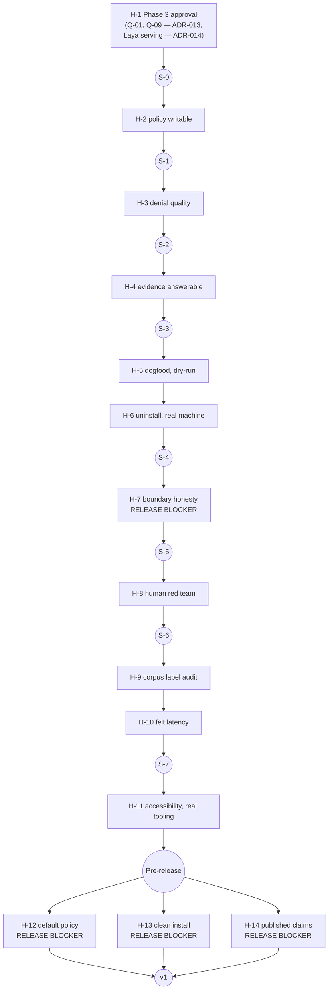

# 07 — Implementation: Work Breakdown and Human Quality Gates

**Status**: Draft
**Last updated**: 2026-10-02
**Approved by**: _pending_

> **Gate.** This plan is **blocked on Phase 3 approval** (gate **H-1**, §4). It is a breakdown of
> [`../03-system-design/`](../03-system-design/README.md), written so the sequencing can be reviewed
> alongside the design rather than after it. **No sprint starts before H-1 is signed off.**
>
> **[`sprint-001-plan.md`](sprint-001-plan.md) is now written** — S-0 below, expanded into ten tasks
> with an acceptance condition and a verification command each. The scaffold boilerplate that
> previously occupied that file (auth, a landing page, a dashboard shell) described a different
> product, bound nothing, and has been removed rather than superseded.
>
> Carries assumptions **A-1 … A-3** from [`../03-system-design/architecture.md`](../03-system-design/architecture.md).
> No build or test command exists yet; §1 S-0 is where the first one is created.

---

## 1. Sequencing principle, and one honest objection

**Every sprint must land something independently useful.** This is a side project with intermittent
time ([ADR-011](../05-adr/011-v1-scope-envelope.md)), so a sprint that only makes sense once the next
three are done is a sprint that may never be finished. Each one below ends in something a developer
could actually run.

**The objection, stated rather than designed around.** CLAUDE.md records ADR-011 as naming Sprint 1's
contents: the `CliAdapter` contract, **both** adapters, the two-OS CI matrix, the accuracy gate, and the
shipped default policy — plus clean removal (ADR-011 item 7). As one sprint on intermittent time that is
months of work with nothing runnable until the end, which is the exact failure mode the
"independently useful" rule exists to prevent.

This plan therefore reads ADR-011's list as **the v1 release envelope's blocking set** — everything in
it ships before v1, none of it is deferred past release — and sequences it across **S-1 … S-6**, each
independently useful. **Confirmed 2026-10-04**: the owner reworded ADR-011's "The team must now" item 7 from "a Sprint 1
deliverable" to "a v1 release blocker, sequenced across the pre-release sprints". Nothing in scope
changed; only the sprint boundary did, matching what this plan already assumed.

```mermaid
flowchart LR
    S0["S-0 Foundations<br/>toolchain, CI skeleton,<br/>action model, precedence"] --> S1["S-1 Decide, locally<br/>deterministic engine<br/>+ guard policy validate"]
    S1 --> S2["S-2 Evidence<br/>audit chain, query,<br/>guard log + verify"]
    S2 --> S3["S-3 First interception<br/>CliAdapter contract<br/>+ Claude Code adapter<br/>+ install/uninstall"]
    S3 --> S4["S-4 Confinement<br/>Seatbelt + Landlock,<br/>BoundaryDescription,<br/>adversarial gate"]
    S4 --> S5["S-5 Second integration<br/>MCP proxy, 5 kinds,<br/>content screening"]
    S5 --> S6["S-6 Intent rules<br/>model runtime port,<br/>accuracy gate"]
    S6 --> S7["S-7 Surfaces<br/>TUI, a11y gate,<br/>metrics, status"]
    S7 --> PR["Pre-release<br/>default policy measured<br/>against real sessions"]
```

---

## 2. Sprints

Each sprint lists: what it delivers, the design section it implements, the CI gate it turns on, and the
**human gate** it ends at (§4). Task ids are referenced by the gate table.

### 2.1 Every task is testable in its own sprint

A task may not enter a sprint unless it carries a **Deliverable**, a falsifiable **Acceptance**
condition, a **Verified by** command, and the design section it **Traces to** — and unless that
verification can run to completion using only what *that sprint and its predecessors* have built.

**No task's verification may depend on an artefact from a later sprint.** This is the rule that makes
"independently useful" (§1) mean something: a sprint whose work can only be checked once the next one
lands has not delivered, it has accumulated. When a task cannot meet the rule, it moves to the sprint
where its verification is possible — **weakening the acceptance condition to fit the sprint is never
the correct response.** Where a condition is genuinely unautomatable, it becomes a named gate in §4
with a stated reason CI cannot answer it, not a looser test.

The rule has teeth: it is what added S0-T9 to S-0 (the precedence resolver would otherwise be
invisible until S-1) and what keeps policy **hot reload** out of S-0 while policy **validation** is in
it — the first needs a daemon to reload into, the second is a pure offline comparison.

Per-sprint plans (`sprint-NNN-plan.md`) carry the four fields per task plus a runnable demo script;
[`sprint-001-plan.md`](sprint-001-plan.md) is the worked example.

### S-0 — Foundations: the things everything else is written against

*Independently useful: `guard policy validate` runs on a policy file in CI. That alone is worth having.*

| # | Task | Implements |
|---|---|---|
| S0-T1 | Rust workspace, `core/` + `adapters/` + `app/` layout; the lint forbidding `core/` importing from `adapters/` or `app/` enforced in CI, not by convention | [`component-design.md`](../04-solution-design/component-design.md) §1 |
| S0-T2 | CI skeleton: `lint+format → typecheck → unit+property`, every stage blocking, on macOS **and** Linux from the first commit | [`testing-strategy.md`](../04-solution-design/testing-strategy.md) §6 |
| S0-T3 | `Action`, `ActionKind` (all eleven), the payload union, `AbsolutePath` newtype with its validating constructor | [`data-model.md`](../03-system-design/data-model.md) §2 |
| S0-T4 | Path/argv/URL normalisation + its bypass test set (`../`, `~`, symlink, case, punycode, `sh -c`) | [`data-model.md`](../03-system-design/data-model.md) §2.3 |
| S0-T5 | Policy schema, total validation, the seven load-time checks, content-hash versioning | [`data-model.md`](../03-system-design/data-model.md) §3 |
| S0-T6 | **Precedence resolver + specificity index**, property-tested for totality, antisymmetry, transitivity; `POLICY_CONFLICT` on an unbreakable tie; **the resolver returns one `Elimination` per loser naming the key that decided it** — a return value, not a log line | [`api-design.md`](../03-system-design/api-design.md) §6, §6.4 |
| S0-T7 | `GuardError` closed catalogue, with an exhaustiveness test diffing the enum against the §5 table | [`api-design.md`](../03-system-design/api-design.md) §5 |
| S0-T8 | `guard policy validate` with exit codes `0`/`1`/`2`, `--json`, and colour-independent output | [`api-design.md`](../03-system-design/api-design.md) §4, §4.1 |
| S0-T9 | `validate --explain` — precedence order and computed specificity, readable **without a daemon**. Added so S0-T6 is observable at H-2; a CLI-surface addition proposed, not taken ([`sprint-001-plan.md`](sprint-001-plan.md) §7). Distinct from `guard explain`, which explains a *recorded decision* rather than a policy's shape | [`api-design.md`](../03-system-design/api-design.md) §6 |
| S0-T10 | One task-runner entry point shared by CI and developers; the `package.json` disposition settled by Q-09's answer — single-language Rust, see [ADR-013](../05-adr/013-model-and-language-resolution.md) — so there is no separate Node toolchain to reconcile | [`testing-strategy.md`](../04-solution-design/testing-strategy.md) §6 |

**Gate on exit: H-2.** Nothing is mocked here that §3 of the testing strategy forbids — the precedence
resolver and path normalisation are both on the never-mocked list, and they are both in this sprint
deliberately: they are the two places a silent bypass is cheapest to introduce and hardest to find later.

S0-T8 … S0-T10 were added when the sprint was planned in detail, for one reason each: §2.1's
**testable-in-its-own-sprint** rule leaves S0-T6 with no human-readable output until S-1's
`policy.simulate` exists (T9), the sprint needs a command to be independently useful at all (T8), and
no build or test command exists in the repository yet (T10). Full acceptance criteria, the demo
script and the H-2 protocol are in [`sprint-001-plan.md`](sprint-001-plan.md).

### S-1 — Decide, locally

*Independently useful: `guard policy simulate` answers "what would you do about this action" from the
command line. A developer can read their own policy back.*

| # | Task | Implements |
|---|---|---|
| S1-T1 | `DecisionPipeline` as a fold with `deny` as the initial value; no `else { allow }` anywhere, asserted by a test that greps the built artefact's control flow for an allow-by-default path | [`architecture.md`](../03-system-design/architecture.md) §4.1 |
| S1-T2 | `DeterministicEvaluator` with short-circuiting | [`architecture.md`](../03-system-design/architecture.md) §4.2 |
| S1-T3 | `HookEvaluator`: bounded external process, hard timeout, bounded output | [`security.md`](../03-system-design/security.md) §6 |
| S1-T4 | `guardd` skeleton: UDS at `0600`, the `0700` parent-directory startup check, hostile-socket refusal, JSON-RPC dispatch with the R/W allowlist | [`security.md`](../03-system-design/security.md) §4.3 |
| S1-T5 | `session.open` / `decide` / `policy.*` / `health`; `PolicyWatcher` + atomic swap | [`api-design.md`](../03-system-design/api-design.md) §3 |
| S1-T6 | **Audit-store benchmark spike**: candidates measured against P95 < 5 ms / P99 < 15 ms with fsync on, APFS + ext4 on real disks | [`data-model.md`](../03-system-design/data-model.md) §6.1 |
| S1-T7 | `DecisionCache` with its key, the never-cached cases, per-session scope | [`data-model.md`](../03-system-design/data-model.md) §5.4 |
| S1-T8 | `Confinement` **validating constructor** subtracting the engine's reserved path set; property test over generated policies | [`security.md`](../03-system-design/security.md) §4.2 |
| S1-T9 | **`EvaluatorResult` returns `step` and `candidates`** — every evaluator reports what it considered as part of its return type, so an untraced evaluator does not compile | [`component-design.md`](../04-solution-design/component-design.md) §2.3 |
| S1-T10 | **`TraceBuilder`**: accumulates steps and candidates inside the fold, owns the caps and truncation-by-rule, sets `truncated` and `dropped`; the no-content rule enforced by construction — the builder has no API that accepts a value | [`data-model.md`](../03-system-design/data-model.md) §5.5 |
| S1-T11 | **`ProvenanceStamp`**: assembled at startup and after any policy or runtime change; `LocalModelRuntime::identity()` and the refusal to start without a stable `weightsDigest` | [`api-design.md`](../03-system-design/api-design.md) §7.6 |
| S1-T12 | Cache hit emits a `cache` trace step citing the reused `actionId`; the hit **copies** the original `evaluator` value rather than inventing a `'cache'` one | [`state-management.md`](../04-solution-design/state-management.md) §A.3 |

**CI gate turned on: performance** (reference workload recorded, P95 regression > 10 % fails) — including
the trace-overhead rows, measured from the first sprint that produces a trace rather than retrofitted.
**Gate on exit: H-3.**

S1-T9 through S1-T12 are in this sprint and not a later one for the reason given in
[ADR-012](../05-adr/012-decision-trace.md): a decision record written without a trace can never acquire
one. If the first decision this product makes is untraced, that gap is permanent in the log — so the
trace ships with the pipeline, not after it.

### S-2 — Evidence

*Independently useful: `guard log` and `guard log verify` work. The product can prove what it decided.*

| # | Task | Implements |
|---|---|---|
| S2-T1 | `AuditWriter`: single writer, canonical byte encoding, hash chain, durable-before-return | [`data-model.md`](../03-system-design/data-model.md) §5.2 |
| S2-T2 | Chain verification with all four outcomes; refuse to append past a break and start a new chain referencing it | [`api-design.md`](../03-system-design/api-design.md) §3.3 `VerifyResult` |
| S2-T3 | Segments, rotation, sealing; `oldestRetainedSeq` honesty about rotation | [`data-model.md`](../03-system-design/data-model.md) §5.3 |
| S2-T4 | `AuditQuery` + the five FR-21 indexes; cursor paging on `seq` | [`data-model.md`](../03-system-design/data-model.md) §6.2 |
| S2-T5 | `audit.query` / `verify` / `stream` / `export`; `guard log`, `log verify`, `log export` with `--json` | [`api-design.md`](../03-system-design/api-design.md) §4 |
| S2-T6 | `ask.resolve` + `guard allow-once`, override records | FR-25 |
| S2-T7 | **The record carries `trace` + `provenance` inside the hash**: nested canonical encoding (arrays in produced order, never sorted; empty ≠ absent), a `decision` record without a trace rejected as malformed, cross-OS byte-equality test | [`data-model.md`](../03-system-design/data-model.md) §5.1, §5.2 |
| S2-T8 | **`decision.explain` + `guard explain`**: renders verdict, path, comparison and provenance **from the record alone** — no evaluation, no policy read; every historical `traceVersion` renders, unknown version → `TRACE_UNAVAILABLE` | [`api-design.md`](../03-system-design/api-design.md) §4 |
| S2-T9 | **`decision.replay` + `guard replay`**: same pipeline type with the audit and cache writers disabled; `identical` / `divergent` / `unreplayable`; divergence attribution; **exit code `4`** on divergence; `--policy`, `--no-model` | [`api-design.md`](../03-system-design/api-design.md) §4, §5 |

**CI gates turned on: adversarial — audit-tampering cases** (edit, truncate, reorder, forge a terminal
record) **and trace-tampering cases** (strip a trace and re-hash, rewrite an eliminating key, reorder
candidates, forge `truncated: false`), plus the **determinism gate** over the sprint's own recorded
history — the corpus it starts is append-only and retained permanently from here on.
**Gate on exit: H-4.**

### S-3 — First interception, and the ability to walk away from it

*Independently useful: the guard actually guards a real Claude Code session — and can be removed cleanly.*

| # | Task | Implements |
|---|---|---|
| S3-T1 | **`CliAdapter` contract + the shared conformance suite, written before either adapter** | [`api-design.md`](../03-system-design/api-design.md) §8 |
| S3-T2 | Claude Code hook adapter: `normalise`, `renderDenial`, recorded real host payloads as fixtures | [ADR-007](../05-adr/007-cli-integration-strategy.md) |
| S3-T3 | Coverage matrix: total over eleven kinds, asserted at startup, printed by `install` and `status` | FR-23, FR-10 |
| S3-T4 | Host version pinning → `AGENT_VERSION_UNSUPPORTED`, session refused | R-05 |
| S3-T5 | `guard install`: bottom-up, launchd agent / systemd user unit, install receipt | FR-24, S-09 |
| S3-T6 | **`guard uninstall`**: top-down, `isRegistered` probe, `plannedChanges`/`--print`, terminal `guard.removed` record, `--purge` + `--yes`, surgical host-config editing, idempotency | FR-27; [`api-design.md`](../03-system-design/api-design.md) §4.2 |
| S3-T7 | `install.probe`, shared by `uninstall` and `status` so they cannot disagree | [`api-design.md`](../03-system-design/api-design.md) §3.1 |

**CI gates turned on: adversarial — interception bypass + crash-safe teardown matrix** (kill the process
at each teardown step; assert fully guarded or fully unguarded, never a registered hook with no engine);
**E2E 11 and 12**.
**Gate on exit: H-5 and H-6.**

### S-4 — Confinement, and an honest boundary

*Independently useful: permitted actions execute inside a real OS boundary, and the published threat model
is generated from what the tests actually prove.*

| # | Task | Implements |
|---|---|---|
| S4-T1 | `SandboxExecutor` + `Confinement` application | [`component-design.md`](../04-solution-design/component-design.md) §2.5 |
| S4-T2 | macOS: Seatbelt profile generation; the `net` allowlist degrading to **deny-all** where host granularity is inexpressible | [`security.md`](../03-system-design/security.md) §2.1 |
| S4-T3 | Linux: Landlock ruleset + seccomp-bpf + network namespace; **kernel ABI startup check that refuses to start** rather than weakening | [`security.md`](../03-system-design/security.md) §2.2 |
| S4-T4 | `BoundaryDescription` as data; the **generated threat model diffed against the adversarial gate's results, so an undefended claim fails the build** | [`security.md`](../03-system-design/security.md) §2, §9 |
| S4-T5 | Adversarial: self-weakening, boundary-claim, and escape attempts on **real kernels** in CI, both platforms | [`testing-strategy.md`](../04-solution-design/testing-strategy.md) §2.2 |

**Gate on exit: H-7.**

### S-5 — Second integration: MCP, and content

*Independently useful: the product guards MCP traffic as well as the host CLI — and proves the adapter
contract was right by being the second implementation of it.*

| # | Task | Implements |
|---|---|---|
| S5-T1 | MCP proxy adapter against the **unchanged** S3-T1 conformance suite; every change the suite needs is a contract bug, logged as such | [`api-design.md`](../03-system-design/api-design.md) §8 |
| S5-T2 | Five `mcp.*` normalisers, five independent coverage cells | FR-28 |
| S5-T3 | `mcp.sample` as an action in its own right (control inversion) | FR-29 |
| S5-T4 | `content.outbound`: structured-secret + semantic-PII detectors; `Finding` with no value field | FR-13 |
| S5-T5 | `content.inbound`: injection screening that **annotates and logs, never blocks**; MCP responses screened | FR-14, FR-29 |

**Gate on exit: H-8.**

### S-6 — Intent rules, and the accuracy gate

*Independently useful: plain-language rules work — the product's actual premise (S-01).*

| # | Task | Implements |
|---|---|---|
| S6-T1 | `LocalModelRuntime` port; **constrained decoding**; startup conformance probe; reject an unconstrainable runtime | [`api-design.md`](../03-system-design/api-design.md) §7 |
| S6-T2 | `IntentEvalOutput` grammar; the engine applies the author's `decision`, the **model never names it** | [`api-design.md`](../03-system-design/api-design.md) §7.1 |
| S6-T3 | `RedactedAction` — structure only reaches the model | [`api-design.md`](../03-system-design/api-design.md) §7.3 |
| S6-T4 | Bounded queue, round-robin fairness, `EVALUATOR_SATURATED` → deny | [`security.md`](../03-system-design/security.md) §6 |
| S6-T5 | Recorded-response stub, subject to the same conformance probe | [`api-design.md`](../03-system-design/api-design.md) §7.5 |
| S6-T6 | **Accuracy corpus**: ≥ 500 versioned entries with a held-out slice; CI gate at ≥ 95 % deny recall, ≤ 2 % false deny (FR-11); ≥ 99 % / ≤ 1 % / ≥ 90 % for FR-13 | [`testing-strategy.md`](../04-solution-design/testing-strategy.md) §2.1 |

**CI gate turned on: accuracy — a release blocker, not a target** (R-01, ADR-011: enforcing from the
first action means there is no observation period in which false denies are harmless).
**Gate on exit: H-9 and H-10.** **Q-01 is answered** (A-2): the model is **Laya**
([ADR-013](../05-adr/013-model-and-language-resolution.md)), served via its own `laya-serve`
sidecar ([ADR-014](../05-adr/014-laya-serving-resolution.md)). The runtime port could already be
built without that answer; the accuracy gate still cannot be *met* until S-6 starts, because
ADR-014 requires re-measuring Laya's real latency and resource figures directly against the
package first — the published numbers cited by ADR-013/ADR-014 are secondary-source estimates,
and the corpus thresholds in S6-T6 are not yet re-derived from a measured baseline.

### S-7 — Surfaces

*Independently useful: a developer can see what happened without reading JSON.*

| # | Task | Implements |
|---|---|---|
| S7-T1 | `guard status`, `metrics`, per-action latency surfacing | FR-23, S-17 |
| S7-T2 | Read-only TUI: keyboard-only, the view inventory | [`routing.md`](../04-solution-design/routing.md) §3 |
| S7-T3 | `guard dry-run`; `mode` in every record | FR-16 |
| S7-T4 | The seven terminal/TUI accessibility checks; 80×24 and 120×40 golden grids | [`testing-strategy.md`](../04-solution-design/testing-strategy.md) §1a |
| S7-T5 | The fourteen critical E2E journeys, macOS + Linux × both adapters | [`testing-strategy.md`](../04-solution-design/testing-strategy.md) §5 |

**CI gate turned on: accessibility (blocking).**
**Gate on exit: H-11.**

### Pre-release — the shipped default policy

*Not a feature sprint. It is the work that R-01 moved from the user's first session to before release.*

| # | Task |
|---|---|
| PR-T1 | `guard policy init`'s default policy: conservative, covering every catastrophic class deterministically |
| PR-T2 | **Measure it against real recorded sessions** and report the false-deny rate (ADR-011: dry-run is opt-in, so this cannot be deferred to users) |
| PR-T3 | `guard install` on clean machines, both platforms, against the < 5 min install-to-first-decision budget |
| PR-T4 | Publish the threat model generated by S4-T4, with §3 of [`security.md`](../03-system-design/security.md) intact |

**Gate on exit: H-12, H-13, H-14 — all three are release blockers.**

---

## 3. What CI owns, so the human gates stay small

Human attention is the scarcest resource on an intermittent side project, so it must not be spent on
anything a machine can assert. CI owns, blocking, on every change:

lint + format → typecheck → unit + property → integration → **accuracy ∥ adversarial ∥ determinism** →
performance → E2E (macOS + Linux × both adapters) → accessibility → build.

That means **nobody should ever be asked to manually re-check**: latency percentiles, chain integrity,
coverage-matrix totality, precedence totality, path-normalisation bypasses, teardown crash-safety,
colour-independence, whether a boundary claim has a passing test, **whether every decision carries a
trace, whether a trace leaked a value, or whether a past decision still replays identically**. If a
human is checking one of those, a gate is missing.

The determinism gate is what keeps the trace out of the human gates. Without it, "is the explanation
right?" would be a recurring manual review of every release's log; with it, the only question left for a
person is the one in H-4 — whether a correct explanation is also a *legible* one.

---

## 4. When a human must test — the quality gates

Fourteen gates. Each exists because the question is one **CI cannot answer in principle**, not merely one
nobody has automated yet. The distinction is the whole point: a gate that could be automated should be,
and the three recurring reasons a human is genuinely required are —

- **Judgment** — is this *reasonable*? (A test can only compare against a label someone's judgment produced.)
- **Perception** — can a person actually read, understand, and act on this?
- **Adversarial creativity** — a test suite only contains attacks someone already thought of.

| # | Gate | When | What the human does | Why CI cannot | Time | Exit condition |
|---|---|---|---|---|---|---|
| **H-1** | **Phase 3 approval** | **Now — blocks everything** | Read the four Phase 3 documents; accept or correct the ADR disposition table; ~~answer or explicitly defer Q-01 and Q-09~~ **done 2026-10-02 — [ADR-013](../05-adr/013-model-and-language-resolution.md)**; ~~resolve how Laya is served~~ **done 2026-10-04 — [ADR-014](../05-adr/014-laya-serving-resolution.md)**; accept or correct assumptions A-1/A-2 | Judgment. Design review has no automated form, and A-1/A-2 are owner decisions this plan refuses to infer | 2–3 h | Phase 3 marked Approved; ADRs 002–014 moved to Accepted; ~~the ADR-011 Sprint-1 wording decision in §1 taken~~ **done 2026-10-04** |
| **H-2** | **Policy language is writable by a human** | End of S-0 | Write five real rules in the policy format **without reading the schema**, then check `guard policy validate`'s errors are actionable | Perception. A schema can be valid and unwritable; S-01's premise is "five lines of English", which only a person attempting it can falsify | 1 h | Five rules written unaided; every validation error says what to do, not just what is wrong |
| **H-3** | **Denial message quality** | End of S-1 | Read 20 denials, half deliberately false. For each: can you tell *which rule*, *why*, and *what to do instead*? | Perception. CI asserts the rule id is present; only a person can judge whether the sentence is usable mid-task — and S-04/R-01 turn on exactly that | 1 h | Every denial names the rule and a remedy; no denial requires reading the policy file to understand |
| **H-4** | **Evidence is answerable** | End of S-2 | Pick three questions a developer would really ask ("what touched my `.env` yesterday?") and answer them with `guard log` only. **Then take one denial you disagree with and run `guard explain` on it**: does the rendered trace tell you which rule won, what else matched, and why the others lost — without opening the policy file? | Judgment. CI tests that the query returns rows and that the trace contains its fields; it cannot tell whether the rows answer a human's question, or whether a list of eliminations reads as an *explanation* rather than a dump | 1 h | All three answered without a second tool and without reading raw segment files; the explanation of a contested denial is understood without reference to the policy, and `guard replay` on it exits `0` |
| **H-5** | **First real-session dogfood, dry-run** | **End of S-3, before any enforcing use** | Run a genuine hour of work with the Claude Code adapter in `guard dry-run`; read every decision afterwards | Judgment on live distribution. The corpus contains what we imagined; a real session contains what actually happens | 1–2 h | Zero would-have-denied actions that the human judges reasonable; any found becomes a corpus entry |
| **H-6** | **Uninstall on a real machine** | End of S-3 | On a machine you care about: install, hand-edit the host config, uninstall. Then `--agent`, a rerun, `--print`, and `--purge`. **Confirm the host CLI still runs.** | Judgment. CI proves the ordering invariant; only a person can confirm their own CLI is undamaged and their config file came back with their formatting intact — and FR-27 exists because getting this wrong converts a lost user into a hostile one | 1 h | Host CLI works in every variant; exit `0` from each broken state; `log verify` reports `closed-by-removal` |
| **H-7** | **Boundary-claim honesty review** | End of S-4 | Read §2 and §3 of [`security.md`](../03-system-design/security.md) **against the adversarial gate's actual results**. Delete any claim not backed by a passing test | Judgment, and the highest-stakes kind here. CI checks the diff mechanically; a human must judge whether the *prose* overstates what the test proves — ADR-008's rule is "delete, don't soften", and only a person can tell softening from accuracy | 1–2 h | Every `enforces` entry has a named passing test; §3's nine items read as plainly as written; **no Windows claim exists anywhere** |
| **H-8** | **Human red-team session** | End of S-5, repeat before release | Spend two hours **trying to get something past the guard**: a path form nobody encoded, an MCP class routed oddly, a shell construct the normaliser mis-parses, content that masks wrongly | Adversarial creativity — the irreducible one. The suite contains attacks we thought of; this gate exists to find the ones we did not, and each finding becomes a permanent test | 2 h | Every bypass found is a new adversarial test; none left unfixed at release |
| **H-9** | **Accuracy corpus label audit** | End of S-6 | Sample 50 corpus entries, including the held-out slice, and check the **labels** are right | Judgment, and this is the gate most often missed. CI measures the model against the labels; **nothing checks the labels.** A mislabelled corpus produces a green release blocker that means nothing | 1.5 h | ≥ 48/50 labels agreed; disagreements resolved by the owner and the corpus re-versioned |
| **H-10** | **Felt latency** | End of S-6 | Use the guard for an hour of real work. Does it feel like it is in the way? | Perception. P95 < 20 ms can pass while a rare slow `ask` ruins the experience — and R-03 is a *perception* risk, which percentiles can measure but not evaluate | 1 h | No point at which the human wanted to turn it off; any such point becomes a performance case |
| **H-11** | **Accessibility, with real tooling** | End of S-7 | Drive the TUI keyboard-only; run it with `NO_COLOR=1`, at 80×24, and under a screen reader; answer H-4's three questions via `guard audit query` alone | Perception. Automated checks assert contrast ratios and grid output; only a person can tell whether the interface is *usable* that way | 1.5 h | Every task completable keyboard-only and colour-free; the audit-query path genuinely substitutes for the TUI |
| **H-12** | **Default-policy credibility** | Pre-release, **blocking** | Read every rule in the shipped default and the false-deny rate from PR-T2. Judge: is this what a careful colleague would block on day one? | Judgment, and R-01's primary mitigation. The default policy is the entire first-run experience of a product that enforces from the first action; "conservative" is a human assessment | 2 h | Owner signs off the rule set and the measured false-deny rate as acceptable for a first run |
| **H-13** | **Clean-machine install** | Pre-release, **blocking** | On a machine that has never had the product: install, work for 30 minutes, uninstall | Judgment on first-run reality. CI runners are not clean machines and have no human first impression; the < 5 min budget is only meaningful as experienced | 1 h | Install < 5 min to first decision; 30 minutes of work with no manual intervention; uninstall leaves a working CLI |
| **H-14** | **Published-claims final read** | Pre-release, **blocking** | Read every externally-visible claim — README, threat model, `--help`, denial text — and strike anything the tests do not support | Judgment. This is the product's integrity in one pass: a security tool that overstates its boundary is worse than one with none, because the user stops checking | 1.5 h | Every claim traceable to a passing test or deleted |

### 4.1 Gate rules

- **A gate blocks the next sprint.** It is not a review to be caught up on later; S-4 does not start
  before H-5 and H-6 are signed.
- **Every finding becomes an automated test.** A gate that finds the same class of problem twice is a
  missing CI stage, and that is a bug in this plan. H-8 in particular is expected to *grow* the
  adversarial suite every time it runs.
- **Four gates are release blockers**: H-7 (boundary honesty), H-12 (default policy), H-13 (clean
  install), H-14 (published claims). H-9 is effectively one too — a green accuracy gate over bad labels
  is worse than a red one, because it is trusted.
- **Total human time: roughly 18–21 hours across the whole v1**, in sessions of one to three hours. That
  is the budget this plan is designed around; if a gate needs more, it has absorbed work CI should own.
- **Five gates need a real machine and a real session** (H-5, H-6, H-8, H-10, H-13). They cannot be done
  on a CI runner, and scheduling them is the main calendar constraint on this plan.

### 4.2 The gates in sequence

---

## 5. Dependencies and risks on this plan

| # | Dependency | Effect if unmet |
|---|---|---|
| D-1 | **H-1** (Phase 3 approval) | Nothing starts |
| D-2 | **Q-01** answered (the local model) — **done 2026-10-02, [ADR-013](../05-adr/013-model-and-language-resolution.md): the model is Laya**, served via its own sidecar — **done 2026-10-04, [ADR-014](../05-adr/014-laya-serving-resolution.md)** | S-6's accuracy gate still cannot be *met* until Laya's real latency/resource figures are measured against the package, per ADR-014; S-0 … S-5 are unaffected, which is why intent rules are sequenced last |
| D-3 | **Q-09** answered (single-language Rust) — **done 2026-10-02, [ADR-013](../05-adr/013-model-and-language-resolution.md)** | S-0's workspace layout and S-7's TUI artefact are built as one Rust binary from the start; the delta that deciding it late would have cost is in [`architecture.md`](../03-system-design/architecture.md) §8 |
| D-4 | Recorded host payloads from both CLIs | S-3/S-5 fixtures. Must be captured from real sessions — a hand-written fixture tests our idea of the host, which is what R-05 says will drift |
| D-5 | macOS **and** Linux CI runners on real kernels | S-4's boundary claims are unpublishable without them; a containerised fake would make §2 of `security.md` false exactly where it matters |
| D-6 | Real recorded sessions for PR-T2 | The default policy cannot be measured, and R-01's primary mitigation is unverified |

| # | Risk to the plan | Mitigation |
|---|---|---|
| P-1 | The audit-store benchmark (S1-T6) finds no candidate meeting 5 ms | The fallback format is already specified ([`data-model.md`](../03-system-design/data-model.md) §6.1), so this costs a sprint, not a redesign |
| P-2 | The `CliAdapter` contract turns out wrong when the MCP proxy is built (S-5) | Expected and useful — it is why the contract is written first and the conformance suite is shared. Every change S5-T1 forces is logged as a contract bug, not absorbed silently |
| P-3 | Intermittent time stalls a sprint mid-flight | Every sprint ends in something runnable; a stall leaves a working, smaller product rather than a branch |
| P-4 | Human gates get skipped under time pressure | The four release blockers are named as such, and §4.1 makes a gate's findings into permanent tests so the cost of skipping is visible later |

---

**Related**: [`../03-system-design/README.md`](../03-system-design/README.md) ·
[`../03-system-design/architecture.md`](../03-system-design/architecture.md) ·
[`../03-system-design/data-model.md`](../03-system-design/data-model.md) ·
[`../03-system-design/api-design.md`](../03-system-design/api-design.md) ·
[`../03-system-design/security.md`](../03-system-design/security.md) ·
[`../04-solution-design/testing-strategy.md`](../04-solution-design/testing-strategy.md) ·
[`../05-adr/011-v1-scope-envelope.md`](../05-adr/011-v1-scope-envelope.md)
