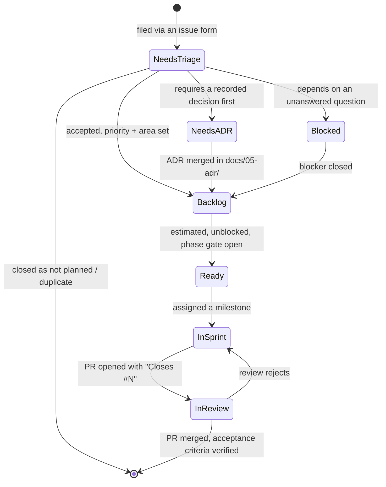

# Issue Tracking — GitHub Issues as the Work Queue

**Status**: Draft
**Last updated**: 2026-09-27
**Approved by**:

## Decision in one line

**GitHub Issues is the system of record for user stories, tasks, and defects.** Markdown files in
`docs/` remain the system of record for *requirements, designs, and decisions*. An issue says what
is being worked on and by whom; a document says what was agreed and why.

Repository: [`AriesNg/ai-guard-bot`](https://github.com/AriesNg/ai-guard-bot/issues).

## What goes where

| Artefact | Home | Why |
|----------|------|-----|
| Requirements (FR / NFR), personas, scope boundaries | `docs/01-discovery/requirements.md` | Needs to be reviewed and **approved** as one coherent whole, and superseded rather than edited away |
| Architecture, data model, API contracts | `docs/03-system-design/`, `docs/04-solution-design/` | Same |
| Decisions and rejected alternatives | `docs/05-adr/` | An ADR is a permanent record; a closed issue is not |
| **User stories** | GitHub issue, `type:story` | Has state, an assignee, a discussion, and closes with a PR |
| **Tasks / spikes** | GitHub issue, `type:task` | Same |
| **Defects** | GitHub issue, `type:defect` | Same |
| Sprint scope and outcome | `docs/07-implementation/sprint-NNN-plan.md` / `-review.md` | A point-in-time snapshot naming the issues in that sprint |
| Security vulnerabilities | Private security advisory | Must not be public before a fix exists |

A requirement is **not** duplicated into an issue body. The story links to its requirement id
(`FR-07`) and the requirement document links back to the issue query. One fact, one home.

## Issue types

Three forms, in `.github/ISSUE_TEMPLATE/`. Blank issues are disabled — every issue arrives with
the fields triage needs.

| Form | Label | Use when |
|------|-------|----------|
| `user-story.yml` | `type:story` | The work can be demoed to a person |
| `task.yml` | `type:task` | It cannot — scaffolding, CI, tooling, refactor, spike |
| `defect.yml` | `type:defect` | Behaviour contradicts an approved document or an acceptance criterion |

## Label taxonomy

Run `./.github/bootstrap-labels.sh` once to create these; it is idempotent and safe to re-run
when the taxonomy changes.

| Group | Labels | Rules |
|-------|--------|-------|
| Type | `type:story`, `type:task`, `type:defect` | Exactly one, set by the form |
| Priority | `P0`, `P1`, `P2` | Exactly one. `P0` means the release does not ship without it |
| Severity | `S1`–`S4` | Defects only, in addition to priority. Severity is impact; priority is scheduling. They are allowed to disagree — an `S1` in an unreleased area can be `P1` |
| Status | `status:needs-triage`, `status:ready`, `status:blocked`, `status:needs-adr` | At most one; absence means "in the backlog, not yet ready" |
| Area | `area:interceptor`, `area:policy-engine`, `area:local-model`, `area:sandbox`, `area:masking`, `area:audit-log`, `area:ui`, `area:config`, `area:infra`, `area:docs` | At least one. Mirrors the core capabilities in the README |
| Phase | `phase:01-discovery` … `phase:07-implementation` | The phase whose documents this traces to. An issue labelled with a phase that is not yet approved must not be worked on — see the phase gate below |

Milestones carry sprints (`Sprint 1`, `Sprint 2`, …), not labels. An issue with no milestone is
backlog.

## Lifecycle



## The phase gate still applies

GitHub Issues does not loosen the phase gate in `.ai/workflow.md`; it makes violations visible.

- A story may be **filed** at any time. Filing is capture, not permission.
- A story may only be **worked on** when the phase it traces to is Approved. Check the
  `**Status**` line in that phase's `README.md`.
- An issue that would force an architectural decision gets `status:needs-adr` and waits for a
  merged ADR in `docs/05-adr/`. Code does not settle a decision retroactively.
- Discovery is where stories *come from*, so filing stories is part of Phase 1 output — see
  `docs/01-discovery/README.md`.

## Traceability

Both directions, so neither side rots:

- **Issue → document**: the story form's Traceability field names the requirement id, design
  document, and constraining ADR.
- **Document → issue**: `requirements.md` carries a table of requirement id → issue link, and each
  `sprint-NNN-plan.md` lists the issue numbers in that sprint.
- **Issue → code**: the PR says `Closes #N`, so the merge commit is discoverable from the issue.

Useful queries:

```bash
gh issue list --label "type:story" --label "P0" --state open       # the P0 story backlog
gh issue list --label "type:defect" --label "S1" --state all       # every critical defect, ever
gh issue list --milestone "Sprint 1"                               # current sprint
gh issue list --label "status:needs-adr"                           # blocked on a decision
gh issue list --search "no:milestone label:type:story is:open"     # unscheduled stories
```

## Conventions

- **Title**: `[Story] Deny reads of ~/.ssh with a named rule id`. The form pre-fills the prefix.
- **One PR closes one issue.** A PR closing nothing explains itself in the Notes section.
- **Branch names**: `<type>/<issue-number>-<slug>`, e.g. `story/14-deny-ssh-reads`,
  `defect/22-fail-open-on-timeout`.
- **Defect intake during a sprint**: an `S1` or `S2` defect found mid-sprint is pulled into the
  current milestone and something of equal size is pushed out — recorded in that sprint's review,
  not absorbed silently.
- **Closing a story** requires every acceptance-criteria checkbox ticked and the verification
  written in the PR. "Looks right" is not verification.
- **Never delete an issue.** Close as `not planned` so the reasoning survives.

## Definition of ready (before an issue enters a sprint)

- [ ] Type, priority, and at least one area label set
- [ ] Traces to an approved requirement or design document
- [ ] Acceptance criteria are testable, and include the deny/failure path
- [ ] Non-functional targets quantified, or explicitly "project defaults"
- [ ] No open `status:blocked` / `status:needs-adr`
- [ ] Small enough to finish inside one sprint — otherwise split it

---

**Prerequisite**: none. This is process, not product, and applies from Phase 1 onward.
**Related**: [`docs/01-discovery/README.md`](../01-discovery/README.md),
[`docs/07-implementation/README.md`](README.md), `.ai/workflow.md`
