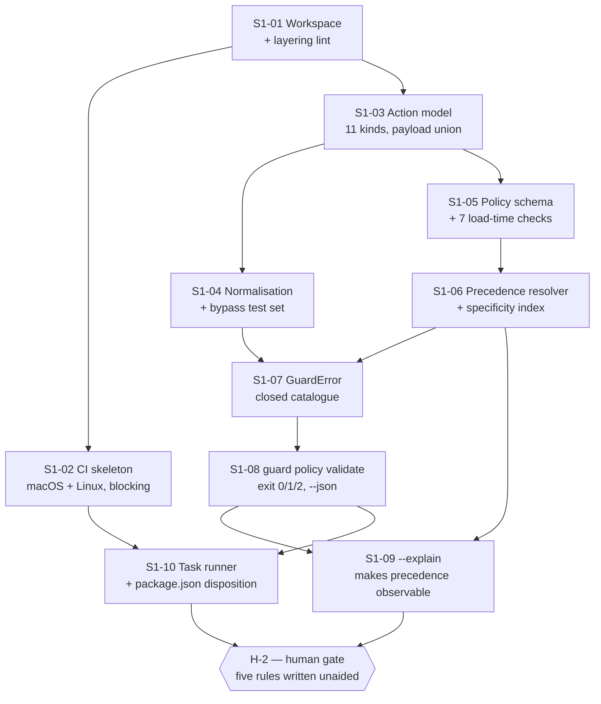

# Sprint 1 — S-0 Foundations: the decision substrate, and the first thing that runs

**Status**: Draft
**Last updated**: 2026-10-02
**Approved by**: _pending_
**Sprint**: 1 of the S-0 … S-7 + pre-release sequence in [`implementation-plan.md`](implementation-plan.md) §2
**Exit gate**: **H-2** — "policy language is writable by a human" ([`implementation-plan.md`](implementation-plan.md) §4)

> **This file replaces the scaffold boilerplate** that previously occupied it (auth, a landing page,
> a dashboard shell). That content described a different product and bound nothing; it is gone rather
> than superseded, because it never applied.
>
> **Gate.** This sprint is **blocked on H-1 — Phase 3 approval.** Nothing below starts before the
> four Phase 3 documents are approved and ADRs 002–012 move to Accepted. The plan is written now so
> the task-level sequencing can be reviewed in the same sitting as the design.
>
> Carries assumptions **A-1 … A-3** from [`../03-system-design/architecture.md`](../03-system-design/architecture.md)
> and adds **A-4 … A-6** in §2 below. **No build or test command exists in this repository yet.**
> Tasks S1-01 and S1-10 are where the first ones are created; until they are merged, do not claim one exists.

---

## 1. Sprint goal, in one sentence

**Make the engine's decision substrate exist and be provable: the canonical action model, the
normalisation that makes it a security boundary, the policy schema with total validation, the
precedence resolver with a proven total order, and the closed error catalogue — delivered behind one
runnable command, `guard policy validate`, with a blocking two-OS CI pipeline around it.**

### 1.1 What is independently useful at the end of this sprint

A developer who has never run the guard can, on macOS or Linux:

```
guard policy validate ./guard.policy.yaml            # exit 0 | 2, human-readable
guard policy validate ./guard.policy.yaml --json     # machine contract, CI-usable
guard policy validate ./guard.policy.yaml --explain  # precedence order + computed specificity
```

That is a real tool — it lints a policy in CI before anything is enforced — and it is the entire
surface this sprint ships. There is no daemon, no interception, no audit log, no model and no sandbox
in Sprint 1; those are S-1 … S-6, and nothing in this sprint's verification may depend on them (§3.1).

### 1.2 Explicitly out of scope for Sprint 1

`guardd`, the Unix socket, `DecisionPipeline`, evaluators of any kind, the audit chain, `CliAdapter`
and either adapter, confinement, the local model, the TUI, `guard install` / `guard uninstall`. Each is
sequenced in [`implementation-plan.md`](implementation-plan.md) §2. Writing any of them in Sprint 1
would produce code this sprint cannot test, which §3 forbids.

---

## 2. Assumptions this sprint carries

Stated rather than resolved, per `.ai/instructions.md` — none of these is inferred into a decision.

| # | Assumption | If it is wrong |
|---|---|---|
| **A-4** | **Q-09 resolves to single-language Rust.** The workspace is `core/` + `adapters/` + `app/` as Rust crates and no Node runtime ships. | If Rust + TypeScript is chosen instead, S1-01 adds a TS workspace beside the crates and S1-10 keeps `package.json` as a delegating entry point. The task list does not otherwise change; the cost is roughly half a day in S1-01/S1-10. **Deciding this before S1-01 starts avoids all of it** (D-3). |
| **A-5** | **`package.json` is scaffold residue.** Under A-4 it is deleted in S1-10, which contradicts the line in [`testing-strategy.md`](../04-solution-design/testing-strategy.md) §6 saying Sprint 1 "populates the currently-empty `package.json` scripts". | That line is amended, not this plan. Filed in §8 as a doc change S1-10 must make. |
| **A-6** | **`component-design.md` §1's `src/` tree is pre-ADR-010** and still shows a Next.js `app/`. The layout S1-01 creates is the same `core/` / `adapters/` / `app/` split, with `app/` as the CLI + TUI binary, not a web app. | If the owner reads §1 as still binding, S1-01 stops and the question returns to Phase 4. ADR-010 makes this unlikely; it is named so nobody has to guess. |

**Q-01 (which local model) does not block this sprint.** Nothing here touches the model runtime —
which is why intent rules are sequenced last ([`implementation-plan.md`](implementation-plan.md) D-2).

---

## 3. The sprint's own rule: every task is testable at the end of *this* sprint

This is the contract the rest of the document is written against, and it is now a standing rule for
every sprint (`CLAUDE.md` → "Sprint tasks must be testable in their own sprint";
[`README.md`](README.md) §Testability contract).

**A task may not enter a sprint unless it carries all four of these, and its verification can run to
completion using only what that sprint and its predecessors have built:**

| Field | What it means |
|---|---|
| **Deliverable** | The artefact that exists afterwards — a module, a command, a CI stage. |
| **Acceptance** | The observable, falsifiable condition. Not "implemented"; a statement that can come out false. |
| **Verified by** | The exact command a reviewer runs, plus the test file asserting it in CI. Automated, unless a human gate is named — in which case [`implementation-plan.md`](implementation-plan.md) §4 says which gate and why CI cannot answer it. |
| **Traces to** | The design section it implements, so a task cannot drift from the document it came from. |

### 3.1 The forward-dependency ban

**No task's verification may depend on an artefact from a later sprint.** This is what makes
"testable after Sprint 1 is completed" true rather than aspirational, and it is why two things here
look different from how they appear in the design documents:

- **S1-06 (precedence resolver)** would naturally be demonstrated through `guard policy simulate` —
  but that command belongs to S-1. It is therefore verified by property tests **plus** `--explain`
  (S1-09), a flag that makes the resolver's output readable **without a daemon**. §7 proposes that
  surface change rather than taking it.
- **S1-05 (policy validation)** includes the `POLICY_WIDENS_BASELINE` check, a pure structural
  comparison and so testable offline — unlike the hot-reload path, which is not, and stays in S-1
  where a daemon exists to reload into.

A task that cannot satisfy this moves to the sprint where its verification is possible. That is the
only correct response; weakening the acceptance condition to fit the sprint is not.

### 3.2 What this sprint deliberately does **not** mock

Per [`testing-strategy.md`](../04-solution-design/testing-strategy.md) §3 the **precedence resolver**
and **path normalisation** are on the never-mocked list — and both are in Sprint 1 on purpose. They
are the two places a silent bypass is cheapest to introduce and most expensive to find later, so they
are built first, against real files in per-test temp directories and real generated rule sets.

---

## 4. Tasks

Ten tasks. **S1-01 … S1-07 are S0-T1 … S0-T7** from [`implementation-plan.md`](implementation-plan.md) §2
with acceptance criteria attached; **S1-08 … S1-10 are added at sprint planning** and are folded back
into that document's S-0 table, so the two cannot disagree.



---

### S1-01 — Workspace layout, and the layering rule enforced rather than promised

| | |
|---|---|
| **Deliverable** | Rust workspace with `core/`, `adapters/`, `app/` crates (A-4, A-6); `core/` subdivided per [`component-design.md`](../04-solution-design/component-design.md) §2 as modules, not yet populated. A CI-enforced lint forbidding `core/` from importing `adapters/` or `app/`. |
| **Acceptance** | (a) `cargo build --workspace` succeeds on macOS and Linux. (b) A deliberately added `use adapters::…` inside `core/` **fails the build**, and the failure names the layering rule rather than a generic resolution error. |
| **Verified by** | `just check-layering`, which builds a fixture crate containing the forbidden import and asserts a non-zero exit with the expected message. Test: `tests/layering/forbidden_import.rs`. **The negative case is the test** — a lint nobody has watched fail is not known to work. |
| **Traces to** | [`component-design.md`](../04-solution-design/component-design.md) §1, "the one structural rule" |
| **Estimate** | 0.5 day |

### S1-02 — CI skeleton: two OSes, every stage blocking, from the first commit

| | |
|---|---|
| **Deliverable** | `lint + format → typecheck/build → unit + property` on **macOS and Linux runners with real kernels**, blocking on every push. Coverage reporting wired to the [`testing-strategy.md`](../04-solution-design/testing-strategy.md) §4 targets for the modules that exist by sprint end (`core/action`, `core/policy`: **95 % line, 90 % branch**). No "allowed to fail" stage exists. |
| **Acceptance** | (a) Both OS jobs run and are required. (b) A PR with a formatting violation, a failing unit test, or coverage below the threshold is **blocked** — each demonstrated once on a deliberately broken branch. (c) **Runner finding recorded**: whether hosted Linux runners can exercise Landlock. [`testing-strategy.md`](../04-solution-design/testing-strategy.md) §6 calls a negative result *a Sprint-1 finding that changes the platform answer*, so it is probed now rather than discovered in S-4. |
| **Verified by** | Three linked PRs, each red for exactly one reason, plus the CI config in review. The Landlock probe is a one-file job printing the Landlock ABI version, kept permanently as `ci/probe-landlock`. |
| **Traces to** | [`testing-strategy.md`](../04-solution-design/testing-strategy.md) §6 |
| **Estimate** | 1 day |
| **Risk it retires early** | D-5. If hosted runners cannot do Landlock, that is known in week one rather than in S-4, where the published boundary claims depend on it. |

### S1-03 — The canonical `Action`: eleven kinds, one discriminated payload

| | |
|---|---|
| **Deliverable** | `ActionKind` as a closed enum of all **eleven** variants; `Action`; the kind-discriminated `ActionPayload` union; `EnvNames` as names only; serde round-trip against the wire shape. |
| **Acceptance** | (a) A `payload.kind` disagreeing with `Action.kind` is a **validation failure**, never a reinterpretation. (b) An `Action` carrying an env **value**, file content, or a request body cannot be constructed — the types make it unrepresentable, and a test asserts the serialised form of a maximal action contains no value-bearing field. (c) Adding a twelfth kind breaks every exhaustive match — demonstrated once on a branch, then reverted. |
| **Verified by** | `just test core::action` — `tests/action/payload_discriminant.rs`, `tests/action/no_secret_fields.rs`, and a serde round-trip property test over generated actions. |
| **Traces to** | [`data-model.md`](../03-system-design/data-model.md) §2.1, §2.2, §2.4 |
| **Estimate** | 1 day |

### S1-04 — Normalisation, and the bypass set that proves it is a boundary

| | |
|---|---|
| **Deliverable** | `AbsolutePath` as a **newtype with a validating constructor** — an unnormalised string cannot become one. Path canonicalisation (`~`, `.`/`..`, symlinks, trailing slash), argv parsing with `shell: true` recorded, URL host extraction (lower-cased, IDNA-normalised, port kept separately). `NORMALISATION_FAILED` for anything unparseable. |
| **Acceptance** | **The bypass set, run against a real filesystem in a per-test temp dir — never mocked:** `../../.ssh/id_rsa`; `~/.ssh/id_rsa`; a symlink into `.ssh`; a case-variant path on APFS; a punycode homograph host; `sh -c 'rm  -rf /tmp/x'` with irregular whitespace; backtick and `$()` substitution; an unparseable shell string. **Each row must either collapse to the same canonical `Action` as its plain form, or fail with `NORMALISATION_FAILED`. An action is never passed through partially parsed, and never silently differs.** Plus the property tests: normalisation is **idempotent** and **collision-free for distinct targets**. |
| **Verified by** | `just test core::action::normalise` — `tests/action/bypass_set.rs` (table-driven, one named row per case above) and `tests/action/normalise_props.rs`. |
| **Traces to** | [`data-model.md`](../03-system-design/data-model.md) §2.3; [`testing-strategy.md`](../04-solution-design/testing-strategy.md) §3 |
| **Estimate** | 2 days |
| **Note** | This table **is** the beginning of the S-4 adversarial suite's "interception bypass" group. Cases found later are added here, and stay forever. |

### S1-05 — Policy schema, total validation, content-hash versioning

| | |
|---|---|
| **Deliverable** | `Policy`, `Rule` (`DeterministicRule` \| `IntentRule`), `DecisionKind`, `VersionedPolicy`. All **seven load-time checks**. Baseline → project merge, narrow-only. `version` as the content hash of the merged, canonicalised policy. |
| **Acceptance** | (a) Each of the seven checks has **at least one rejecting fixture and one accepting fixture**, and each rejection reports its specified code — `POLICY_INVALID`, `POLICY_WIDENS_BASELINE`, `POLICY_CONFLICT`. (b) Validation is **total**: a policy is fully valid or fully rejected, and no partial-activation path exists. (c) Two different orderings of the same rule set produce the **same** `version` hash; any rule change produces a different one. (d) **NFR, measured not asserted**: a 200-rule policy loads and validates in **< 500 ms**, recorded as the sprint's first performance datum. |
| **Verified by** | `just test core::policy` over `tests/fixtures/policy/{valid,invalid}/**` — one file per check, named for the check. `just bench policy-load` for (d). |
| **Traces to** | [`data-model.md`](../03-system-design/data-model.md) §3, §3.1, §3.2 |
| **Estimate** | 2 days |

### S1-06 — Precedence resolver and specificity index — proven total, not asserted total

| | |
|---|---|
| **Deliverable** | The five-key comparison (decision strength → evaluator authority → specificity → source layer → declaration order); `specificity()` with the published weight table; `specificityIndex` precomputed **once per policy version**. One implementation, in `core/policy`, with no second copy anywhere. **The resolver returns one `Elimination` per loser** — the losing rule, what it lost to, and the key that decided it ([`api-design.md`](../03-system-design/api-design.md) §6.4) — as a return value, not a log line, because S-2's decision trace and `guard explain` consume it ([ADR-012](../05-adr/012-decision-trace.md)). |
| **Acceptance** | **Property-tested over generated rule sets for totality, antisymmetry and transitivity** — the three properties that make "more specific wins" an order rather than an intuition. Plus the named cases: an exact match outranks a pattern that also matches it; an intent rule never outranks a deterministic rule on specificity; **a model `deny` beats a deterministic `allow`** (key 1 before key 2, deliberately — [`api-design.md`](../03-system-design/api-design.md) §6.1); and two rules with **different decisions** tying on all five keys are rejected at load with `POLICY_CONFLICT` **naming both rule ids**. Plus one more property, which is what makes the later trace trustworthy: **every loser in a resolved set carries exactly one eliminating key, and replaying that key's comparison reproduces the loss.** A resolver that reports "lost on specificity" where the decision was really made on source layer would put a plausible falsehood inside the audit hash. |
| **Verified by** | `just test core::policy::precedence` — `tests/policy/precedence_props.rs` (proptest) and `tests/policy/precedence_cases.rs`. Human-observable output via S1-09. |
| **Traces to** | [`api-design.md`](../03-system-design/api-design.md) §6, §6.4 |
| **Estimate** | 2 days |
| **Note** | Never mocked, here or in any later sprint. S-1's `policy.simulate` and S-2's `policy.diff` call this same code, which is what makes a simulation unable to disagree with enforcement. |

### S1-07 — `GuardError`: the closed catalogue

| | |
|---|---|
| **Deliverable** | `GuardError` with the **twenty** codes of [`api-design.md`](../03-system-design/api-design.md) §5 as a closed enum — the table now includes `RECORD_NOT_FOUND`, `TRACE_UNAVAILABLE` and `POLICY_VERSION_UNAVAILABLE`, added by [ADR-012](../05-adr/012-decision-trace.md) — each carrying its `retryable` value and an actionable `message` that says what to do instead. |
| **Acceptance** | (a) An **exhaustiveness test** asserts the code set matches the documented table exactly — a code added to the design and not to the code, or the reverse, **fails the build**. This test is what keeps the set closed; without it, "closed" is a comment. (b) Every code's `retryable` value matches the table. (c) Only the codes reachable in Sprint 1 are *constructible* so far (`POLICY_INVALID`, `POLICY_WIDENS_BASELINE`, `POLICY_CONFLICT`, `NORMALISATION_FAILED`, `INVALID_REQUEST`); the rest exist as variants with a per-code checklist naming the sprint that must make each constructible, so an orphaned code stays visible. |
| **Verified by** | `just test core::error` — `tests/error/catalogue_matches_design.rs`, which parses the table out of `api-design.md` §5 and diffs it against the enum. |
| **Traces to** | [`api-design.md`](../03-system-design/api-design.md) §5 |
| **Estimate** | 1 day |

### S1-08 — `guard policy validate`: the first real command

| | |
|---|---|
| **Deliverable** | The CLI binary with exactly one working subcommand. **Exit codes `0` valid, `1` operational error, `2` policy invalid** — `3` (denied) is unreachable this sprint and must not be emitted. `--json` emitting the `GuardError` shape. Data on stdout, diagnostics on stderr. `NO_COLOR` and a non-TTY produce plain text **with no loss of information**. |
| **Acceptance** | (a) Exit codes asserted per fixture, and crucially **`2` is distinguishable from `1`**: an unreadable file is `1`, an invalid policy is `2`. Conflating them makes a CI failure ambiguous in exactly the case a developer most needs it clear. (b) `--json` is a single stable-field document parseable by `jq`, with no warning text ever reaching stdout. (c) **Colour-independence** (WCAG 2.1 AA 1.4.1): the `NO_COLOR=1` render and the styled render carry identical information, asserted by diffing their stripped forms. (d) Every validation error names the **rule id** and the **file:line** where one applies. |
| **Verified by** | `just test cli::policy_validate` — snapshot tests of stdout/stderr with and without `NO_COLOR`, an exit-code table test, and a `--json` schema test. |
| **Traces to** | [`api-design.md`](../03-system-design/api-design.md) §4, §4.1; [`testing-strategy.md`](../04-solution-design/testing-strategy.md) §1a |
| **Estimate** | 1.5 days |

### S1-09 — `--explain`: making the resolver observable without a daemon

| | |
|---|---|
| **Deliverable** | `guard policy validate <file> --explain` — read-only, offline, exit code unchanged — printing the merged rule set in **precedence order**, with each rule's computed specificity, the key that decided each adjacent pair, and the source layer it came from. **A flag on an existing read-only command, not a new verb** (§7). |
| **Acceptance** | (a) For a fixture policy with a known intended ordering, the printed order matches, and every printed specificity equals the value in `specificityIndex` — the same code path, not a re-derivation. (b) `--explain` **modifies nothing** and never changes the exit code. (c) A `POLICY_CONFLICT` prints as the tied pair with all five key values shown equal, so the author can see *why* it tied. |
| **Verified by** | `just test cli::policy_explain` — a golden-output snapshot at 80 columns; a test asserting printed specificity equals the index value for every rule in the fixture; a hash-the-tree-before-and-after test for (b). |
| **Traces to** | [`api-design.md`](../03-system-design/api-design.md) §6, §4; §3.1 of this plan |
| **Estimate** | 1 day |
| **Why it exists** | Without it, S1-06 — the sprint's highest-risk task — is verifiable only by tests the human gate cannot read. H-2 asks a person to write five rules unaided; they cannot judge whether precedence behaved sensibly when the only window into it is a proptest. |

### S1-10 — One command entry point, and the `package.json` question answered

| | |
|---|---|
| **Deliverable** | A single task runner (`justfile`) defining `just lint`, `just test`, `just build`, `just check-layering`, `just bench` — the same commands CI runs, so a green local run means something. Under **A-4**, `package.json` is **deleted** as scaffold residue and [`testing-strategy.md`](../04-solution-design/testing-strategy.md) §6's sentence about populating its scripts is amended in the same PR. Under the A-4 alternative, `package.json` scripts delegate to `just`. |
| **Acceptance** | (a) Every CI stage invokes a `just` recipe — asserted by a test that greps the CI config for any build/test command not routed through the runner, so the two cannot drift. (b) `just test` passes from a clean clone on both OSes. (c) The repository contains no command that is documented but does not run: a doc test walks `README.md` and `docs/07-implementation/*.md` for fenced `guard …` and `just …` invocations and asserts each resolves. |
| **Verified by** | `just test meta` — `tests/meta/ci_uses_runner.rs`, `tests/meta/documented_commands_exist.rs`. |
| **Traces to** | [`testing-strategy.md`](../04-solution-design/testing-strategy.md) §6; A-4, A-5 |
| **Estimate** | 0.5 day |

---

## 5. Definition of Done for Sprint 1

A task is done when **all** of these hold. The sprint is done when every task is done **and** H-2 is signed.

- [ ] Acceptance condition passes, by the named command, on **both macOS and Linux**.
- [ ] Tests written **alongside** the code, never deferred (`.ai/workflow.md`).
- [ ] **No `TODO` or `FIXME` anywhere** — unfinished work becomes a backlog line in §9, not a comment (`.ai/rules/general.md`).
- [ ] Complete and runnable; no skeletons, no stubs standing in for logic this sprint owns.
- [ ] Coverage at or above the target for the touched module (`core/action`, `core/policy`: 95 % line / 90 % branch).
- [ ] Nothing on the never-mocked list is mocked.
- [ ] Error paths carry messages that say **what to do**, not only what is wrong.
- [ ] Any design-document drift corrected **in the same PR** (§8), not filed for later.

---

## 6. Sprint review — the demo script

Run end to end at the review, in this order. Every step is executable at the end of Sprint 1 using
nothing from a later sprint — §3's rule applied to the sprint as a whole.

| # | Step | What it shows | Passes when |
|---|---|---|---|
| 1 | `just test` on a clean clone, both OSes | The pipeline is real | Green; every stage blocking |
| 2 | `guard policy validate examples/valid.yaml` | The happy path | Exit `0` |
| 3 | `guard policy validate examples/widens.yaml` | FR-05 enforced structurally | Exit `2`, `POLICY_WIDENS_BASELINE`, both rule ids named |
| 4 | `guard policy validate examples/tie.yaml` | Ties are a validation failure, not a coin-flip | Exit `2`, `POLICY_CONFLICT`, both ids named |
| 5 | `guard policy validate examples/valid.yaml --explain` | The resolver, readable | Order and specificity match the index |
| 6 | `NO_COLOR=1 guard policy validate examples/invalid.yaml` | WCAG 1.4.1 | Same information as the styled render |
| 7 | `guard policy validate examples/valid.yaml --json \| jq .` | The machine contract | One clean document; nothing but data on stdout |
| 8 | `just test core::action::normalise -- --nocapture` | The boundary, named case by case | Every bypass row collapses or fails closed |
| 9 | The deliberately-red PRs from S1-02 | The gates actually block | Three reds, three reasons |
| 10 | **H-2**: the reviewer writes five rules **without reading the schema** | The product's premise (S-01) | Five written unaided; every error actionable |

**Step 10 is the exit gate and the one step CI cannot perform.** A schema can be valid and unwritable;
only a person attempting it can falsify "five lines of English". Budget **1 hour**, and treat a failure
as a sprint finding — the schema changes, not the reviewer's expectation.

---

## 7. One surface change, proposed rather than taken

`--explain` (S1-09) is **not** in [`api-design.md`](../03-system-design/api-design.md) §4. Proposing
before building, per `.ai/rules/general.md`:

| Option | Shape | Assessment |
|---|---|---|
| **A — `validate --explain` (recommended)** | A flag on an existing read-only command | No new verb, no new exit code, no new RPC. Fits inside Sprint 1's scope and gives H-2 the window it needs into S1-06. |
| **B — a new `guard policy explain` verb** | A thirteenth command | Clearer name, but grows the CLI surface, needs its own exit-code semantics, and the §4 table is a reviewed contract. |
| **C — nothing; rely on proptests** | No change | Cheapest, and leaves the sprint's highest-risk task invisible to the human gate. Rejected: it would make H-2 a judgement about a schema with no view of what the schema *does*. |

**Recommendation: A.** It needs one row added to the §4 CLI table at Phase 3 approval (H-1). If the
owner prefers B or C, S1-09 changes shape or disappears, and the rest of the sprint is unaffected.

---

## 8. Design-document drift this sprint must fix

Each is corrected in the PR that encounters it. The spiral model says supersede rather than silently
edit — and each of these is a correction, not a decision reversal.

| # | Document | Drift | Fix |
|---|---|---|---|
| 1 | [`testing-strategy.md`](../04-solution-design/testing-strategy.md) §6 | "Sprint 1 … populates the currently-empty `package.json` scripts" | Amend to the task runner, under A-4 (S1-10) |
| 2 | [`component-design.md`](../04-solution-design/component-design.md) §1 | `src/app/` shown as the Next.js App Router, pre-ADR-010 | Re-describe `app/` as the CLI + TUI binary (A-6) |
| 3 | [`api-design.md`](../03-system-design/api-design.md) §4 | `--explain` absent | Add one row — **only if §7 option A is accepted at H-1** |
| 4 | `README.md`, `package.json` | Describe a web-app scaffold | Rewritten / removed in S1-10 |
| 5 | This document, §4 S1-07 | Said "eighteen" `GuardError` codes where §5's table held seventeen, before [ADR-012](../05-adr/012-decision-trace.md) added three | Corrected to **twenty**, counted from the table itself. S1-07's exhaustiveness test parses that table, so the prose count cannot be the authority — this row records why the number moved |

---

## 9. Sprint backlog and carry-out

Nothing here is a `TODO` in code; this list is where unfinished work lives instead.

| # | Item | Disposition |
|---|---|---|
| B-1 | Audit-store benchmark spike | **S-1** (S1-T6 there) — it needs a durability target, not a schema |
| B-2 | The remaining fifteen `GuardError` codes becoming *constructible* | Ticked by the sprint that owns each (S1-07 acceptance (c)); `RECORD_NOT_FOUND`, `TRACE_UNAVAILABLE` and `POLICY_VERSION_UNAVAILABLE` become constructible in **S-2**, with `explain` and `replay` |
| B-3 | Policy fixtures for `mcp.*` server-identity matching | S-5, when the MCP adapter exists to produce them |
| B-4 | Performance gate as a CI stage | **S-1** — Sprint 1 records one datum (policy load); a gate needs a reference workload |
| B-5 | The default policy `guard policy init` writes | Pre-release (PR-T1 / PR-T2) — a release blocker, deliberately not here |
| B-6 | `TraceBuilder`, `ProvenanceStamp`, and the trace inside the audit record | **S-1 and S-2** ([`implementation-plan.md`](implementation-plan.md) §2). Nothing decides in Sprint 1 — no daemon, no `decide` — so there is no decision to trace yet; the one trace obligation that *is* in this sprint is S1-06's `Elimination` return value, because the resolver is built here and S-2 cannot retrofit grounds it was never given |
| B-7 | `guard explain` / `guard replay` and the determinism gate | **S-2** ([`testing-strategy.md`](../04-solution-design/testing-strategy.md) §2.4). The determinism corpus starts with S-2's own recorded history and is append-only from then on |

---

## 10. Risks specific to this sprint

| # | Risk | Mitigation |
|---|---|---|
| SR-1 | **H-1 slips** and the sprint cannot start | The plan is reviewable alongside Phase 3, so H-1 can approve both in one sitting |
| SR-2 | **Q-09 answered mid-sprint**, after S1-01 has built the wrong workspace | A-4 names the cost (≈ half a day) and §2 asks for the decision **before** S1-01. It is the only task the answer touches |
| SR-3 | Hosted Linux runners cannot exercise Landlock | **Probed in S1-02, not S-4.** A negative result changes the platform answer while that is still cheap ([`testing-strategy.md`](../04-solution-design/testing-strategy.md) §6) |
| SR-4 | The specificity weights turn out wrong once real policies exist | They are data in one table, computed once per version, and the property tests pin the *relation* rather than the numbers. Re-weighting is a fixture change |
| SR-5 | H-2 fails — the schema is valid but unwritable | The intended outcome of a gate that works. Budget a follow-on half-sprint; do not start S-1 with a schema a human cannot write, since S-01 is the product's premise |

---

## 11. Capacity

| | |
|---|---|
| **Total estimate** | **12.5 ideal days** of build, plus **1 hour** of human gate (H-2) |
| **Shape** | Side project, intermittent ([ADR-011](../05-adr/011-v1-scope-envelope.md)) — so the sprint is sized by content, not by a date |
| **Critical path** | S1-01 → S1-03 → S1-05 → S1-06 → S1-08 → S1-09 → H-2 (≈ 9 days) |
| **Parallelisable** | S1-02 alongside S1-03/S1-04; S1-10 alongside S1-08 |
| **First useful merge** | S1-01 + S1-02 — a two-OS pipeline on an empty workspace is already worth having, and every later task then lands into a gate rather than ahead of one |

---

**Related**: [`implementation-plan.md`](implementation-plan.md) · [`README.md`](README.md) ·
[`../03-system-design/data-model.md`](../03-system-design/data-model.md) ·
[`../03-system-design/api-design.md`](../03-system-design/api-design.md) ·
[`../04-solution-design/testing-strategy.md`](../04-solution-design/testing-strategy.md) ·
[`../04-solution-design/component-design.md`](../04-solution-design/component-design.md) ·
[`../05-adr/011-v1-scope-envelope.md`](../05-adr/011-v1-scope-envelope.md)
